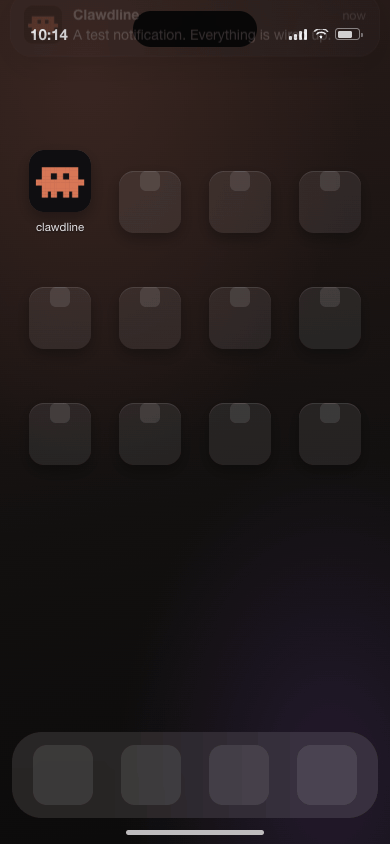

<div align="center">

# Clawdline

**One bar for every Claude Code session already running on your Mac.**

Type into it and the message lands in whichever session you point it at.
Press <kbd>⌘</kbd><kbd>J</kbd> and that session reads back where you are already looking — laid
out, not scraped. Press <kbd>⌘</kbd><kbd>K</kbd> and every session is a row that says what it is
doing: **working, finished, or waiting for an answer.**

Nothing is installed into Claude Code — it reads the screen each session is already drawing, so
**the four you opened by hand an hour ago are there too**, not only the ones something dispatched
for you. iTerm2 directly, every other terminal through tmux.

[](LICENSE)
[](#install)
[](Sources)
[](#install)

<a href="https://ko-fi.com/sainteye"></a>

English · [繁體中文](README.zh-TW.md)


</div>

---

> ### Connecting your own project
>
> Paste this repository's address at your Claude Code agent and ask it to connect your project.
> **[docs/connect.md](docs/connect.md) is written for it** — the files to create, the formats,
> and how to check its own work. It installs nothing and adds no dependency to your project;
> every integration here is a small JSON file that Clawdline reads.
>
> *"Connect this project to Clawdline — https://github.com/sainteye/clawdline"* is the whole
> instruction.

## What it is for

Claude Code puts everything in one rectangle at the bottom of one terminal window: what it says,
what it is asking you, and the box you type into. That is a good design for one session.

**You have four.**

So the day gets spent going *to* sessions. To say anything to one, you find its tab. To find out
whether it is still working, you find its tab. And the thing you are picking from is a row of tab
titles — which are *tasks*, and two projects can be working on tasks that read alike.

Clawdline is one place for all of them, at eye level. It types into any of them, reads any of
them back, and — the part that only matters once there is more than one — tells you which one
has stopped and which one is waiting for an answer, without your having to go and look.

**It installs nothing into Claude Code.** No hooks, no MCP server, nothing added to your
settings, no wrapper around the `claude` command. It reads the screens your sessions are already
drawing and the transcripts they are already writing. That is why it works with the sessions you
started an hour ago, why it cannot break the thing it is reading, and why turning it off leaves
nothing behind to undo.

There is exactly one thing you can *ask* it to install, and it is a button you have to press:
five hook entries that let Claude Code say when a turn starts and ends, instead of Clawdline
finding out on its next look. It changes when a reading happens and never what one says.
[How that works, and why the screen still decides](docs/hooks.md).

## What it does that a prompt box does not

- **Tells you which session wants you.** Four tabs working on tasks that read alike are four
  identical rows in every other tool. Here a session that is running carries the line Claude Code
  draws for itself, and one with a question on screen says so — loudly, because that is the only
  state that costs you something for every second it goes unnoticed. Each row wears its own
  project's mark. Nothing is installed into Claude Code to know this: it is each session's own
  screen, read.
  → [The session list](#which-session-wants-you)

  

- **Answers the same question on your phone.** Your Mac serves a page; your phone opens it and
  reads what every session is doing, transcript and all — and, if you arm the second switch, types
  into them. Off in a fresh install, bound to loopback, every request carrying a device token, and
  a device paired by a code that appears on the Mac and nowhere else. Reaching it from outside is
  `cloudflared`, which is your own install and never bundled. A phone can be told when a session
  starts waiting for you.
  → [From a browser, or a phone](#from-a-browser-or-a-phone)

  

- **Says it in the notch, too.** Your mascot lives in the camera housing: it sleeps there while
  nothing is running, leans out while something is, names the session that wants you, and dances
  when a long job finishes. How busy it looks is how much you have running. One word in the config
  turns it off.
  → [The notch](#the-notch)

  

- **The terminal's tab follows.** Move through the list and iTerm2 moves with you — without
  coming to the front, because taking your keyboard is the one thing this exists to avoid. The
  bar's target and the tab in front of you stop being two different sessions.
  → [Which tab it sends to](#which-tab-does-it-send-to)

- **Dictation in Chinese, and in two languages at once, without your voice leaving the Mac.**
  Words appear as you speak them; when you stop, Whisper reads the same audio back and replaces
  them. *"cambia el retry a exponential backoff"* is one sentence, and no live recogniser will
  hear it — Apple's changes language between sessions, never inside one. Claude Code's own
  `/voice` is good and closer to hand, but it streams your audio to Anthropic's servers, needs a
  Claude.ai account, and **as of 2026-08-17 (Claude Code 2.1.233) its twenty dictation languages
  [do not include Chinese](docs/compatibility.md)** — Japanese and Korean are there, no variety
  of Chinese is. Whisper here runs on your machine and needs no account at all.
  → [Dictation](#talk-instead-of-type) · [Whisper setup](docs/whisper.md)

  

- **Reads the session back, laid out.** Not a screenshot of a terminal: headings, tables with
  borders, code — and runs of tool calls folded to one line each, because thirty lines of paths
  is not what you came back to read. A live line says what it is doing right now.
  → [The transcript pane](#reading-a-session-back)

  

- **Tells you which project, not just which task.** Two tabs can be working on tasks that read
  the same. The bar names the repository, its branch, what is uncommitted, a deploy in flight and
  a backlog — with the project's own pixel icon and colour.
  → [Which project](#which-project-not-just-which-task)

- **Takes a screenshot straight from your clipboard.** Drop a file anywhere on the window or
  paste an image; it appears as a thumbnail, and arrives in Claude Code as `[Image #3]` —
  in the message, numbered, the way a paste does. Anything that is not an image goes as a path,
  because that is what Claude Code can do something with.
  → [Files and images](#dropping-in-a-file-or-an-image)

- **Remembers what you sent.** <kbd>↑</kbd> and <kbd>↓</kbd> walk back through your own prompts,
  and those same words are what dictation is told to expect — so the terms you actually use are
  the ones it gets right.
  → [Use it](#use-it)

- **Wears a mascot you drew.** The character on the bar is a JSON file: a pixel grid, a palette
  and five animations. Swap it without forking anything.
  → [Mascots](#bring-your-own-mascot)

  

## Contents

- [Install](#install) · [Use it](#use-it)
- **Knowing** — [which session wants you](#which-session-wants-you) · [the notch](#the-notch)
- **Reading** — [the transcript pane](#reading-a-session-back) · [which project](#which-project-not-just-which-task) · [the servers behind it](#the-servers-that-make-up-running-locally)
- **Writing** — [dictation](#talk-instead-of-type) · [files and images](#dropping-in-a-file-or-an-image) · [which tab it sends to](#which-tab-does-it-send-to)
- **Away from the Mac** — [the page your phone opens](#from-a-browser-or-a-phone) · [what is in the way](#what-is-in-the-way) · [the tunnel](#the-tunnel-if-the-phone-is-not-in-the-room) · [notifications](#being-told-instead-of-looking)
- **Making it yours** — [mascots](#bring-your-own-mascot) · [config](#config) · [other terminals](#other-terminals-run-claude-code-in-tmux)
- **Under it** — [how it works](#how-it-works) · [permissions and privacy](#permissions-and-privacy) · [limitations](#limitations) · [troubleshooting](#troubleshooting)
- **Going further** — [connect your own project](docs/connect.md) · [from a browser or a phone](docs/remote.md) · [the API](docs/api.md) · [the dev stack a project declares](docs/devstack.md) · [hooks, for the twenty-second gap](docs/hooks.md) · [Whisper for mixed languages](docs/whisper.md) · [which Claude Code versions](docs/compatibility.md) · [project status files](docs/project-status.md) · [mascot format](docs/mascots.md)

## Why

Claude Code draws its input box at the bottom of the terminal, and terminals are usually
full-screen. So the thing you look at a few hundred times a day sits in the bottom-left corner
of the display — the furthest point from where your eyes rest.

There is no setting for this. The input box is pinned to the bottom of the viewport, and a
plugin cannot move it: plugins add commands, agents, hooks, MCP servers and skills, not TUI
layout.

So Clawdline goes the other way. It leaves the terminal alone and gives you a second place to
type — one that appears where you tell it to, takes your text, and puts it in the session you
were last working in. Focus returns to whatever app you were in. Your eyes never travel.

## Install

Pick whichever you trust most — they all end up with the same app.

**Homebrew**

```bash
brew install --cask sainteye/tap/clawdline
xattr -dr com.apple.quarantine /Applications/Clawdline.app
```

**A script that fetches the latest release**

```bash
curl -fsSL https://raw.githubusercontent.com/sainteye/clawdline/main/install.sh -o install.sh
less install.sh          # 40 lines; worth the ten seconds
bash install.sh          # or: bash install.sh ~/Applications
```

**By hand** — grab the `.zip` from [Releases](https://github.com/sainteye/clawdline/releases/latest),
unzip it into `/Applications`, then:

```bash
xattr -dr com.apple.quarantine /Applications/Clawdline.app
```

**From source** — no package manager, no dependencies, a few seconds:

```bash
git clone https://github.com/sainteye/clawdline.git
cd clawdline && ./build.sh
open ~/Applications/Clawdline.app
```

<details>
<summary>Why the <code>xattr</code> line, and why building from source skips it</summary>

The release build is ad-hoc signed but **not notarized** — notarizing needs a paid Apple
Developer account. macOS quarantines anything downloaded from the internet and refuses to
open an unnotarized copy, so the flag has to come off, either with that command or by way of
System Settings → Privacy & Security → Open Anyway.

An app you compiled yourself was never downloaded, so it is never quarantined. If you would
rather not take a stranger's binary on faith, that is the option to use: the whole build is
`swiftc` over a handful of files you can read.

</details>

The first time you send something, macOS asks whether Clawdline may control iTerm2. Say yes;
it cannot send anything without that. Menu bar ✳ → **Launch at login** makes it stick around.

## Use it

Press <kbd>⌥</kbd><kbd>Space</kbd> in iTerm2, type, press <kbd>Enter</kbd>.

| key | what it does |
|---|---|
| <kbd>⌥</kbd><kbd>Space</kbd> | show / hide the bar |
| <kbd>Enter</kbd> | send to the current target tab |
| <kbd>⇧</kbd><kbd>Enter</kbd> | new line (the bar grows) |
| <kbd>Tab</kbd> / <kbd>⇧</kbd><kbd>Tab</kbd> | next / previous Claude Code tab |
| <kbd>⌘</kbd><kbd>K</kbd> | open the session list |
| <kbd>⌘</kbd><kbd>1</kbd>…<kbd>⌘</kbd><kbd>9</kbd> | jump straight to a session |
| <kbd>↑</kbd> / <kbd>↓</kbd> | history, when the field is empty |
| <kbd>⌘</kbd><kbd>J</kbd> | show what that session is saying |
| <kbd>⌘</kbd><kbd>F</kbd> | fill the screen with it |
| <kbd>⌘</kbd><kbd>R</kbd> | newest message at the top instead of the bottom |
| <kbd>⌘</kbd><kbd>+</kbd> / <kbd>⌘</kbd><kbd>−</kbd> / <kbd>⌘</kbd><kbd>0</kbd> | text size in that pane, remembered |
| <kbd>⌘</kbd><kbd>S</kbd> | the servers each project runs — start, restart, stop, see what broke |
| <kbd>⌘</kbd><kbd>M</kbd> | browse / switch mascots |
| <kbd>⌘</kbd><kbd>D</kbd> | make the mascot dance |
| <kbd>⌘</kbd><kbd>/</kbd> | show the rest of the keys |
| <kbd>⌘</kbd><kbd>L</kbd> or click the microphone | dictate instead of typing |
| drag / <kbd>⌘</kbd><kbd>V</kbd> | drop a file or paste an image anywhere on the window |
| <kbd>Esc</kbd> | close |

<kbd>⌘A</kbd> · <kbd>⌘C</kbd> · <kbd>⌘V</kbd> · <kbd>⌘X</kbd> · <kbd>⌘Z</kbd> work as you expect.

**The hotkey only fires while iTerm2 is in front.** Everywhere else <kbd>⌥</kbd><kbd>Space</kbd>
is still whatever it was before you installed this. Set `"scope_app": ""` to make it global.

### Which tab does it send to?

Clawdline lists every iTerm2 session, checks each one's TTY against `ps`, and keeps the ones
actually running `claude`. It defaults to the session you were last looking at.

The bar always names its target along the bottom edge. **It never sends blind** — a prompt box
that will not tell you where the text goes is worse than no prompt box.

**And the terminal follows.** Move through the list and iTerm2 moves with you: the tab in front
of you is the session the bar is pointed at, by construction. Selecting a tab is not the same as
bringing the terminal to the front and only the first one happens — otherwise every press of
<kbd>Tab</kbd> would hand iTerm2 your keyboard, which is the one thing this application exists to
avoid doing. `"follow_target": false` if you keep a terminal tab open to read from while you work
somewhere else.

### Dropping in a file or an image

Drag a file anywhere onto the window, or paste an image, and it appears in the box as a
thumbnail — the picture you dropped, not forty characters of directory.

**An image arrives as `[Image #3]`**, the same as if you had pasted it into Claude Code
yourself: in the message, numbered, and something you can point at in the sentence you are
writing. That is not a string anything can type — Claude Code produces it when it reads an image
off the system pasteboard on a Ctrl-V — so the send is split around the images, each one is lent
to the pasteboard for the keystroke, and the pasteboard is handed back exactly as it was.

Only into a Claude Code session, because Ctrl-V in a shell means something else entirely; and
only when the image loads, otherwise it falls back to the path. Anything that is **not** an
image — a PDF, a folder — goes as a path on purpose: Claude Code reads files itself, so a path
is the whole handoff and is the same thing you would have typed. `send_images_as_paste: false`
sends everything the old way.

What is on screen is for you; what goes down the wire is for Claude Code, and the moment those
are the same string one of them is being made worse to suit the other.

An image off the clipboard has no path yet, so one is written under
`~/Library/Caches/dev.sainteye.clawdline/drops/` and that path is inserted. Those files are the
only thing this leaves behind, so the most recent few are kept and the rest are removed.

### Talk instead of type

**Claude Code has its own dictation** — `/voice`, hold space — and it is good. What it does not
do is transcribe on your machine (its docs: "audio is not processed locally"), work without a
Claude.ai account, hear two languages in one sentence, or — **as of 2026-08-17, Claude Code
2.1.233** — understand Chinese at all: its list runs to twenty languages, Japanese and Korean
among them, and no variety of Chinese. Those are what this is for; the whole comparison, with
the date it was checked, is in [docs/whisper.md](docs/whisper.md).

<kbd>⌘</kbd><kbd>L</kbd>, or the microphone at the right of the box, turns your voice into text
in it. **It stops on its own when you are done talking** — a pause of a couple of seconds fixes
a sentence, a longer silence ends the session, so a paragraph said in one go needs one keystroke
rather than two. Pausing does not stop it: the recogniser settles a sentence at every pause and
starts the next from nothing, so the sentences are stitched back together on this side rather
than the second one replacing the first. The rings around it follow the same audio being transcribed, so
a ring that will not move means the microphone is hearing nothing — a failure you would otherwise
find out about by reading an empty box afterwards.

**Mixed-language speech is not a switch Apple can offer you.** Neither of its speech APIs changes
language mid-sentence: one recogniser, one locale. What is available is a hundred phrases of
bias, and Clawdline spends them on your own prompt history — the words you have typed at
Claude Code are the words you would say to it, so `webhook`, `rebase` and the name of your repo
survive being said inside a Chinese sentence. It needs no word list to maintain, and a list you
have to curate is one that goes stale the week you write it.

Words still being worked on are drawn faded, and come up to full when they settle. An
underline is what macOS input methods use, and it was the first thing tried here — but it only
speaks to people who already know that convention, and a line under a sentence competes with the
sentence. Fading reads as "not all the way here" to anybody, and it puts the emphasis the right
way round: the words that have settled are the ones that look normal. **Dictation starts at the
caret**, so you can go back and say a sentence into the middle of what you have written. Every pause of about two seconds fixes what you have said so far, so earlier sentences
stop moving while you carry on — `voice_settle_seconds` sets the pause, 0 turns it off. A pause
means quiet *compared to the last few seconds*, not quiet compared to a number: an ordinary room
here measures a third of the way up the scale, so a fixed threshold would be this room and
nobody else's. Four seconds of it ends the session altogether (`voice_stop_seconds`), and a
sentence that broke off mid-clause is given longer than one that arrived with a full stop on it —
being late costs an open microphone in a quiet room, being early costs the keystroke this is
here to remove. Pressing <kbd>Enter</kbd> while still talking means "that was the
end of it": the microphone closes, the last stretch is read back, and then it sends — you do not
have to stop it first. You can also stop, fix a word by hand, and carry on talking: an edit anywhere in the box ends the
current run, and the next thing you say starts after the caret rather than being written into
the middle of the sentence you were correcting.

Recognition runs on this Mac for the dictation languages you have downloaded, and goes to Apple
for the ones you have not. The bar says which, for as long as it is listening. See
[Permissions and privacy](#permissions-and-privacy).

If you do speak two languages in one sentence, **[Whisper](docs/whisper.md) is an optional second
pass that handles it** — a `brew install` and a model file, after which Clawdline uses it without
being told to. It does not replace the live text: Apple's recogniser keeps writing as you speak,
and when you stop, Whisper reads the same recording and replaces the run with its version. The
feedback of one, the sentence of the other. That page has a prompt you can paste into Claude Code
to have it installed for you.

### The servers that make up "running locally"

Most projects have a handful of long-running things — an API, a front end, a worker, a tunnel.
Each was started from a terminal tab, and that tab belongs to it for the rest of the day.
Restarting one means finding its tab, stopping all of them, and starting all of them again.

<kbd>⌘</kbd><kbd>S</kbd> puts them where you already type:

    ⌘1  atrium   ▪ 8/8   9h 37m   api:8004  blog:4324  web:3004   ↗ atrium-dev.example.com
    ⌘2  cairn    ▪ 6/6   9h 48m   api:8002  web:3001            ↗ cairn-dev.example.com

How many are up, how long they have been, every port as a link, and the address it is served on.
Start, stop and restart are there too.

**Clawdline never starts a process of its own**, and that one rule is why this works at all.
Anything it spawned would die with it — on quit, on update, on crash — and a dev stack whose life
is tied to a text field is worse than one tied to a terminal tab; at least the tab is visible
while it dies. So it reads one file from your repository, `.devstack.json`, and runs the commands
that file names. process-compose, Overmind, pm2, Docker Compose, a Makefile with PID files: they
all reduce to "a command that prints state", and nothing here knows which one you use.

Adopting it has three heights, and the first one is four lines of JSON:

| | | |
|---|---|---|
| **Tier 0** | declare which ports belong to which service | no commands, and nothing to trust |
| **Tier 1** | add a `status` command that prints a small JSON document | the row goes live |
| **Tier 2** | point it at something that already keeps state — process-compose, Compose | it reads what is already there |

**Naming commands in a file means something can run them, so cloning a repository must not be
enough.** Reading declared ports needs no trust — connecting to a TCP port executes nothing — so
an untrusted project still shows real state at Tier 0. Running any of its commands, including
`status`, is gated per repository, and editing the file revokes that, because the edit is exactly
where a command would be added.

A project that declares no ports and has not been trusted reports *unknown*, not *stopped*. It is
very likely running, and an indicator that says "down" about a live site is worse than none — the
next real outage looks identical to it.

**[docs/devstack.md](docs/devstack.md) is the format**, with working examples the test suite
parses, so the page cannot quietly stop being true.

### Which project, not just which task

The bar names its target along the bottom edge, and a tab title is the *task* — "investigate the
webhook" reads much like another project's "investigate the webhook". So the line leads with the
repository, its branch, and how much is uncommitted:

    ▣ atrium  investigate the webhook  ⎇ main *3   9/10

If you use [claude-bestiary](https://github.com/sainteye/claude-bestiary) for your terminal status
line, the mark and the colour come from its registry — `~/.claude/project-icons.json` — so the
icon in the bar and the icon in the terminal are the same icon because they are the same row,
not because two programs were kept in step by hand. Clawdline only ever reads that file: it is
usually a symlink into a checkout, and writing through the link would replace it with a copy.

It can show more than the name. A deploy in flight draws its progress, a backlog shows the lane
that is asking for attention, a health check shows a dot — and the first two are links, so the run
or the page opens where you would have gone looking for it anyway.

None of that is computed by Clawdline: they are small JSON files, by default under
`~/.claude/statusline-cache/` — `status_dir` and `icons_file` point it somewhere else.
**[docs/project-status.md](docs/project-status.md) is the format**,
with working examples the test suite parses, so the page cannot quietly stop being true. Anything
can write them — a cron job, a git hook, or claude-bestiary, which already does for its own status
line. Without them the footer simply has less to say.

Without a registry the colour is derived from the path instead, which is stable from one launch
to the next. The branch and the count come from one `git status --porcelain=v2 --branch`.

### Reading a session back

<kbd>⌘</kbd><kbd>J</kbd> opens a pane below the input showing what that session currently says,
refreshed about once a second and following <kbd>Tab</kbd> as you switch. The rest of the
screen blurs behind it, because reading a transcript is a different mode from firing off one
line. The text is selectable — copying an error out of it is most of the point.

It only auto-scrolls when you were already parked at the end where new lines land; being
yanked away while reading something further up is worse than not following at all. And an unchanged terminal produces an
identical capture, which is skipped entirely rather than relaid out under your eyes.

Where it can, the pane shows the **conversation** rather than the screen. Claude Code writes
each session to `~/.claude/projects/<project>/<session>.jsonl` as it goes, and that file has
the structure the screen only implies: who spoke, what they said, which tools ran. Reading it
means real message boundaries, full history rather than one viewport, and typography instead
of a screenshot — speakers get a label, prose gets a proportional face, tool calls recede into
monospace at the edge of the page.

<kbd>⌘</kbd><kbd>F</kbd> makes it the size of the screen — not macOS's full screen, which moves
the window to a Space of its own and is the opposite of what a panel you summon over your work
is for. It is a resize, animated, and the mascot has a routine for it.

Switching to another app puts the panel away, and coming back to the terminal takes it out
again — at whatever size it was. Leaving a panel you had open is "I need to see something for a
moment"; <kbd>Esc</kbd> is how you say "I am done", and something you closed on purpose stays
closed. Set `"reopen_on_return": false` if you would rather every appearance be one you asked
for.

<div align="center">

</div>

<kbd>⌘</kbd><kbd>R</kbd> turns the whole thing round, newest message at the top. It follows
whichever end the newest message is at — auto-scrolling to the top rather than the bottom —
and it is remembered. Only the transcript flips: a terminal capture is a picture of a grid,
and reversing its lines would have a wrapped sentence reading upwards.

While the session is working, the pane carries a line saying what it is doing —
`Finagling… (5m 52s · ↓ 18.6k tokens)`. That one is scraped from the terminal even when
everything else comes from the file, because it is never written to the file: the transcript
records messages once they exist, and this is a spinner painted on the screen and erased again.

Runs of tool calls fold. A single answer can sit under thirty lines of paths and shell, and
the shell is not what you came back to read — so each finished run collapses to one line saying
how many steps it took and which tools ran, and clicking it opens the run back up. The run still
going never folds: that one is the part that is changing.

What Claude writes is Markdown, so the pane renders it: headings, lists, tables with real
borders, quotes, emphasis, and code. Leaving a table's pipes in and setting it in monospace
does not work — a CJK glyph comes from a fallback face whose advance is not reliably twice the
monospace one, so pipes that line up in the source land somewhere different on every row.
Anything unrecognised falls through as plain text, which is the one failure mode that matters:
a stray asterisk on screen is a blemish, a sentence swallowed by a parser is a bug.

Finding the right file takes three steps, because no record carries a tty: the session's
working directory gives the project folder, the tab title matches the `aiTitle` the transcript
recorded, and the most recent file breaks any tie. **The format is undocumented and can
change**, so every field is optional on the way in and anything unrecognised is skipped.

When there is no transcript — a plain shell, a non-Claude pane — it falls back to scraping the
terminal. iTerm2 hands over the **visible screen** and no more, since its scripting has no
scrollback; tmux gives the visible pane plus 200 lines of history. Set `output_mode` to
`terminal` or `transcript` to pin it either way.

**The card is frosted glass, and glass takes the colour of what is behind it.** A screen of
green diff or a bright page tints the whole thing and drags the text with it, so a dark layer
sits between the material and everything drawn on it. `card_opacity` is how much of it: 0 is
pure glass, 1 is opaque. Raise it if you work over bright or strongly coloured windows.

**On that fallback path, colour only survives through tmux.** `capture-pane -e` keeps the
escape sequences, which get parsed into real colour. iTerm2's scripting returns a plain string:
it will tell you which red it uses for ANSI red, but not which characters are red, so that path
arrives as plain text. None of this touches the transcript, which is coloured by what the text
means rather than by what the terminal drew.

Set `output_font` to whatever your terminal uses. The default is Menlo; a status line built out
of box-drawing characters comes out at the wrong widths in anything with different metrics,
which is what makes it look broken.

## Which session wants you

Not looking at the terminal works for one session. With four, you are back to going round the
tabs to find out who finished — so the thing that made the bar worth having stops working at
exactly the point you start needing it.

<kbd>⌘</kbd><kbd>K</kbd> answers it instead:

<div align="center">

</div>

- **Working** carries the line Claude Code draws for itself — *Crystallizing… (13m 46s)* — in
  grey. Quiet on purpose: four rows calling for attention at once is the same as none of them
  calling.
- **Waiting for you** is the loud one, and the only one. A question on screen with nobody
  answering it is the single state that costs you something for every second it goes unnoticed.
- **Quiet** says nothing at all, and so does a session whose screen could not be read — because
  drawing "no idea" as "idle" would be a confident wrong answer about somebody's work.

Each row wears its project's own pixel mark, from the same registry the footer and your terminal
status line use. A tab title is the *task*, and two projects can be working on tasks that read
alike; the mark is the part you do not have to read.

**The menu bar carries it too.** The ✳ was a fixed character that opened a menu — permanently
visible and permanently saying nothing. It has a count on it now, and a mark when something is
waiting.

**None of this is installed into Claude Code.** No hooks, no settings file of yours is edited,
nothing to set up: it is each session's own screen, read the same way the <kbd>⌘</kbd><kbd>J</kbd>
pane reads it, about once a second while the bar is up and once every twenty seconds while it is
not.

### Twenty seconds is a long time

That last number is the one thing looking cannot fix. A reading is a round trip to every terminal
you have open, so away from the bar it happens rarely — and a permission dialog can sit there
through a whole train of thought before the menu bar mentions it.

Claude Code will say so itself, if you ask it to. **Settings → Claude Code hooks → Install** puts
five entries in `~/.claude/settings.json`; after that, the moment a turn starts, ends, or needs an
answer, a two-line note lands in a directory Clawdline is watching, and the reading it would have
taken twenty seconds later happens in **under a second** instead.

The polling underneath barely changes, and the screen does not stop being the authority: a note
says *when* something happened, never what is on the screen, so it asks for a reading and
`SessionState` still decides. **Nothing a hook sends ever claims that a session is working** —
Claude Code draws its live line about two seconds after you press Return and removes it again
while the answer streams, so a nudge looks twice rather than asserting anything. Removing the
hooks leaves nothing behind, and a copy of your settings file is kept the first time so you can
diff it.

Five events, all rare — `PreToolUse` is deliberately not among them. The full contract, including
what a note is and is not allowed to change, is in [docs/hooks.md](docs/hooks.md).

## From a browser, or a phone

The bar answers "which session wants me" while you are at the machine. Away from it, the same
question is still worth answering — and it is the same reading, so there is a page for it.

**Your Mac serves a page and your phone opens it.** Every session with its state, its project's
mark, and its transcript laid out the way <kbd>⌘</kbd><kbd>J</kbd> lays it out — and, if you arm
the second switch, a box to type into them. On a desktop it is two columns with the app's own
keys; on a phone it is a single column meant to be added to the home screen, where it behaves like
an app rather than a page. It speaks the same fourteen languages the bar does, and while `lang` is
`auto` it answers in the *phone's* language rather than the Mac's, because the phone is the thing
being held.


It is off in a fresh install and stays off until you go and switch it on. Not a default somebody
picked: a listening socket is the difference between a program on your machine and a service on
your machine, and that difference should be something you did on purpose.

### What is in the way

In the order a request meets it:

- **It binds `127.0.0.1` and nothing else.** Not "binds everything and filters" — the listener is
  created with a required local endpoint of loopback, so there is no interface on your network for
  it to be found on. The way out of the machine is a tunnel that dials *out*, never a port that
  sits and waits.
- **The `Host` header is checked before anything else is looked at.** A page on `evil.com` can
  already `fetch` `http://127.0.0.1:7717/…`; what usually saves a local server is that the page
  cannot *read* the reply, and DNS rebinding removes exactly that. The one thing rebinding cannot
  change is `Host`, which still says `evil.com` — so a request naming a host this server does not
  answer to is refused on the spot. It answers to `127.0.0.1`, `localhost`, `::1`, whatever is in
  `remote_hostname`, and anything under `.trycloudflare.com`.
- **Cross-site requests are refused**, on the `Sec-Fetch-Site` header a browser sets and a page
  cannot forge. Following a link is let through, because typing the address into a bar that
  happened to be showing another page is cross-site too — what separates them is the mode, not the
  site. Anything that mutates is checked against `Origin` as well, since a cookie is sent whether
  the page asking wanted it or not.
- **Everything else needs a device token**, wherever it came from. 256 random bits, kept as a
  SHA-256 and compared in constant time — including the lookup, so a wrong token cannot be used to
  find out which device ids are real. Open without one: the page, its icons and manifest,
  `/v1/health`, the interface's own strings, and the pairing routes. There is no exception for
  loopback, and that is not zeal — once a tunnel is up, a request from a phone in another country
  arrives from `127.0.0.1` like everything else, so *but it came from this machine* would be wrong
  in precisely the situation it was meant to cover.
- **A device is paired by a code shown on the Mac.** The browser asks and gets an id back; the six
  digits appear in an alert **on the Mac's screen** and are never in that reply. Five guesses, two
  minutes, one pairing open at a time, three in ten minutes. Anybody who can reach the address can
  start one; only somebody who can see your screen can finish one.
- **Typing into a session is a separate switch from reading one.** Reading hands over a repository
  name, a branch and a task title. Writing is remote code execution, because Claude Code runs
  `bash`. Two features at two risk levels, so two switches rather than two positions on one dial —
  and sending is granted to paired devices as a group, so taking it back takes it back from all of
  them at once.
- **A tunnel refuses to start until something has been paired.** *Reachable from the internet*
  should be a decision a person made rather than something one config key did.
- **What was done is written down.** Every pairing, revocation, send and session started goes to
  `~/.config/clawdline/remote-audit.jsonl`, mode `0600`, appended and never rewritten — because if
  somebody does get in, the question you will have is what they did, and that has no answer unless
  it was recorded while it was happening.

**A paired device is trusted until you revoke it.** There is no expiry and no re-prompt: its token
works until you take it away in Settings → Remote, which takes its notifications with it.
[docs/remote.md](docs/remote.md) is where the rest of the honest half lives — a tunnel means
Cloudflare terminates the TLS and your transcripts cross its edge in the clear, a quick tunnel's
address is itself a credential, and nothing at this layer defends against something already
running as you on the Mac.

### Turning it on

**Settings → Remote → let a browser or your phone see your sessions.** If the browser is on this
Mac that is the whole of it: *Open in a browser* mints a device for it and opens the page already
signed in.

**For a phone, *Pair a phone…* draws a QR code.** It carries a key of its own, minted for that
scan, so a photograph of somebody's screen is a device you can see in the list and take away again
rather than this Mac's own key. The alternative is the six-digit code, from the phone's side —
which works and costs a walk to the machine.

### The tunnel, if the phone is not in the room

A phone cannot reach `127.0.0.1`, so the QR code points at a public address as soon as there is
one. That address comes from `cloudflared`, which dials **out** to Cloudflare and lets the traffic
back down the connection it made — no port to forward, and nothing on your network listening.

**`cloudflared` is a program you install yourself.** It is never bundled and never downloaded by
this app; `dependencies: none` stays true because it is your binary, found where package managers
put it, exactly like `tmux` and `whisper-cli`. `brew install cloudflared`, or put the path in
`cloudflared_path` if yours lives somewhere unusual. Two modes:

- **`quick`** needs no Cloudflare account. It invents an address per run — four English words
  under `trycloudflare.com` — which this end learns by reading cloudflared's own logging. Good for
  an afternoon. The address changes every time, and for the length of a run it is a credential:
  anybody who has it reaches your sign-in page.
- **`named`** runs a tunnel you created yourself with `cloudflared tunnel create`, at a hostname
  you routed to it. Both `remote_tunnel_name` and `remote_hostname` have to be set, and it refuses
  with a sentence rather than starting without them: cloudflared never prints the hostname for a
  named tunnel, so a tunnel missing that field is one that comes up and can never be told to
  anybody.

Clawdline writes its own `~/.config/clawdline/cloudflared.yml` and points cloudflared at it, so
your `~/.cloudflared/config.yml` is never read for this. That is not tidiness: that file's
`tunnel:` key overrides the name on the command line, and its ingress list will happily answer
`404` for a hostname it has never heard of.

### Being told, instead of looking

A paired phone can subscribe to notifications and then buzz when **a session starts waiting for an
answer** — the one state that costs you something for every second it goes unnoticed. Two more,
both off unless asked for: `push_on_finish` for a turn that ran over two minutes and stopped, and
`push_on_deploy` for a deploy that stopped running, whichever way it went.



The message is sealed to the device, so the push service carries ciphertext and learns only that
something went to a subscription. Encryption settles who may read it in transit and settles nothing
about who reads it off a locked phone lying face-up on a table, so what is inside is the project
and the state and never the task text.

**The Mac has to be running.** This is not a service somewhere; it is your machine, awake, noticing
and posting. Asleep or quit, nothing goes out, and nothing is saved up to go out later. And on
iOS the page has to have been added to the home screen and opened from there — Apple only delivers
notifications to a web app that lives there, which is a rule of theirs and not a setting here.

### Starting one from the sofa

With sending on, a paired device can also **start a new Claude Code session** in a directory this
Mac has already worked in. The client never sends a path — it sends an opaque id out of a list the
Mac built from Claude Code's own record of where it has run, and the command is the literal
`claude` with no arguments. There is no field on that route a directory or a command could be
written into, which is a stronger statement than "the path is validated", because validation is
something the next person to edit the file can weaken by accident and an absent parameter is not.
It needs iTerm2 running or tmux to hand, and it takes no focus: whoever is at the Mac is in the
middle of something else. On the page it is the `+` beside the filter: the Mac's own list of
places, marks and all, and a line under the header while the tab opens and the session catches up.

**One rough edge worth knowing.** A page that is already open keeps the interface it loaded, so
after updating the app you reload it by hand.

`docs/remote.md` has the threat model in full, including what this does **not** defend against, and
[docs/api.md](docs/api.md) is the surface a script or a plugin talks to — every session, every
transcript, an event stream, and `curl` as the only SDK.

**[docs/remote.md](docs/remote.md)** · **[docs/api.md](docs/api.md)**

## The notch

This one is play, and it says so in the source. It tells you nothing the menu bar mark does not —
it is the same reading, wearing a costume.

<div align="center">

</div>

Your mascot lives in the menu bar band beside the camera housing. It leans out while something is
running — **how hard it looks like it is working is how much you have running** — names the
session that wants you when one does, and dances when a long job finishes.

**When nothing is running it is still there, asleep.** Just the character, breathing slowly with
its eyes shut: no ear, no name, no number. That is the state your machine is in for most of the
day, so it is built to be forgotten rather than read — and when work starts it stretches, and gets
on with it.

- **Click the character** and the bar opens, already pointed at the session it was talking about.
- **Click the words** and you land in that terminal tab.
- **When the number stands for more than one session** it offers a menu rather than guessing,
  with a way through to the whole list.

Nothing is ever covered except menu bar space: the shape sits in the menu bar's own band and
grows sideways, because the notch is a hole with a camera behind it and pixels drawn there are
drawn on the back of a camera. On a display without a notch it becomes a pill under the menu bar,
on whichever screen your pointer is on — and there it does not sleep. A pill is fine for the
minute a job takes and quite another thing parked over your menu bar all day, so a screen with no
camera housing behaves exactly as it did before: it shows up when there is something to say and
goes away again.

```jsonc
{ "notch": false }   // and none of it is created — no window, no observer, nothing drawn
```

## Bring your own mascot

The character on top of the bar is **data, not code**. One JSON file holds the pixel grid, the
palette, every pose and every animation, so replacing it never means forking this repo.

```
~/.config/clawdline/mascots/clawd.json
```

Edit it, press <kbd>⌥</kbd><kbd>Space</kbd>, and the change is on screen. No rebuild.

### Browse and switch

<div align="center">

</div>

<kbd>⌘</kbd><kbd>M</kbd> lists every pack you have. Arrow keys **preview as you move** — the
character on the bar changes while the list is still open, so you pick by looking rather than
by reading names. <kbd>⌘</kbd><kbd>1</kbd>–<kbd>⌘</kbd><kbd>9</kbd> jumps straight to one, and
the menu bar ✳ has the same list.

Two ship with the app. [**docs/gallery.md**](docs/gallery.md) is where more get posted:

<div align="center">


</div>

### Make one

The intended way is to let Claude Code do it. Save a reference image, then:

> Here is a reference image: `~/Downloads/my-character.gif`
>
> Make it into a Clawdline mascot pack. The format is in `docs/mascots.md`, and
> `~/.config/clawdline/mascots/clawd.json` is a working example. Grid no larger than 20×16.
> Put the feet on the bottom row so it stands on the bar. Write the routines: `pop`, `idle`,
> `typing`, `dance`, `cheer`, `stretch`, and `sleep` — a long, looping, eyes-shut breath with
> no blink block, for the notch when nothing is running. Save it as
> `~/.config/clawdline/mascots/my-character.json` and point the config at it.
>
> Then check your work: run
> `open "clawdline://snapshot?path=/tmp/m.png&routine=dance&t=0.3"`, look at the PNG, and fix
> whatever is wrong. Repeat until it reads like the reference.

That last instruction is the one that matters. `clawdline://snapshot` renders a frame of any
routine to a PNG **without needing Screen Recording permission**, so the agent can see what it
drew and iterate. Pixel art written blind comes out as a blob.

Full format reference, every routine trigger, and notes on what reads well at this size:
**[docs/mascots.md](docs/mascots.md)**. Packs are pure data — a grid of characters, colours and
numbers — so one cannot execute anything; the worst a bad one does is refuse to load and say
why. `tools/validate-pack.py` checks a pack, and CI runs it on every pull request.

## How it works

Text does not go in as synthetic keystrokes, and it is not written to the terminal's pty —
you cannot write to another process's TTY on modern macOS. It goes through iTerm2's scripting
interface, wrapped in a bracketed paste:

```
ESC[200~ your text, newlines and all ESC[201~     ← one paste, not a row of Enters
CR                                                ← then a single Return to submit
```

Without that wrapper a two-line prompt submits itself after the first line. The other benefit
is that **the terminal never has to come to the front** — which is the entire point.

## Config

Menu bar ✳ → **Settings…** has a control for everything worth changing, and every
control applies the moment you move it.

Underneath it is `~/.config/clawdline/config.json`, which is still the truth and still
hand-editable — the settings window writes exactly what you would have written. There is a
button in it that opens the file, for the handful of keys that only live there. Editing it
while the app is running is fine: it writes back only what it changed itself, and leaves the rest
of the file — including settings from a version that knew about more of them — alone.

```jsonc
{
  "hotkey": "option+space",              // cmd / option / control / shift + one key
  "scope_app": "com.googlecode.iterm2",  // comma-separated; "" makes the hotkey global
  "y_fraction": 0.30,                    // where the bar's top edge sits, 0 = top of screen
  "width": 720,
  "language": "auto",                    // auto, or any tag from the list below
  "mascot": "clawd",
  "tmux_path": ""                        // empty = look in the usual places,
  "output_height": 340                    // ⌘J pane height, 80–900
  "output_font": "Menlo",                // match your terminal, or box-drawing breaks
  "output_mode": "auto",                 // auto | transcript | terminal
  "output_size": 11.5,                   // ⌘+ / ⌘- change this live
  "output_newest_first": false,          // ⌘R: newest at the top
  "card_opacity": 0.55,                  // 0 = pure glass, 1 = opaque
  "reopen_on_return": true,              // come back when the terminal does
  "notch": true,                        // the character in the notch — false turns it off
  "follow_target": true,                 // the terminal's tab follows what the bar points at
  "backdrop": 0.5,                       // ⌘J background blur, 0 = none
  "voice_settle_seconds": 1.8,           // how long a pause ends a sentence, 0 = off
  "voice_stop_seconds": 4.0,             // how long a silence ends the session, 0 = off
  "voice_vocabulary": [],                // names a transcriber cannot be expected to know
  "send_images_as_paste": true,          // images arrive as [Image #3], not as a path
  "hooks": true,                         // believe Claude Code's hooks when they are installed
  "status_dir": "",                      // project status files; "" = claude-bestiary' own
  "icons_file": "",                      // icon registry;        "" = claude-bestiary' own

  "remote": false,                       // serve the web interface — off until you turn it on
  "remote_port": 7717,                   // loopback only; the tunnel is what makes it reachable
  "remote_write": false,                 // may a paired device type into a session, or only read
  "remote_tunnel": "off",                // off | quick | named
  "remote_tunnel_name": "",              // the named tunnel to run; required for "named", no default
  "remote_hostname": "",                 // your own domain, for a named tunnel
  "push_on_finish": true,                // buzz when a turn over two minutes ends
  "push_on_deploy": false,               // buzz when a deploy stops running, either way
}
```

### Languages

The interface speaks English, Chinese (Traditional and Simplified), Japanese, Korean, Spanish,
Portuguese, French, German, Russian, Italian, Hindi, Indonesian and Turkish. `auto` follows the
system; naming a tag (`ja`, `pt`, `zh-Hant`) pins it.

Adding one is a copy of [`Sources/Copy+English.swift`](Sources/Copy+English.swift) and a line in
`L.catalog`. Two things hold it up afterwards: the compiler refuses to build a language that is
missing a string, and the test suite refuses one that is still in English — the first is what a
protocol buys you, and the second is what it cannot, because a copied file compiles perfectly.
Corrections to any of these are welcome; the ones nobody here speaks natively are the ones most
likely to need them.

## Permissions and privacy

| what | why | when |
|---|---|---|
| **Automation → iTerm2** | the only way to put text into a session | once, on your first send |
| **Microphone + speech recognition** | dictation | only if you press the microphone |
| *(nothing else)* | no accessibility, no screen recording | — |

The global hotkey uses Carbon's `RegisterEventHotKey` rather than an `NSEvent` monitor
specifically to **avoid** the accessibility permission — a tool that opens a text box has no
business being able to read every key you press.

**Two things here can use the network, and both are switches you threw.** [Remote
access](#from-a-browser-or-a-phone) is one: off in a fresh install, loopback only until you point
it at a tunnel, and it is `cloudflared` — your own install — that carries anything off the
machine. Notifications to a phone are the same switch's other half, and they go out sealed. The
other is dictation, below.

**Dictation says so while it does it.** macOS recognises speech on the Mac for the dictation
languages you have downloaded, and sends audio to Apple for the ones you have not. Which of the
two is happening is written across the bottom of the bar the whole time it is listening — the
microphone is never open without that line being on screen, and closing the panel stops it. If you
would rather it never left the machine, install the language in System Settings › Keyboard ›
Dictation.

Nothing else here talks to the network — with remote access off and the microphone untouched,
nothing does at all. Your prompt history lives in `~/.config/clawdline/config.json` and goes
nowhere.

## Other terminals: run Claude Code in tmux

iTerm2 is supported directly. Everything else — Terminal.app, Warp, Tabby, Ghostty,
Alacritty, Kitty — works if Claude Code is running inside **tmux**:

```bash
tmux new -s work
claude
```

That is the whole setup. Clawdline lists tmux panes alongside iTerm2 sessions, spots the ones
running `claude` the same way, and sends through `load-buffer` + `paste-buffer` with the same
bracketed-paste wrapper. Nothing else to configure, and **tmux needs no macOS permission at
all** — it is an ordinary subprocess, not cross-app automation.

If your terminal is not iTerm2, widen the hotkey scope so ⌥Space fires there too:

```jsonc
{ "scope_app": "com.apple.Terminal,com.googlecode.iterm2" }
```

<details>
<summary>Why not support those terminals directly?</summary>

Because they cannot receive text. Terminal.app has `do script`, which sounds like it would
work — it does not. A program blocked on `read` in one of its tabs never sees a byte of what
`do script` sends; the call returns success and nothing arrives. Warp and Tabby have no
equivalent interface at all.

The only remaining route is synthetic keystrokes, which needs the accessibility permission —
the right to observe every key you press, for a tool whose whole job is opening a text box —
and needs the terminal in front, which is the thing this exists to avoid. tmux gives the same
result for neither cost.

</details>

## Limitations

- **One direction.** Claude's replies still live in the terminal. That half scrolls upward
  anyway; this fixes the half that was nailed to the bottom-left corner.
- **tmux is required for non-iTerm2 terminals**, per the section above.
- **Apple silicon, macOS 13 or newer.** The build is arm64 only, so a downloaded release will
  not start on an Intel Mac. Building from source on one is a one-word change to `build.sh`'s
  target, and untested — nobody here has an Intel Mac to be wrong about it on.

## Troubleshooting

Everything the app does is logged to `~/Library/Logs/Clawdline.log`: whether the hotkey
registered, whether the panel opened, what happened to every send.

- **Nothing happens on ⌥Space** — check the log for `hotkey registered`. If it is missing,
  another app owns that combination; pick a different one in the config.
- **"No Claude Code session found"** — the automation permission was probably declined. Run
  `tccutil reset AppleEvents dev.sainteye.clawdline`, then reopen the bar to be asked again.
- **A send fails** — the bar comes back with your text still in it and the reason along the
  bottom. It never eats what you typed.

## Contributing

Plain AppKit, no dependencies, no build system beyond `swiftc`.

```bash
./test.sh     # 1226 checks, a couple of seconds
./build.sh    # builds and relaunches if it was running
swift build   # only so your editor can index the code — see Package.swift
```

**[CONTRIBUTING.md](CONTRIBUTING.md)** has the rest: where things are, how to add a language or
a mascot, and what a third way of sending text would look like.

## Credits

The mascot is fan art of the pixel character that appears in Claude Code, known in the
community as **Clawd**. This project is not affiliated with, endorsed by, or connected to
Anthropic. Claude and Claude Code are trademarks of Anthropic.

The mascot lives in a swappable JSON file precisely so you can replace it with something of
your own — see [docs/mascots.md](docs/mascots.md).

**The notch belongs to somebody else's idea.** Putting live agent activity in the MacBook's
camera housing is [CLI Island](https://github.com/bistin/cc-island) (formerly `cc-island`) by
[bistin](https://github.com/bistin) — that project got there first, and reading it is what
turned "the bar should tell you when a session wants you" into something with a shape. The
implementation here is its own and works differently (it reads the sessions' screens, and only
uses [hooks](docs/hooks.md) — optionally, and to decide *when* to read rather than what a reading
says), but the idea, and the two-ears-around-the-hole grammar that makes it look right, are
borrowed with thanks.

The shape of the notch itself — the concave flare where it meets the menu bar — comes from
[DynamicNotchKit](https://github.com/MrKai77/DynamicNotchKit) by way of
[boring.notch](https://github.com/TheBoredTeam/boring.notch), which is also where the window
level that gets a panel *above* the menu bar was learned from.

## License

[MIT](LICENSE)
