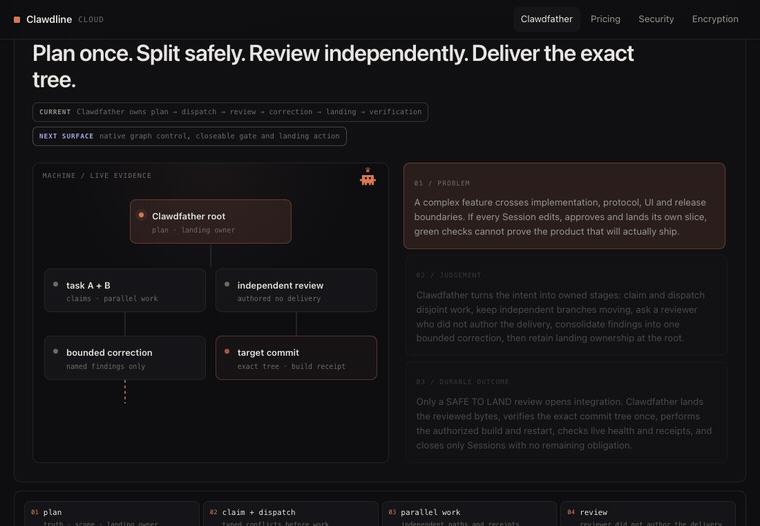
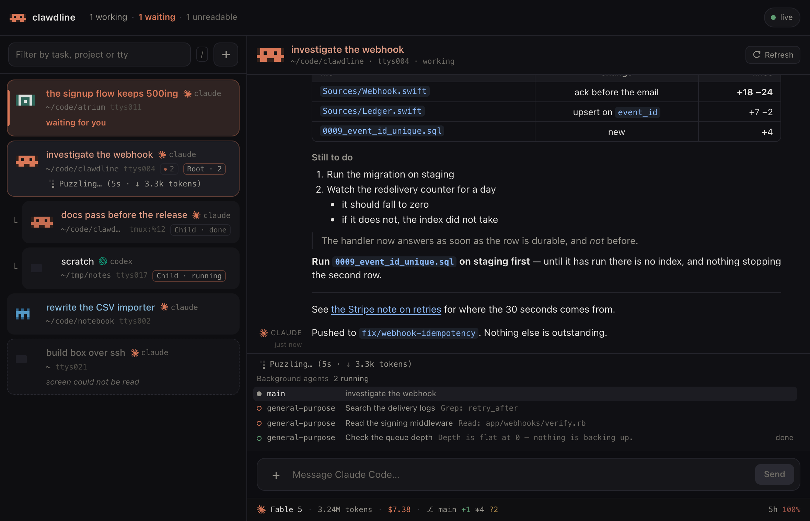
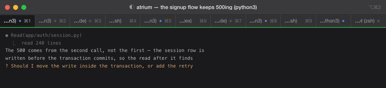
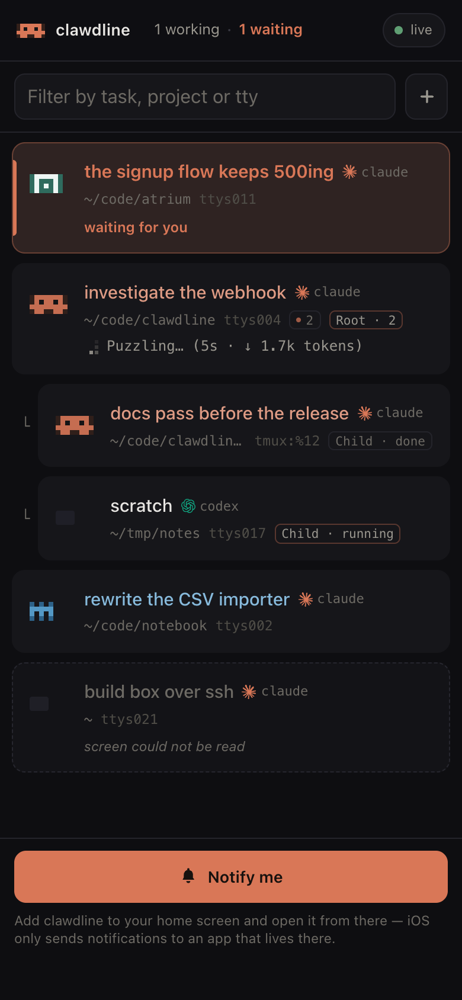
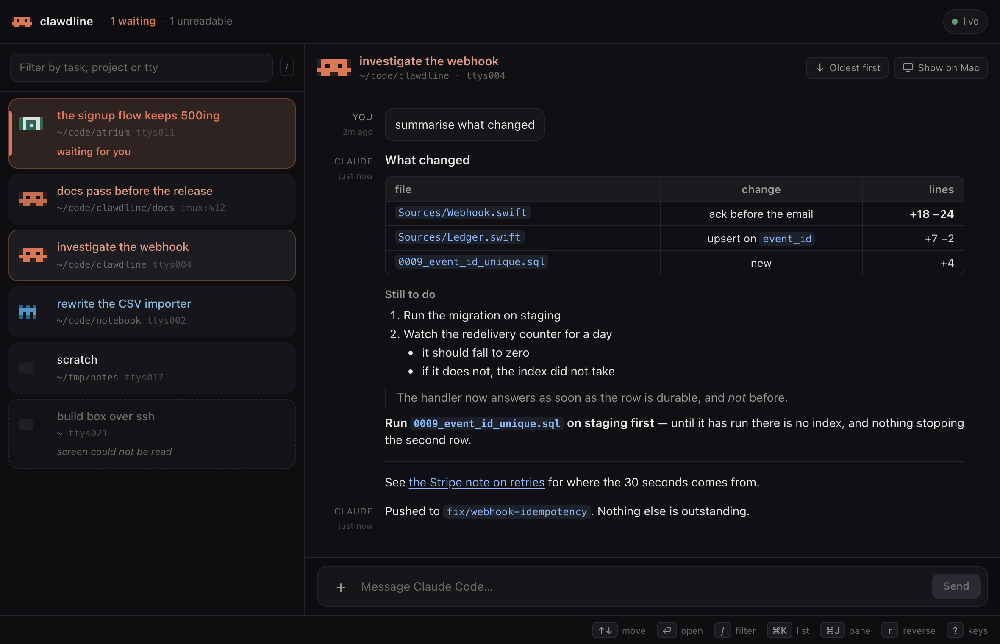
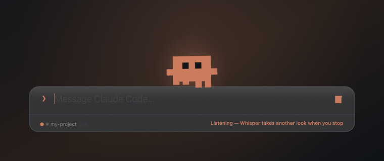
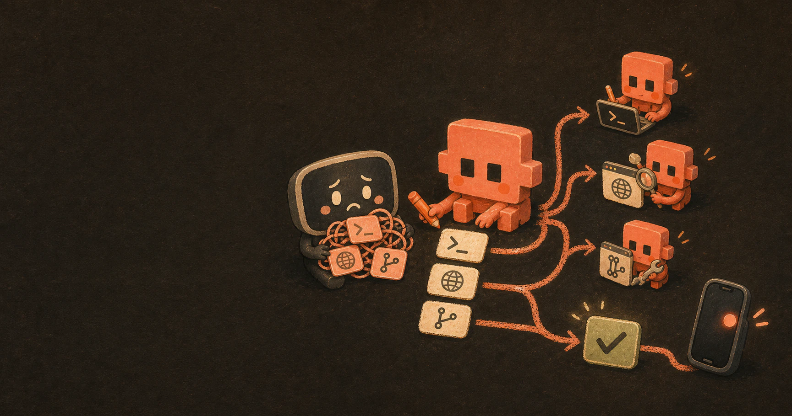
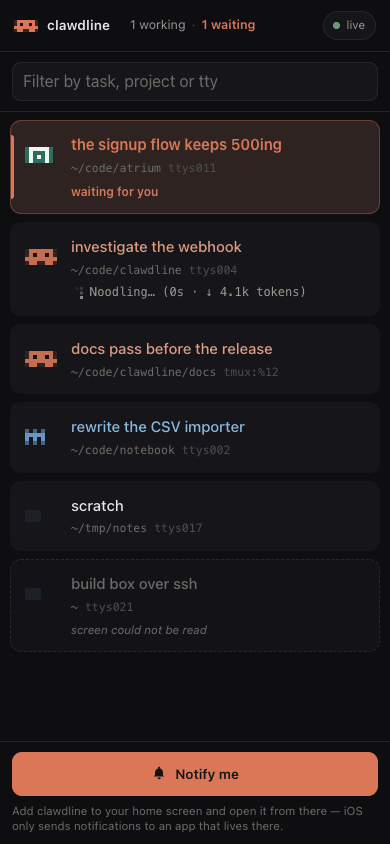

# Clawdline

**A local control plane for Claude Code and Codex: see every live session, hand work across
assistants, review it independently, and ship the exact tree.**

[](LICENSE)
[](#install)
[](Sources)
[](#install)

English · [繁體中文](README.zh-TW.md)

[Website](https://clawdline.com/) · [Install](#install) ·
[The Clawdfather loop](#the-clawdfather-delivery-loop) ·
[Protocol](docs/clawdline-protocol.html) · [Public manual](https://clawdline.com/docs) ·
[Technical documentation](#documentation)

## The Clawdfather delivery loop

Most agent tools optimize one conversation or start more workers. Clawdline starts where that
stops being enough: several real terminal sessions, Claude and Codex in the same project, work that
can collide, a result that still needs an independent reader, and a target branch that must contain
the reviewed bytes before anybody calls it done.

**Clawdfather is the durable, machine-wide coordination role.** It keeps the map of Sessions,
tasks, waits and pending landings; turns one intent into owned work; routes each part to the right
assistant; asks a different session to review the delivery; sends findings through one bounded
correction; and keeps integration at the root until the exact commit tree has been verified and
released.



```text
intent
  → plan + landing owner
  → claims + parallel Claude / Codex dispatch
  → independent review
  → one bounded correction
  → root-owned landing
  → exact-tree verification
  → authorized build, restart and live receipt
```

This is deliberately more than a spawn button:

- **Delivered is not reviewed.** A child returning `success` proves that an answer arrived. A
  reviewer who did not author it decides whether it is safe, and names reproducible evidence.
- **Reviewed is not landed.** `SAFE TO LAND` opens integration; it does not finish it. The root
  stages named paths, reads the actual staged diff, records the target commit and remains the
  owner until the broker can verify the landing.
- **Green is about a subject.** A working-tree check proves a child's overlay. Release acceptance
  runs against the exact candidate tree, then build/restart and live health get their own receipts.
- **Parallelism has boundaries.** Declared write paths are checked before a shared-tree task starts;
  non-file operations can serialize; waits, releases and completion acknowledgements are typed
  records rather than lines somebody hopes another Session noticed.

Today this workflow runs through one explicitly registered Clawdfather Session and Clawdline's
existing resume, dispatch, review, landing, closeability and verification primitives. A typed
decision-and-delivery graph now travels with each task; the broker validates its dependencies,
derives its live frontier from durable receipts, and publishes a control sheet through the API.
The visual editor is still a future UI. Decisions about product intent, irreversible effects,
spend, credentials, privacy and security still belong to a person.

## Why Clawdline is different

| | |
| --- | --- |
| **It coordinates the sessions you already have.** | No wrapper, replacement runtime or special way to start work. A Claude Code or Codex process you opened by hand appears beside the sessions Clawdline dispatched; quit the app and they keep running. |
| **Claude and Codex are peers, not separate worlds.** | Either assistant can dispatch the other. Every child remains a visible terminal Session with a transcript, state, question, task record and usage — on the Mac and on your phone. |
| **The delivery graph survives the chat.** | Claims, waits, results, reviews, landing records, completion ACKs and closeability are durable evidence. A tab going quiet cannot silently turn pending work into completion. |
| **The project is the unit.** | Sessions, tasks, schedules, dev servers, branches, backlog, health and deploy state meet on one project row instead of being scattered across a terminal, a CI tab and a status page. |
| **Local first; Cloud adds reach.** | The free Mac app works without an account and installs nothing into either assistant. [Clawdline Cloud](https://clawdline.com/) is the optional encrypted route to another Mac, a phone or a runner; execution and the content key stay on hardware you own. |

## The fleet it coordinates



Nobody runs one coding agent for long. By the afternoon there are five, and two of them were not
started by you — a session decided the diff wanted a second reader and sent one off. What you have
then is not a row of terminals. It is a fleet with a shape: which of them is working, which is
stuck on a question, which assistant each one is, and **which of them asked for which**. A terminal
window cannot show you any of that. It offers tab titles, and a tab title is a *task* — two
projects can be working on tasks that read alike — and no plugin can fix it, because plugins add
commands, agents, hooks, MCP servers and skills, not TUI layout.



Eleven sessions, as a terminal has them. Every title is clipped from the left until all that
survives is the process in brackets, so the bar reads `…n3)` `…de)` `…sh)` eleven times over — and
one of those is a Codex session, which the bar has no way of saying either. The only one that
tells you what it is, is the tab already in front of you. Finding out about the other ten means
visiting them, one at a time, while they carry on without you.

None of that is a failure of the terminal: a tab is a process, and a process is all a tab ever
promised to be. It is simply not the shape the work has. **What a fleet looks like with its shape
drawn is the picture at the top of this page** — not more information, the same information
arranged, so
which one is working, which one is stuck, and which one is another session's errand is something
you see rather than something you go and look for.

Clawdline draws the shape and lets you act on it. Press <kbd>⌘</kbd><kbd>K</kbd> and every session
is a row that says what it is doing — **working, finished, or waiting for an answer** — with the
sessions a session sent away indented underneath it. Press <kbd>⌥</kbd><kbd>Space</kbd>, type, and
the message lands in whichever of them you point at.

**Nothing is installed into Claude Code or Codex.** No hooks, no MCP server, no wrapper around
the `claude` or `codex` command, no edits to your settings. Clawdline reads the screens your sessions
are already drawing and the records they are already writing — which is why the four sessions you
started by hand an hour ago appear in the list too, not just the ones something dispatched for you.
iTerm2 is supported directly; every other terminal works through tmux.

**Codex sessions are in the same list**, on the same terms: what each is doing, what it has said,
what you send it, and opening a new one — and either assistant can be on either end of a dispatch,
so a Claude Code session can send work to a Codex child, or the other way round.
[The whole of what that means →](#codex-in-the-same-bar)

Nothing to migrate, nothing to undo. Quit it and your setup is exactly as it was.

## Everything around the loop

| | |
| --- | --- |
| **Clawdfather: plan, delegate, review, correct, land**<br><br>One registered machine-wide role keeps Session, task, wait and landing evidence in view while feature-sized work stays in independent tabs. It can decompose across projects, route around one exhausted assistant, require independent review and retain root-owned integration.<br><br>[How feature-sized dispatch is governed →](docs/dispatching.md) · [Verification and review →](docs/verification-workflow.md) |  |
| **The fleet, and who dispatched whom** `⌘K`<br><br>Every Claude Code and Codex session on the Mac in one list — the ones you opened yourself, and the ones a session dispatched sitting indented under whoever asked for them. One glance answers what a row of tabs cannot: which of them is waiting on you, and which of them is another session's errand.<br><br>[Handing work to another session →](#handing-work-to-another-session) |  |
| **Which session wants you** `⌘K`<br><br>A working session carries the live line Claude Code draws for itself; a session with a question on screen is the loud one, because that is the only state costing you something for every second it goes unnoticed. Each row wears its project's own mark.<br><br>[How each state is decided →](docs/interface.md#which-session-wants-you) |  |
| **Read a session back** `⌘J`<br><br>Not a screenshot of a terminal. Clawdline reads the session's transcript file, so you get real message boundaries, full history, headings, bordered tables and code — with finished runs of tool calls folded to one line each. `⌘F` fills the screen.<br><br>[What the pane does →](docs/interface.md#reading-a-session-back) |  |
| **The same sessions on your phone**<br><br>Your Mac serves a page; your phone opens it and reads every session, transcript and all — and types into them if you arm the second switch. Off by default, bound to loopback, every device paired by a code shown only on the Mac. Reaching it from outside is `cloudflared`, which is your own install.<br><br>[From a browser, or your phone →](#from-a-browser-or-your-phone) |  |
| **Dictation that keeps up with two languages**<br><br>Words appear as you speak, and the recogniser is fed your own prompt history, so `webhook` and `rebase` survive being said inside a Chinese sentence. Claude Code's own `/voice` streams audio to Anthropic's servers, needs a Claude.ai account, and [does not support Chinese](docs/compatibility.md#claude-code-has-its-own-dictation-now). Add [Whisper](docs/whisper.md) — one `brew install` and one model file — and a second pass reads the same audio back, so one sentence can hold two languages.<br><br>[What it does while you talk →](docs/interface.md#talk-instead-of-type) |  |

**Says it in the notch, too.** Your mascot lives in the camera housing. It sleeps while nothing
runs, leans out while something does, names the session that wants you, and dances when a long job
finishes. On a display without a notch it becomes a pill below the menu bar. `"notch": false`
removes it entirely. [More →](docs/interface.md#the-notch)


Also:

- **Close is a proof, not an idle colour** — the broker projects whether a Session is blocked,
  needs an attestation, is safe, or is unknown from current process identity plus tasks, waits,
  pending landings, handoffs, completion delivery and declared obligations. An opted-in close uses
  an opaque compare-and-swap version and fails closed if the evidence moved.
  [Contract →](docs/session-closeability.md)
- **Local usage analytics, with the gaps still visible** — filter and group by model, assistant,
  origin, project, day, coverage or task; cost is never invented for an unknown model or billed
  plan, and missing-source coverage stays separate from a deliberate zero.
  [API →](docs/api.md#get-v1orchestratorusageanalytics-analyticscsv-analyticsjson)
- **Your dev servers, where you already type** — `⌘S` lists each project's long-running processes,
  how long they have been up, every port as a link, and start/stop/restart. Clawdline never spawns a
  process of its own; it runs the commands your repo declares in `.devstack.json`.
  [Format →](docs/devstack.md) · [Adopting it →](docs/devstack-adopting.md)
- **Which project, not just which task** — the bar names the repository, its branch, what is
  uncommitted, a deploy in flight, whatever long thing is running in another tab, and a backlog,
  with the project's own icon and colour; the browser page and a paired phone add a milestone.
  Seven kinds of small file, and a project writes as many of them as it has something to say
  through. [Format →](docs/project-status.md) · [All seven →](docs/connect.md)
- **A progress bar for anything that takes minutes** — a test run, a build, a data import, a long
  encode, a deploy script of your own: whatever is taking the time writes one small file and the bar
  draws how far it has got, phase by phase, with a tick or a cross at the end. It is a protocol
  rather than a test-runner feature, so the assistant in the next tab can use it too — instead of
  four silent minutes, the person watching gets to see where the job is.
  [`clawdline-progress` and the format →](docs/project-status.md#a-long-local-operation-in-flight--run-pathjson)
- **The terminal's tab follows** — move through the list and iTerm2 moves with you, without coming
  to the front. The bar's target and the tab in front of you stop being two different sessions.
- **Images and files** — drop a file on the window or paste an image. Images arrive in Claude Code
  as `[Image #3]`, exactly as a paste does; anything else goes as a path.
  [How →](docs/interface.md#dropping-in-a-file-or-an-image)
- **Claude Code and Codex, side by side** — both appear in the same list, are read the same way
  and take the same prompts. A row says which it is only when the list is holding both, because on
  a Mac running one of them the word would be on every row and separate nothing — and when it does,
  it wears that assistant's own product mark beside the word. A Codex session can name itself, too.
  [What it takes →](#codex-in-the-same-bar)
- **Call a session what it is about** — a row's name comes from the conversation's own records: what
  the assistant called it in its transcript or thread metadata, or the task a dispatched tab was
  opened for. **Never the tab's title**, which anything in the terminal may overwrite — one iTerm2
  restart once left eleven of fifteen rows reading `Default`. And neither of those is always the
  thing you would call it. Press the title on the Session info card and type your own: it outranks
  every automatic name, and emptying the field hands that name back. The name belongs to the conversation
  rather than to the tab, so the next session started in the same window is named for itself again.
  Codex takes the new name on its thread at once; Claude is told with `/rename` when it is idle and
  not showing a menu, and while it is busy the name still changes here — the answer says the
  downstream one did not change rather than implying it will catch up.
- **Your skills, from the box** — type `/` in a Claude Code session and the bar lists the skills
  that working directory can actually reach, filtered as you type: project, personal and plugin
  skills, in the precedence a typed command would get. Names and descriptions only, read off
  `SKILL.md` — opening a menu never opens a skill's body. The same list is on the phone.
- **Prompt history** — <kbd>↑</kbd> and <kbd>↓</kbd> walk back through what you have sent, and those
  same words are what dictation is told to expect.
- **Press it instead of typing it again** — the project mark on a session's header opens that
  project's snippets: the lines you type several times a day, one press each. A press puts the
  words in the composer and the send button is still the only thing that sends, so a mis-tap in a
  pocket cannot run `commit, push, deploy` in the wrong session. Kept on the Mac, scoped to one
  project or to every one, and readable on a phone over the relay.
  [What the mark does →](docs/interface.md#the-mark-in-a-sessions-header) · [The routes →](docs/api.md#the-snippets-a-session-can-press)
- **Bring your own mascot** — the character is one JSON file: a pixel grid, a palette and seven
  routines. No fork required. [Format →](docs/mascots.md) · [Gallery →](docs/gallery.md)
- **Fourteen languages** — English, Chinese (Traditional and Simplified), Japanese, Korean,
  Spanish, Portuguese, French, German, Russian, Italian, Hindi, Indonesian and Turkish. The
  interface follows the system, or pin one in the config.

> ### Connecting your own project
>
> Paste this repository's address at your Claude Code agent and ask it to connect your project.
> **[docs/connect.md](docs/connect.md) is written for it** — all seven files a project can write,
> the formats, and how to check its own work. Every integration is a small JSON file that Clawdline
> reads; nothing is installed and no dependency is added to your project.
>
> *"Connect this project to Clawdline — https://github.com/sainteye/clawdline"* is the whole
> instruction.

## Handing work to another session

The delivery loop above is built from an intentionally small broker. A session you are talking to
is a session you are waiting on, and some of what gets asked for —
draw this, run the suite, read this diff — does not need the conversation it was asked in. A
session holding the `clawdline` skill writes the task down and asks the app to run it. Clawdline
opens a terminal tab, starts the assistant the task named, types the briefing into it, watches for
the child's answer, adds up what it spent, and tells the session that asked.



**The child can be either assistant, on any model.** One Claude Code session can send the drawing
to a Codex child and the diff to a Claude Code one in the same breath, and name `haiku` for a
mechanical pass or `opus` for a judgement somebody will act on; what the app has to know is which
binary to start and which screen to read afterwards, and it knows both already — which is why one
Mac runs a mixed fleet without a framework in the middle of it. And the drawing is a real drawing:
Codex has an image model built in, so what comes back is a PNG rather than a description of one.
Dispatching is a plain local HTTP route, so anything running as you can ask for a child; the skill
that writes the task down is [in this repository](skills/clawdline/), for Claude Code.

**How work gets handed out is a file you edit** — two of them, if this machine has something to
say about itself. `~/.config/clawdline/dispatch-policy.md` is the base, and the optional
`dispatch-policy.local.md` beside it holds what is true only here; both are read on every dispatch
and composed into the briefing of **every** child, with the local one last so that its more
specific rules win. Which assistant for which kind of work, which model deserves which job, how big one task should be, when
small work is batched instead of dispatched, what shape the graph should be. The default it arrives
with is [`Resources/dispatch-policy.md`](Resources/dispatch-policy.md) in this repository, so it can
be read and argued with before you install anything; your machine's copy is yours to edit, and
deleting the contents means there are no house rules. Every task also
carries a `plan`, the whole graph it is one node of, so a leaf knows what its answer feeds instead
of writing a report nobody asked for.

**A dispatched agent you cannot see is a background job; one you can watch, answer and stop is a
session.** So a child here is not a job id in a queue. It is a row in the same list as everything
else, indented under the session that asked for it, carrying its own state, its own transcript and
its own token count — on the Mac and on the phone, where you can read what it is doing, answer the
question it is stuck on, or end it. What it spent is added up per task, in tokens and, where the
model has a published price, in dollars.

**Dispatching has a door of its own.** It sits behind a `0600` file only a local process can read,
so a paired phone can watch the tasks and never start one — typing into a session and spawning
five more are not the same right. And **the tree has a bottom, one level down**: a session may have five
children out at once, and a child opens nothing — work inside it that wants to run in parallel goes
to that assistant's own subagents, which cost no tab and pass through no broker. Twenty dispatched
terminals across the whole Mac is already more than anybody wants to audit; without a floor it is a
fork bomb with a language model in it.

**[docs/clawdline-protocol.html](docs/clawdline-protocol.html)** is the whole protocol on one
page, written for somebody who just installed this: how a task is dispatched, what claims and file
waits guarantee, why landing belongs to the root that asked, and what each promise is worth. Open it
from a checkout; it needs nothing from the network.
**[docs/orchestrator.md](docs/orchestrator.md)** is the same protocol in reference form: the file
formats, the credentials, the lifecycle and the routes with `curl` transcripts.
**[docs/dispatch-permissions.md](docs/dispatch-permissions.md)** is the part that bites: the four
places a dispatched session stops to ask, which two of them no setting reaches, and why the flag
that reads as "get on with it" quietly means the opposite on the cheapest model.

## Several sessions, one working tree

Dispatching multiplies a problem no list can draw. Two sessions in one repository are two writers
on one working tree, and they cannot see each other. One stages the half-finished edit another was
still typing. Two runs of the same suite write their test binary to the same fixed path and race
for it. Nothing reports an error at the time; what you get is work that was there an hour ago and
is not there now.

Neither session knows enough to stop that. The app does — every dispatch goes through it, and it
already knows where every other task is working and what each one said it would touch.

**It says when somebody else is in that folder.** A dispatch into a directory another root's task
is working in still opens, because two sessions in one repository is a normal afternoon rather than
an error — but the answer carries a warning naming that task, and the other root gets a line about
yours. When both tasks have declared claims that rule the collision out, nobody is interrupted —
the precise answer replaces the coarse one. Visibility first, before anything is refused.

**A task can name what it will write, and a clash is refused at the door.** `claims` is a list of
paths relative to the project — `["Sources/Orchestrator.swift", "docs"]` — where a directory covers
everything under it. If a live task belonging to a *different* root the app could actually identify
has claimed a path that equals,
contains or sits under one of yours, the dispatch is refused before a tab is opened, and the
refusal is the part worth having: which task is holding it, whose it is, when it started, every
conflicting path, and how long to wait. Two tasks under the same root may overlap and are only
warned — that root drew the graph and may have ordered the work itself.

**Work that is not a file can take turns.** Some collisions have no path to declare: `./test.sh`
here writes its test binary to one fixed location, so two runs that share no source file still
overwrite each other. `serialize` names those operations — `["build"]` — and tasks that want the
same name queue in the order they were created, each taking every name it asked for at once, so two
of them cannot deadlock over a crossed pair.

**Where this stops is worth saying plainly.** A claim is a gate at dispatch, not a lock on the
filesystem: a child that ignores its briefing can still write outside what it declared. What the
gate removes is the window where two sessions have both already been briefed, are both already
editing, and the two people behind them have to negotiate about work that is half done. And it
arbitrates *tasks*. The session you opened in a tab yourself was never dispatched, so nothing above
sees it at all — which is what the next section is for.

**And keep separate lines of work in sibling checkouts, not a repository nested inside another.**
It is tempting to keep a private half inside a public checkout — a folder the outer repository
gitignores, carrying its own git history. We tried it; the machinery above cannot see it. Worktree
isolation copies tracked files, and a directory the outer repository ignores is not tracked — so a
task isolated into a worktree arrives without the very folder it was sent to change, and a branch
of the outer repository can never deliver the nested work either. Claims still stand guard, but
that is the coarse tool doing the sharp one's job. Two sibling checkouts give each repository its
own worktrees, claims and sessions, and cost only the convenience of editing both halves in one
folder.

**And there is a hook for the commit itself.** Claims are a gate at dispatch; the moment a commit
is typed, this repository's own `pre-commit` guard reads them back and refuses a commit carrying a
path another session's live task claimed, or one concluding a merge somebody else resolved by hand.
It is not on until you switch it on — `sh tools/install-git-hooks.sh`.

[Claims, leases, and the queue in full →](docs/orchestrator.md#reserving-declared-write-paths-at-dispatch)
· [the commit guard →](docs/shared-tree-guard.md)

## Rules an agent reads on the way in

The app stands in the door of a dispatch. Nothing stands in the door of the terminal you opened
yourself, and most of the sessions in a working tree are those. What reaches them is whatever is in
the tree when they start reading — so that is where the rules go.

This repository keeps its operating rules in [`AGENTS.md`](AGENTS.md) and its implementation-free
project vocabulary in [`CONTEXT.md`](CONTEXT.md). The rules are the ones a shared tree
needs rather than a style guide: everything already uncommitted when you arrive is somebody else's
unfinished work; stage by naming each path and never `git add -A`; read the staged diff before
committing rather than trusting a clean `--stat`; a worker session hands its changes back instead
of committing them; do not run the build, because it replaces the app the person is using; and
declare `claims` for every path a task may write. [`CLAUDE.md`](CLAUDE.md) is a single line pointing
at that file — the two assistants look for different names, and one set of rules should not have to
be maintained twice.

**Nothing in Clawdline reads either file.** The assistants do, on their own, in whatever repository
they are opened in, which is what makes the pattern worth copying rather than installing: two files
at the root of your own project, no dependency, nothing to undo. What belongs in them is what a new
session cannot work out from the code — which changes are not its to touch, how to stage, and what
it must never run. A repository with neither still works exactly as it did; it simply has nothing to
say to whoever opens it next.

### Put the Clawdline rules where every project can read them

A repository's `AGENTS.md` or `CLAUDE.md` reaches only the agents opened in that repository. If
these Clawdline operating rules should follow agents across projects, put a block delimited by
`<!-- clawdline rules: begin -->` and `<!-- clawdline rules: end -->` in `~/.codex/AGENTS.md`, and
put the corresponding block in `~/.claude/CLAUDE.md` for Claude Code. The canonical text to copy
is under [the localhost-failure rule](AGENTS.md#prove-a-localhost-failure-before-calling-clawdline-offline)
and [the recurring-stall rule](AGENTS.md#repeated-communication-stalls-require-a-capacity-and-protocol-audit)
in this repository's `AGENTS.md`; the short version below carries the same requirements.
Project-local instructions may override those global defaults. Clawdline and `install.sh` do not
edit either global file; adding or updating the block is an explicit setup step.

Keep these two rules in that block:

- **Prove a localhost failure before calling Clawdline unavailable.** A restricted sandbox's
  connection failure to `http://127.0.0.1:7717` is not evidence that the service is down. Read the
  currently configured port, then repeat the same minimal, read-only `GET /v1/health` request in
  an execution environment that is allowed to reach loopback. Only that permitted request still
  failing justifies calling the service unavailable. This is an agent operating rule, not a
  request for a person to disable their sandbox: obtain any extra localhost permission through
  the provider's normal approval flow. And do not replace a failed Clawdline dispatch with a
  provider-native child session while describing it as a Clawdline task.
- **Audit recurring communication stalls end to end.** Repeated slow sends, loading states,
  pending messages or event loss are not closed by changing only a timeout or spinner. Trace
  connection and queue ownership, queue and concurrency bounds, backpressure, synchronous
  external calls, retry amplification, idempotency and delivery receipts, SSE revision and resume,
  stale snapshots, and failure isolation. Distinguish `accepted`, `executed`, `delivered`,
  `observed`, and `acknowledged` instead of treating one HTTP response as all five states.

Task completion follows that rule in the broker itself. The terminal outcome and an idempotent
completion outbox are persisted together before a background terminal send; retries keep one
`notice_id`, and only the explicit root ACK records observation and acknowledgement. Use
`GET /v1/orchestrator/completions?pending=true` for the machine ledger and keep task/result polling
as the fallback. Eight unsuccessful attempts become a typed `dead_letter`; after repairing the
cause, a machine-authenticated operator can explicitly rearm it through
`POST /v1/orchestrator/completions/reconcile` with boolean `include_dead_letter`. A new dispatch
that supplies a watched terminal id instead of its assistant's
process-bound conversation id is refused with `root_identity_is_terminal`, the canonical id and
the actual assistant even when the caller mislabeled it; unknown or conflicting identity remains
nullable rather than guessed. A grandchild completion reaches its parent only while the full
terminal/assistant/TTY/PID/start/transcript/conversation tuple still matches. A proved Coordinator
rebind validates an old task with its historical assistant, then routes completion with the current
canonical conversation-and-assistant tuple, including Codex-to-Claude and Claude-to-Codex moves.

## Install

For the complete zero-to-first-Session path, Shell and terminal setup, browser/phone access,
Clawdline Cloud, E2EE, and troubleshooting, use the
**[public manual](https://clawdline.com/docs)**. First choose how you want to install; both paths
install the same Mac app.

### Ask an AI to install it (recommended)

Paste this whole prompt into Claude Code or Codex already running on this Mac:

```text
Install Clawdline for me. First read https://clawdline.com/docs/install and
https://github.com/sainteye/clawdline/blob/main/install.sh, check that this Mac meets the
requirements, explain the installation method and commands you plan to use, then install it and
verify that Clawdline opens. Do not change my Claude Code, Codex, or project configuration.
```

The AI can choose the installation method that fits this Mac. It will still stop for macOS
permissions or system actions that need your confirmation.

### Install it yourself

Choose one method below. For a first install, the inspectable installer script is recommended.

**Script**

```sh
curl -fsSL https://raw.githubusercontent.com/sainteye/clawdline/main/install.sh -o install.sh
less install.sh          # inspect the exact script before your Shell runs it
bash install.sh          # or: bash install.sh ~/Applications
```

**By hand** — download the `.zip` from
[Releases](https://github.com/sainteye/clawdline/releases/latest) and unzip it into
`/Applications`. If the check below says `adhoc`, clear the quarantine flag once:

```sh
xattr -dr com.apple.quarantine /Applications/Clawdline.app
```

**From source** — no package manager, no dependencies, a few seconds:

```sh
git clone https://github.com/sainteye/clawdline.git
cd clawdline && ./build.sh
open ~/Applications/Clawdline.app
```

> **Do you need the `xattr` line?** Ask the build you downloaded rather than this page, because the
> answer changes with the release and a page cannot:
>
> ```sh
> codesign --display --verbose=2 /Applications/Clawdline.app 2>&1 | grep -E 'Authority|Signature'
> ```
>
> `Authority=Developer ID Application: TsunamiWorks Co., Ltd.` means it is signed and notarized: it
> opens like any other download and the `xattr` line does nothing for you. `Signature=adhoc` means
> it is not, and macOS refuses it until the quarantine flag comes off.
>
> **Every release up to and including v0.6.0 is ad-hoc**, so today the line is needed. It is not a
> missing Apple account — the certificate exists and `tools/release.sh` is built around it, with
> `notarytool submit --wait`, a stapled ticket and `spctl --assess` all of which it refuses to
> publish without. No release has been cut through that path yet, and the first one that is will
> answer `Authority=` above. `install.sh` already makes this check for you and only strips
> quarantine when the answer is `adhoc`.
>
> An app you compiled yourself was never downloaded, so building from source skips all of it.

The first time you send something, macOS asks whether Clawdline may control iTerm2. Say yes — it
cannot send anything without that. Menu bar ✳ → **Launch at login** makes it stick around.

### What works immediately, and what you switch on

The bar is the whole product on the first run: the sessions are already there, the hotkey already
sends, <kbd>⌘</kbd><kbd>J</kbd> already reads one back. Everything else is off until you go and turn
it on, in whatever order you want it.

| | Where you turn it on | The page for it |
| --- | --- | --- |
| **The bar** — see, send, read back | nothing; macOS asks once for iTerm2 | — |
| **Your project's own row** — servers, branch, mark, deploy, whatever long job is running here, backlog; the browser page and a paired phone add a milestone | seven kinds of small JSON file in and beside your repo; paste this repository at an agent and it writes them | [connect.md](docs/connect.md) |
| **The page, here or on a phone** | Settings → Remote → *Let a browser or your phone see your sessions*, then *Open in a browser* or *Pair a phone…* | [remote.md](docs/remote.md) |
| **Typing from a paired device** | Settings → Remote → *Let a paired device write into a session* | [remote.md](docs/remote.md) |
| **Reaching it from outside** | Settings → Remote → *Reach this Mac from anywhere*; the `cloudflared` it runs is your own install | [remote.md](docs/remote.md#the-tunnel) |
| **Handing work to another session** | the same *Let a browser…* switch, then one of [the skill's](skills/clawdline/) two files into `~/.claude/skills/clawdline/` | [orchestrator.md](docs/orchestrator.md#the-skill) · [dispatch-permissions.md](docs/dispatch-permissions.md) |
| **A session saying its turn is done** | nothing, if it is picking up a handoff — the package carries the line. Otherwise the skill above, and optionally [one line in your global `CLAUDE.md`](docs/orchestrator.md#and-one-optional-line-in-your-global-claudemd) | [orchestrator.md](docs/orchestrator.md#the-skill) |
| **A question noticed in a second rather than twenty** | Settings → Claude Code hooks → *Install* | [hooks.md](docs/hooks.md) |
| **Two languages in one sentence** | one `brew install`, plus the model file it reads | [whisper.md](docs/whisper.md) |

**Dispatching rides on the same local switch as the page, and on a different credential.** That
first switch is what puts a door on `127.0.0.1`; what opens it for a dispatch is a `0600` file in
your home directory, written for you, which no paired device was ever given and no page can read.
Turning it on for dispatching alone puts nothing on your network: the listener is loopback, the
tunnel is a separate switch, and that one refuses to start until a device has been paired.

**Sharing a working tree has no switch of its own.** The folder warning applies to every dispatch;
`claims` and `serialize` are fields a task fills in; `AGENTS.md` is a file in your repository that
this app never reads. What is left to configure is how many children a session may have out, and
how far each may go before it stops to ask — the *Agent tasks* rows of Settings → Remote, or
[`orchestrator_*` in the config](#configuration).

## Use it

Press <kbd>⌥</kbd><kbd>Space</kbd> in iTerm2, type, press <kbd>Enter</kbd>.


| Key | Action |
| --- | --- |
| <kbd>⌥</kbd><kbd>Space</kbd> | Show / hide the bar |
| <kbd>Enter</kbd> | Send to the current target |
| <kbd>⇧</kbd><kbd>Enter</kbd> | New line |
| <kbd>Tab</kbd> / <kbd>⇧</kbd><kbd>Tab</kbd> | Next / previous session |
| <kbd>⌘</kbd><kbd>K</kbd> | Open the session list |
| <kbd>⌘</kbd><kbd>1</kbd>…<kbd>⌘</kbd><kbd>9</kbd> | Jump straight to a session |
| <kbd>↑</kbd> / <kbd>↓</kbd> | History, when the field is empty |
| <kbd>⌘</kbd><kbd>J</kbd> | Read that session back |
| <kbd>⌘</kbd><kbd>F</kbd> | Fill the screen with it |
| <kbd>⌘</kbd><kbd>R</kbd> | Newest message at the top |
| <kbd>⌘</kbd><kbd>+</kbd> / <kbd>⌘</kbd><kbd>−</kbd> / <kbd>⌘</kbd><kbd>0</kbd> | Text size in that pane |
| <kbd>⌘</kbd><kbd>S</kbd> | The project's servers |
| <kbd>⌘</kbd><kbd>L</kbd> | Dictate instead of typing |
| <kbd>⌘</kbd><kbd>M</kbd> / <kbd>⌘</kbd><kbd>D</kbd> | Switch mascot / make it dance |
| <kbd>⌘</kbd><kbd>/</kbd> | Show the rest of the keys |
| Drag or <kbd>⌘</kbd><kbd>V</kbd> | Drop a file or paste an image |
| <kbd>Esc</kbd> | Close |

The hotkey only fires while your terminal is in front; everywhere else <kbd>⌥</kbd><kbd>Space</kbd>
is whatever it was before. Set `"scope_app": ""` to make it global.

**The bar always names its target along the bottom edge.** It never sends blind — a prompt box that
will not tell you where the text goes is worse than no prompt box at all.
[How the target is chosen →](docs/interface.md#which-session-it-sends-to)

## First choose where you want to control Clawdline

There are two goals. On a computer, use the local browser. On a phone, choose either Clawdline.com
or a Cloudflare Tunnel you manage. All three paths reach the same Sessions on the same Mac.

```text
I want to control Clawdline on this Mac
├─ From this computer's browser → local browser (no account)
└─ From a phone
   ├─ Through Clawdline.com → Clawdline Cloud (account + E2EE; currently preview)
   └─ At my own URL → Cloudflare Tunnel (you manage Cloudflare and the domain)
```

### Goal 1: Control it from a browser on this computer

In **Settings → Remote**, turn on *Let a browser or your phone see your sessions*, then choose
*Open in a browser*. Clawdline creates a device credential for that browser, opens
`http://127.0.0.1:7717`, and signs it in. This needs no Clawdline account, Cloudflare setup, or
phone pairing.

### Goal 2: Control it from a phone

The phone has two independent connection paths:

- **Through Clawdline.com:** sign in to Clawdline Cloud, connect this Mac under
  **Settings → Remote → Clawdline Cloud**, then approve the phone from an already trusted device.
  The relay carries signed ciphertext. Cloud account enrollment is currently a preview and is not
  generally available yet. See [Clawdline Cloud](docs/cloud.md) for the complete flow.
- **Through your own Cloudflare Tunnel URL:** first open the local browser and create at least one
  paired device. Install `cloudflared`, then choose a temporary address or *My own domain* under
  **Settings → Remote → Reach this Mac from anywhere**. Open that HTTPS address on the phone and
  finish pairing it. You manage the custom hostname, Tunnel, and Cloudflare account; see
  [Named Tunnel](docs/remote.md#named--your-own-domain) for the complete setup.

Whichever phone path you choose, viewing and control remain separate permissions. Leave *Let a
paired device write into a session* off when the phone only needs to monitor work; turn it on only
when the phone must send messages, start Sessions, or end them.

**The page is the same fleet, not a cut-down one.** Every session the Mac can see is on it, grouped
the same way — a dispatched child indented under the session that asked for it — with each one's
transcript, its state, the question it is stuck on and a box to answer it from. A phone that can
type can also start a session and end one; what it cannot do is dispatch, which is
[a separate credential this Mac never serves](#handing-work-to-another-session).

**Or pick up where you left off.** *Start a session* has a tick box that turns the project list
into the conversations you have already had in that project — from the selected assistant's own
history, filtered by typing part of one — and the row you press is `claude --resume <id>` or
`codex resume <id>` in a new tab rather than a new conversation. **The ones you had**, which is a
narrower list than the ones on disk: sessions this app dispatched to do a task are left out, as
are Claude `-p` one-shots. Claude names come from its transcripts; Codex names and first-message
previews come through its supported app-server, so neither index or title is invented here. One
that something is writing to right now says so and takes you to that session instead: two
processes on one transcript is a corrupted record, not a second opinion.



It is off in a fresh install, and stays off until you go and switch it on — a listening socket is
the difference between a program on your machine and a service on your machine.

What stands in the way of a request, in the order it meets them:

- **Loopback only.** The listener is created with a required local endpoint, so there is no
  interface on your network to find it on. The way out is a tunnel that dials *out*, never a port
  that waits.
- **The `Host` header is checked first.** DNS rebinding cannot change `Host`, so a request naming a
  host this server does not answer to is refused on the spot.
- **Cross-site requests are refused**, on the `Sec-Fetch-Site` header a page cannot forge. Anything
  that mutates is checked against `Origin` as well.
- **Everything else needs a device token** — 256 random bits, stored as a SHA-256 and compared in
  constant time. There is no exception for loopback, because once a tunnel is up, a phone in another
  country arrives from `127.0.0.1` like everything else.
- **Pairing needs your screen.** The six-digit code appears on the Mac and is never in the reply the
  asker got. Five guesses, two minutes, one pairing at a time.
- **Reading and writing are two switches.** Reading hands over a repository name and a task title;
  writing is remote code execution, because Claude Code runs `bash`.
- **A tunnel refuses to start until something has been paired**, and every pairing, revocation and
  send is appended to `~/.config/clawdline/remote-audit.jsonl`.

A paired device can also subscribe to notifications and buzz when a session starts waiting for you.
The message is sealed to the device, and names the session task, project and state.
With sending on, it can start a new session too, in a directory this Mac has already worked in: the
client never sends a path, only an opaque id out of a list the Mac built for itself.

With sending on it can also **close a session** — the assistant leaves through its own `/quit` or
`/exit` and the terminal tab it occupied closes behind it, joined into one action because the moment
the assistant leaves, the bare shell drops off the list and the page has nothing left to close — and
**bring a session's tab to the front** on the Mac without saying where it is. Typing `/` on the page
opens the same skill menu the bar has, over the same metadata-only route.

**With [Whisper](docs/whisper.md) installed, a phone can dictate into that box too.** The microphone
beside the send button records, your Mac reads it back with the model already on it, and the words
land in the box for you to edit before anything is sent — same engine, same language and same
vocabulary as the bar's own dictation, and the audio goes no further than your Mac. Every phone
already has a recogniser behind a permission prompt; what that one costs is the sentence. There is
no live text on a phone, because Whisper reads a finished recording rather than a stream, so you
watch a timer instead of words. It needs an https address, which a tunnel gives you, and it sits
behind the sending switch: a device that may only read has nowhere to put a sentence once it has
one.

**[docs/remote.md](docs/remote.md)** has the threat model in full, including what this does *not*
defend against. **[docs/api.md](docs/api.md)** is the HTTP surface a script or a plugin talks to:
every session, every transcript, an event stream, and `curl` as the only SDK.

## How it works

**Reading.** Clawdline lists every iTerm2 session and tmux pane, checks each one's TTY against
`ps`, and keeps the ones actually running `claude` or `codex`. State comes from each session's own
screen — a spinner line means working, a menu with a caret parked on it means waiting, and a screen
that could not be read reports *unknown* rather than *idle*, because drawing "no idea" as "idle"
would be a confident wrong answer about somebody's work. Where a record exists on disk, the
<kbd>⌘</kbd><kbd>J</kbd> pane reads that instead of the screen.

**Writing.** Text is not sent as synthetic keystrokes and is not written to the terminal's pty —
you cannot write to another process's TTY on modern macOS. It goes through iTerm2's scripting
interface (or `load-buffer` + `paste-buffer` in tmux), wrapped in a bracketed paste:

```
ESC[200~ your text, newlines and all ESC[201~     ← one paste, not a row of Enters
CR                                                ← then a single Return to submit
```

Without that wrapper, a two-line prompt submits itself after the first line. The other benefit is
that the terminal never has to come to the front, which is the entire point.

**Optional hooks.** Away from the bar, a reading happens every twenty seconds, so a permission
dialog can sit unnoticed for a while. **Settings → Claude Code hooks → Install** puts nine matcher
groups, under eight event names, in `~/.claude/settings.json`; after that, a note lands the moment
a turn starts, ends, or needs an answer, and the reading happens in under a second instead. A note
only says *when* to look — never what the screen says — so the screen remains the authority.
Removing the hooks leaves nothing behind. [The full contract →](docs/hooks.md)

## Codex in the same bar

Codex sessions sit in the same list as Claude Code ones and take the same four things: **you can
see them, read what they have said, send them work, and open a new one.** Nothing is installed into
Codex either — it is read the same way, off what it already draws and already writes.

| | |
| --- | --- |
| **Seen** | A tty running `codex` is a session, whether that is the native binary or the published Node shim, which spawns it. `codex exec`, `codex sandbox` and the servers are the same binary doing something you cannot type into, so they are left out rather than offered as somewhere to send work. **Being left out travels down the process tree, not across the tty:** interactive Codex now starts `codex app-server` beside its own UI, and a refused child must not disqualify the parent that spawned it. |
| **Read** | <kbd>⌘</kbd><kbd>J</kbd> reads the rollout Codex is writing — `~/.codex/sessions/YYYY/MM/DD/rollout-….jsonl` — and lays it out as the same conversation a Claude Code transcript becomes. **Which file belongs to which session is a fact, not a guess:** a Codex process holds its own rollout open, so it is asked outright, which is what keeps two sessions in one directory from showing each other's work. Its subagents write files of their own in the same folder, and those are told apart by what Codex writes in the first line. |
| **Sent** | The same bracketed paste and the same single Return. A question on screen is read the same way too — numbered rows under a caret — and a bare digit answers it from the phone, which was checked against a real dialog rather than assumed. |
| **Started** | *Start a session* offers whichever of the two this Mac has, and the row you press opens it there. From a phone the assistant is a **name** in the path — `POST /v1/places/:id/start/codex` — resolved against a two-case list, never a command that travels. |

One difference worth naming: **background agents are a Claude Code row only.** Codex sends
subagents off too, but Clawdline's count comes from a directory Claude Code writes and nothing else
does, so a Codex session that has three out looks like one thinking hard.

Codex ends on `/quit` where Claude Code ends on `/exit`, and each refuses the other's — which is
why *End* knows which it is talking to. If Codex lives somewhere other than `~/.codex`, set
`codex_home` in the config; an app launched from Finder cannot see your `CODEX_HOME`.

**Optional automatic names.** Turn on *Name new sessions* in Settings and Clawdline asks the
configured small Codex model for one title after the first request. Codex uses it directly. Claude
Code normally writes its own title; Clawdline uses the model only when the first turn has finished
and that title is still absent. The helper run is ephemeral, uses low reasoning with tools disabled,
and never replaces a name you or Claude Code chose. It is off by default because each fallback is a
real Codex turn and spends Codex usage.

Built and used against **Codex 0.149.0** and **Claude Code 2.1.235**. Neither screen is a promised
interface: [what is read, and what you would see if it changed →](docs/compatibility.md)

## Other terminals: run Claude Code in tmux

Terminal.app, Warp, Tabby, Ghostty, Alacritty and Kitty all work, provided Claude Code runs inside
tmux:

```sh
tmux new -s work
claude
```

That is the whole setup, and tmux needs no macOS permission at all — it is an ordinary subprocess,
not cross-app automation. If your terminal is not iTerm2, widen the hotkey scope so
<kbd>⌥</kbd><kbd>Space</kbd> fires there too:

```json
{ "scope_app": "com.apple.Terminal,com.googlecode.iterm2" }
```

**Why not support those terminals directly?** Because they cannot receive text. Terminal.app's
`do script` returns success and delivers nothing to a program blocked on `read`; Warp and Tabby have
no equivalent interface. The only route left is synthetic keystrokes, which needs the accessibility
permission — the right to observe every key you press, for a tool whose whole job is opening a text
box — and needs the terminal in front, which is the thing this exists to avoid.

## Configuration

Menu bar ✳ → **Settings…** has a control for everything worth changing, and every control applies
the moment you move it. Underneath is `~/.config/clawdline/config.json`, which is hand-editable and
stays the truth. Editing it while the app is running is fine: it writes back only what it changed
itself.

**The bar**

| Key | Default | |
| --- | --- | --- |
| `hotkey` | `option+space` | cmd / option / control / shift + one key |
| `scope_app` | `com.googlecode.iterm2` | comma-separated; `""` makes the hotkey global |
| `terminal` | `auto` | which terminal a new session opens in: `auto`, `iterm`, `tmux` — separate from the hotkey's scope |
| `y_fraction` · `width` | `0.30` · `720` | where the bar sits, and how wide |
| `language` | `auto` | or any tag: `ja`, `pt`, `zh-Hant` … |
| `mascot` · `notch` | `clawd` · `true` | the character, and whether it lives in the notch |
| `follow_target` | `true` | the terminal's tab follows what the bar points at |
| `tmux_path` | `""` | empty looks in the usual places |
| `codex_auto_name` | `false` | name a new session from its first request; Claude uses it only when its own title is absent |
| `auto_name_assistant` | `codex` | `codex` or `claude`; which installed assistant spends the naming turn |
| `codex_auto_name_model` | `gpt-5.6-luna` | model for that turn when `auto_name_assistant` is `codex` |
| `codex_home` · `codex_path` | `""` | overrides for a nonstandard Codex home or executable |

**Reading a session**

| Key | Default | |
| --- | --- | --- |
| `output_mode` | `auto` | `auto` · `transcript` · `terminal` |
| `output_font` | `Menlo` | match your terminal, or box-drawing breaks |
| `output_height` · `output_size` | `340` · `11.5` | pane height and text size |
| `output_newest_first` | `false` | <kbd>⌘</kbd><kbd>R</kbd> |
| `card_opacity` · `backdrop` | `0.55` · `0.5` | glass and blur; raise over bright windows |
| `reopen_on_return` | `true` | come back when the terminal does |

**Dictation, files, integrations**

| Key | Default | |
| --- | --- | --- |
| `voice_settle_seconds` | `1.8` | how long a pause ends a sentence; 0 = off |
| `voice_stop_seconds` | `4.0` | how long a silence ends the session |
| `voice_vocabulary` | `[]` | names a transcriber cannot be expected to know |
| `voice_language` | `auto` | pin the language; `voice_engine` and the Whisper keys are in [whisper.md](docs/whisper.md) |
| `send_images_as_paste` | `true` | images arrive as `[Image #3]`, not as a path |
| `hooks` | `true` | believe Claude Code's hooks when installed |
| `session_registry` | `true` | believe what each Claude Code session writes about itself |
| `on_state_change` | `[]` | your own program, run whenever a session changes state — argv, not a shell line. [What it is told →](docs/notifications.md) |
| `status_dir` · `icons_file` | `""` | project status files and the icon registry |

**Remote**

| Key | Default | |
| --- | --- | --- |
| `remote` · `remote_port` | `false` · `7717` | serve the web interface; loopback only |
| `remote_write` | `false` | may a paired device type, or only read |
| `remote_tunnel` | `off` | `off` · `quick` · `named` |
| `remote_tunnel_name` · `remote_hostname` | `""` | both required for a named tunnel |
| `cloudflared_path` | `""` | empty looks where package managers put it |
| `push_on_delivery` · `push_on_fanout` | `true` · `true` | a session reporting it delivered; the last task of a fan-out coming back. `push_on_fanout` inherits the removed `push_on_finish` |
| `push_on_deploy` | `false` | when a deploy stops running, either way |
| `smart_notifications` | `false` | let Haiku replace the generic fan-out notice with one sentence about what the work did. On the delivery notice it spends nothing and carries the session's own summary |
| `orchestrator_enabled` | `true` | may a session hand work to another |
| `orchestrator_max_children` | `5` | child sessions one session may have out, 1–10 |
| `orchestrator_max_grandchildren` | — | no longer read. The tree is one level deep as a fact of the code, not of this file; an old config keeps the key and nothing looks at it |
| `orchestrator_permission` | `full` | how far a child goes before it asks: `ask` · `edits` · `full`. Also the ceiling — a task cannot ask for more |
| `orchestrator_notify_root` | `true` | type a line back into the session that asked |
| `orchestrator_child_linger` | `180` | seconds a reported child's tab stays open; `0` closes it at once, `-1` never |

## Permissions and privacy

| What | Why | When |
| --- | --- | --- |
| **Automation → iTerm2** | the only way to put text into a session | once, on your first send |
| **Microphone + speech recognition** | dictation | only if you press the microphone |
| *(nothing else)* | no accessibility, no screen recording | — |

The global hotkey uses Carbon's `RegisterEventHotKey` rather than an `NSEvent` monitor specifically
to **avoid** the accessibility permission: a tool that opens a text box has no business being able
to read every key you press.

**Three things here can use the network, and all are switches you threw.** Remote access is one — off
in a fresh install, loopback only until you point it at a tunnel, and it is your own `cloudflared`
install that carries anything off the machine. Dictation is the other: macOS recognises speech
locally for the dictation languages you have downloaded and sends audio to Apple for the ones you
have not, and which of the two is happening is written across the bottom of the bar the whole time
it is listening. Install the language in System Settings › Keyboard › Dictation if you would rather
it never left the machine. Codex automatic naming is the third: when enabled, the first request is
sent once more through the configured Codex model to produce the title.

With remote access and automatic naming off and the microphone untouched, nothing here talks to the
network at all. Your prompt history lives in `~/.config/clawdline/config.json` and goes nowhere.

## Requirements and limitations

- **Apple silicon, macOS 13 or newer.** The build is arm64 only, so a release download will not
  start on an Intel Mac. Building from source there is a one-word change to `build.sh`, and
  untested.
- **iTerm2, or tmux for everything else.**
- **One direction.** Claude's replies still live in the terminal — <kbd>⌘</kbd><kbd>J</kbd> reads
  them back, but the bar is for what you send. That half scrolls upward anyway; this fixes the half
  nailed to the bottom-left corner.
- **Neither assistant's screen or record is a promised interface.** Every field is optional on
  the way in and anything unrecognised is skipped.
  [Which versions this was run against →](docs/compatibility.md)
- **Background agents are counted for Claude Code only.** A Codex session with subagents out looks
  like one thinking hard about a sentence.
- **Sharing a working tree is arbitrated at the door, not on the disk.** What it knows about is
  dispatched tasks and what they declared; a tab you opened yourself, or a child that ignores its
  briefing, can still write anywhere. [Why it is still worth having →](#several-sessions-one-working-tree)

## Troubleshooting

Everything the app does is logged to `~/Library/Logs/Clawdline.log`.

- **Nothing happens on <kbd>⌥</kbd><kbd>Space</kbd>** — check the log for `hotkey registered`. If it
  is missing, another app owns that combination; pick a different one in the config.
- **"No Claude Code session found"** — the automation permission was probably declined. Run
  `tccutil reset AppleEvents com.tsunamiworks.clawdline`, then reopen the bar to be asked again.
- **A send fails** — the bar comes back with your text still in it and the reason along the bottom.
  It never eats what you typed.

## Documentation

The **[public manual](https://clawdline.com/docs)** is the canonical task-oriented guide for a
person installing and using Clawdline. The pages below are the open-source technical contracts and
deep implementation references; they remain public because source, tests, skills, and integrations
link to them.

| | |
| --- | --- |
| [The bar, up close](docs/interface.md) | the session list, the <kbd>⌘</kbd><kbd>J</kbd> pane, dictation, files, the notch |
| [Session states and list icons](docs/session-states.md) | every status glyph, the four independent axes, what you should do, and why finished is not the same as safe to close |
| [Clawdfather and feature-sized dispatch](docs/dispatching.md) | how the machine-wide context owner decomposes, delegates, reviews and retains landing ownership without turning every small task into a new tab |
| [Handing work off](docs/orchestrator.md) | one session dispatching another: the protocol, the credentials, the lifecycle |
| [The shared-tree commit guard](docs/shared-tree-guard.md) | the `pre-commit` hook that refuses another session's staged work, what `sh tools/install-git-hooks.sh` turns on, and what a `pre-commit` hook cannot see |
| [Verification and review](docs/verification-workflow.md) | implementation → independent review → bounded correction → focused confirmation → exact-tree acceptance |
| [Session closeability](docs/session-closeability.md) | broker evidence, closure attestations and the compare-and-swap that makes safe-to-close a proof rather than a colour |
| [Scheduled tasks](docs/schedules.md) | task templates that dispatch on local wall-clock time, catch-up, and tab-close policy |
| [Continuing work in a new session](docs/handoff.md) | one session handing its whole line of work to the next |
| [Where a dispatched session stops](docs/dispatch-permissions.md) | the four gates in order, and the flag that means the opposite on the cheapest model |
| [Connecting a project](docs/connect.md) | written for an agent: all seven files a project can write, in order, and how to check its own work |
| [The dev stack](docs/devstack.md) · [adopting it](docs/devstack-adopting.md) | `.devstack.json`, and the three heights of adopting it |
| [Project status files](docs/project-status.md) | the other six: the mark and the colour, a deploy, any long local operation, a backlog, a milestone, a health check |
| [From somewhere else](docs/remote.md) · [the API](docs/api.md) | the threat model in full, and the HTTP surface |
| [Clawdline Cloud](docs/cloud.md) | the bridge on the Mac, the hosted console, the key handover, and what has never been run against a real account |
| [Hooks](docs/hooks.md) | the eight events, and why the screen still decides |
| [Notifications](docs/notifications.md) | who hears what, and why depth decides the audience rather than the volume |
| [Waiting](docs/waiting.md) | where the work runs, and the two ways waiting for a subprocess has broken this |
| [Backgrounded conversations](docs/background-conversations.md) | the tab that stops writing its own file, and what reads it instead |
| [Whisper](docs/whisper.md) | dictating in more than one language |
| [Mascot packs](docs/mascots.md) · [gallery](docs/gallery.md) | the format, and where packs get posted |
| [Versions](docs/compatibility.md) | which Claude Code and Codex releases this was run against |

## Contributing

Plain AppKit, no dependencies, no build system beyond `swiftc`.

```sh
./test.sh     # 9226 checks, minutes rather than seconds
./build.sh    # builds and relaunches if it was running
swift build   # only so your editor can index the code
```

That check count is the seal in `test.sh`, and how long the suite takes was measured — on a named
machine, split into the four parts the seconds go to — in
[docs/suite-runtime.md](docs/suite-runtime.md). `Tests/docs-suite-facts.mjs` fails if either stops
matching its source; this block said "a couple of seconds" for a suite that takes minutes until
2026-09-04.

[CONTRIBUTING.md](CONTRIBUTING.md) has the rest: where things are, how to add a language or a
mascot, and what a third way of sending text would look like. Corrections to any of the fourteen
translations are welcome — the ones nobody here speaks natively are the ones most likely to need
them.

## Credits

The mascot is fan art of the pixel character that appears in Claude Code, known in the community as
**Clawd**. This project is not affiliated with, endorsed by, or connected to Anthropic. Claude and
Claude Code are trademarks of Anthropic.

Putting live agent activity in the MacBook's camera housing is
[CLI Island](https://github.com/bistin/cc-island) by [bistin](https://github.com/bistin), which got
there first; the implementation here is its own and works differently, but the idea is borrowed with
thanks. The shape of the notch itself comes from
[DynamicNotchKit](https://github.com/MrKai77/DynamicNotchKit) by way of
[boring.notch](https://github.com/TheBoredTeam/boring.notch).

The glossary-and-pointer architecture, explicit decision maps and derived frontier were adapted
with thanks from [mattpocock/skills](https://github.com/mattpocock/skills), especially its
writing-for-agents, domain-modeling, wayfinder, to-tickets and code-review guidance. Clawdline's
protocol and implementation are its own; this project is not affiliated with or endorsed by that
repository.

[](https://ko-fi.com/sainteye)

## License

[MIT](LICENSE)
