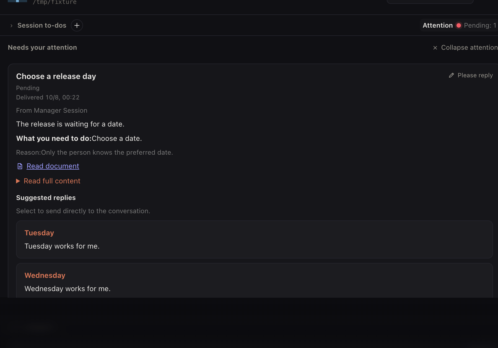
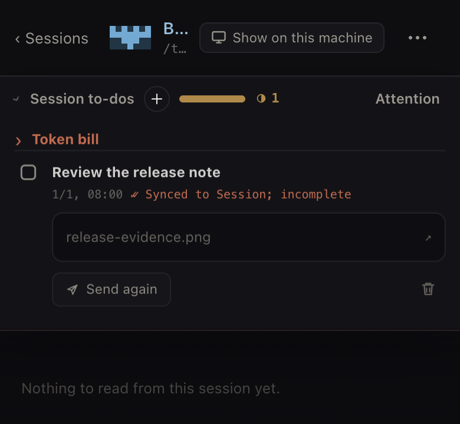
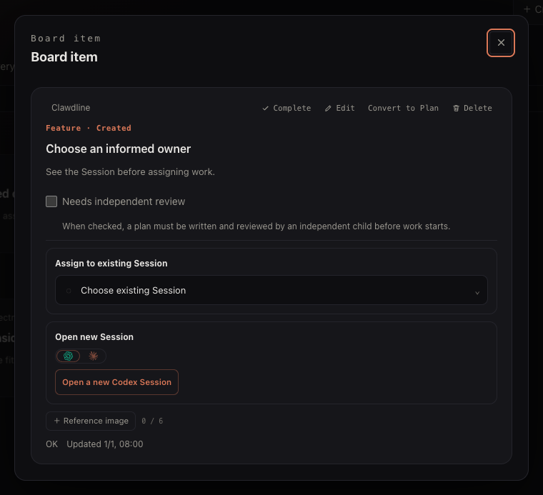
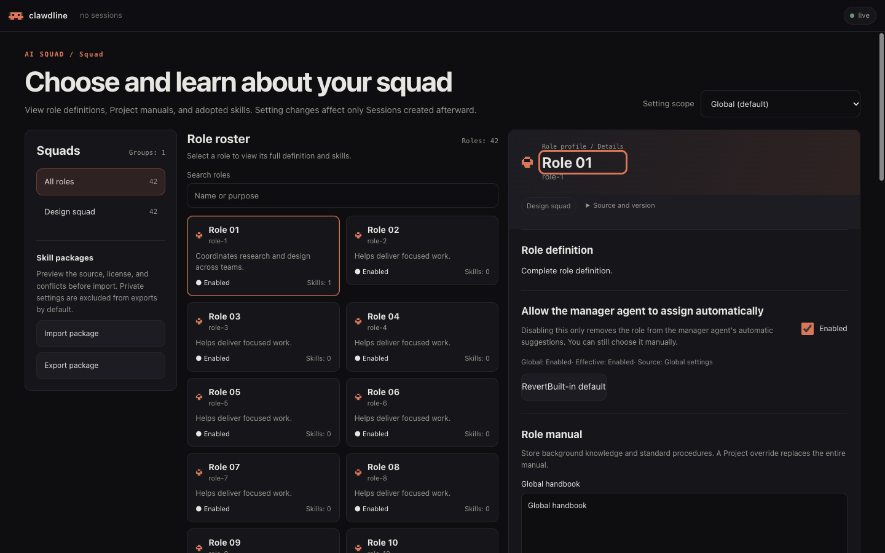
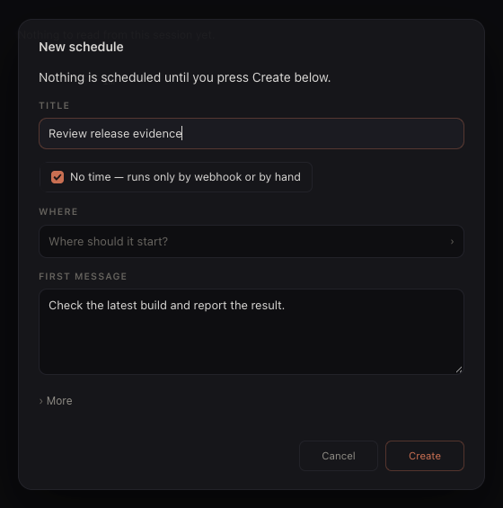

# Clawdline

[繁體中文](README.zh-TW.md)

[](LICENSE)
[](go.mod)

**A control plane for the Claude Code and Codex sessions you already run.**

Clawdline is a local daemon with a web console, for macOS and Linux. It finds your sessions in
tmux (and iTerm2 on macOS) without a wrapper or hooks, shows which ones need you, and lets one
session hand work to another and prove that it landed. Your agents and code stay on your machine;
optional Clawdline Cloud reaches it from a phone or other machines through an end-to-end encrypted
relay.

Work does not have to occupy one long turn. A Session can leave a long-running command with the
daemon and return when it finishes; an Agent can leave a concrete request for you in the Session's
attention panel; and you can save future work as a Session to-do without interrupting its current
turn.

New here? Follow [your first Session](docs/user/first-session.md), or choose a job in the
[user guide](docs/user/README.md). Agents should read the
[guide compiled into the current machine](docs/agent-contract.md).

## What it does

**Basics — every day**

- **See every session.** Each row shows its project, assistant and state: working, waiting for
  you, idle, or unreadable — never guessed idle. Read the real transcript, answer, send text or a
  marked-up picture, dictate, start a session, stop a turn, close one safely, or archive it and
  bring it back later. [Sessions](docs/user/sessions.md)
- **Live terminals.** Open a terminal beside the session list and type in it, on this machine or
  from app.clawdline.com once that browser has Cloud terminal permission; it switches to a direct
  connection when the machine is reachable. [Terminals](https://clawdline.com/docs/shells/#terminals)
- **Your phone, with notifications.** The same console works in any browser, with separate read
  and send permissions, over an SSH forward, your own free cloudflared tunnel, or Cloud. Web Push
  tells you when a session has waited ten minutes, an agent calls for you, or a schedule fails;
  tapping one opens that session.
  [Remote access](docs/user/remote-access.md) · [Notifications](docs/user/notifications.md)
- **Usage at a glance.** Context, token spend per session and Board item, and how much of each
  assistant's plan is left. [Usage](docs/user/usage.md)

**Coordinate work — what sets it apart**

The screenshots below show the current console with sample data.

- **Owned dispatch with landing evidence.** A session sends bounded work to a child session,
  gets the result back, or hands its whole line of work to a successor. Claims stop overlapping
  writes, and Clawdline records whether the work actually reached the branch, not only that the
  child finished. [Dispatch and landing](docs/user/clawdfather-and-dispatch.md)
- **Callbacks for heavy work.** A Session can queue a long-running build, test suite, CI check or
  deployment with the daemon and end its turn. The daemon waits for the Heavy Work slot, runs the
  command, and sends a completion notice; the Session then reads the result and continues. That
  avoids spending repeated Agent turns polling an idle command. It can reduce waiting tokens,
  especially late in a large-context Session, but the amount saved depends on the provider's
  context caching and pricing. The completion still needs one follow-up; a callback does not start
  a child Session. [Callbacks](docs/user/clawdfather-and-dispatch.md#callbacks-for-long-commands)

  ```mermaid
  flowchart LR
    A["Agent queues build, CI or deploy"] --> B["Heavy Work queue"]
    B --> C["Daemon runs command"]
    C --> D["Completion notice"]
    D --> E["Session reads result once"]
  ```

- **Notes when a person is needed.** An Agent can leave a concrete question or action in a
  Session's attention panel, with suggested replies when there is a choice. You can answer from
  there; the Agent continues independent work in the meantime. [Attention notes](docs/user/sessions.md#attention-notes-from-agents)

  

- **To-dos for later.** Add a direct to-do to a Session while it is busy. The row stays there for
  the Session to pick up later; adding it does not send a message or wake the Session.
  [Session to-dos](docs/user/board.md#session-to-dos)

  

- **A Board that follows delivery.** Assign a Feature, Issue or Epic to a session and follow it
  through implementation, verification, merge and deployment, each phase with evidence. Planning
  is on by default: Features need observable acceptance criteria. A plan and independent review
  are required when you turn on **Needs independent review**. Epics require a reviewed plan.
  Questions for you appear on the card. The Board itself is off until you turn it on in Settings.
  [Board](docs/user/board.md)

  

- **Agent squad and roles.** Start a session as a built-in role — architect, reviewer, technical writer and more —
  with its own handbook and skills. [Roles](docs/personas.md)

  

- **Schedules and webhooks.** Save a task that a session runs on the local clock or by hand, with
  catch-up, timeouts and failure alerts. Cloud Pro also starts it from a webhook.
  [Schedules](docs/user/schedules.md)

  

**Projects and machines**

- **Add a local project by hand.** On the machine that holds an existing directory, run
  `clawdline project add` from that directory, or pass a relative or absolute path, while its daemon is running. The command
  succeeds only after that daemon registers the directory. `clawdline project list` reads the same
  list; the open session start sheet refreshes automatically, and **Projects** can be reopened to see it. The console has
  no Add Project button. Each Project row has **Remove from list**, which keeps its directory and sessions. [Add a project](docs/user/projects.md#add-a-project)
- **Projects across machines.** Give a second machine the same project names, icons and untracked
  skills, matched by git origin, with or without Cloud. [Projects](docs/user/projects.md)
- **One set of rules and skills for Claude and Codex.** `clawdline project unify` shows how to give
  a project's Claude Code and Codex sessions the same `AGENTS.md` and skills, and changes files only
  when you apply that plan. It never commits. [Unify](docs/project-files.md#unify)
- **Optional encrypted Cloud.** Pair a phone or several machines through Clawdline Cloud's
  end-to-end encrypted relay. Off by default; a preview. [Remote access](docs/user/remote-access.md)

## Install

On macOS 13+ or Linux, with tmux and Claude Code or Codex:

```sh
curl -fsSL https://raw.githubusercontent.com/sainteye/clawdline/main/install.sh | sh
```

It installs the latest signed release for your system as a per-user service that starts at login
(no `sudo`, no Go or Node.js), adds the menu-bar app on a Mac, and opens the console in your
browser. On a server, add `-s -- --headless` after `sh`. Run `claude` or `codex` inside tmux, and
the session appears in the list.

Each step with a check that it worked, every option, removal, and building from source are in
[Install and first run](docs/user/install.md). A release updates itself from the console's Settings
page or with `clawdline update --apply`, and rolls back by itself if it does not come up
([Updates](docs/updates.md)).

## Limits

- **Pre-1.0**: expect changes between releases.
- The console supports **English, Traditional Chinese, Simplified Chinese, Japanese, Korean,
  Spanish, Brazilian Portuguese, French and German**. Newer copy missing from a secondary
  translation falls back to English ([Localization](docs/localization.md)).
- **Windows** runs the daemon and console but cannot list sessions or open terminals. Linux runs
  headless under `systemd --user`; macOS has an optional native app ([Platforms](docs/user/platforms.md)).
- Claude's **5h/7d plan percentages** need a Claude Code status line that writes
  `~/.claude/statusline-cache/rate-limits.json` ([Usage](docs/user/usage.md)).
- Everything on your machine is free and needs no account. Cloud has a Free plan and a Pro plan.

## How it compares

[T3 Code](https://github.com/pingdotgg/t3code) is a full control surface with desktop and mobile
apps and native version-control flows. [Herdr](https://github.com/herdrdev/herdr) is a
terminal-first agent multiplexer. [Orca](https://github.com/stablyai/orca) is an agent development
environment with an editor and diff review. Clawdline is not an IDE and does not replace Claude Code
or Codex: it operates the sessions you already start — dispatch, landing evidence, the Board and
schedules — when the hard part is running several agents reliably over time.

## Documentation

- Start: [Install and first run](docs/user/install.md) · [Platforms](docs/user/platforms.md) ·
  [Troubleshooting](docs/user/troubleshooting.md)
- Basics: [Sessions](docs/user/sessions.md) · [Keyboard shortcuts](docs/user/keyboard-shortcuts.md) ·
  [Remote access](docs/user/remote-access.md) · [Notifications](docs/user/notifications.md) ·
  [Usage](docs/user/usage.md)
- Coordinate work: [Dispatch and landing](docs/user/clawdfather-and-dispatch.md) ·
  [Callbacks](docs/user/clawdfather-and-dispatch.md#callbacks-for-long-commands) ·
  [Attention notes](docs/user/sessions.md#attention-notes-from-agents) ·
  [Session to-dos](docs/user/board.md#session-to-dos) · [Board](docs/user/board.md) ·
  [Schedules](docs/user/schedules.md)
- Projects and machines: [Projects](docs/user/projects.md) · [Updates](docs/updates.md)
- Website guides: [clawdline.com/docs](https://clawdline.com/docs/)
- Building on it: [architecture.md](docs/architecture.md), [AGENTS.md](AGENTS.md),
  [docs/README.md](docs/README.md)

## License

[MIT](LICENSE)
