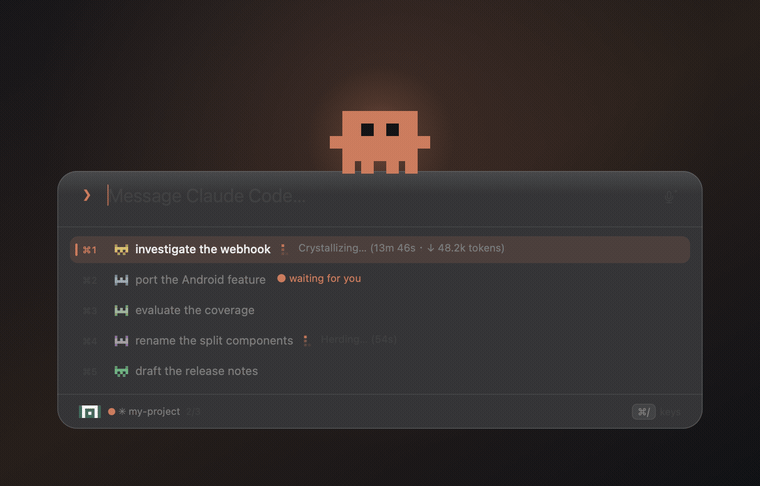
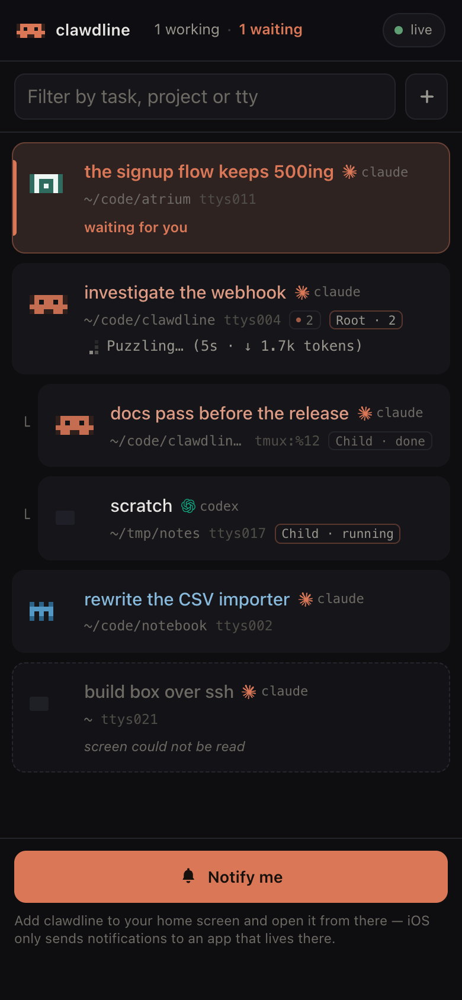

# Clawdline

[繁體中文](README.zh-TW.md)

[](LICENSE)
[](go.mod)

**A control plane for the Claude Code and Codex sessions you already run.**

Clawdline is a local daemon with a web console, for macOS and Linux. It finds your sessions in
tmux (and iTerm2 on macOS) without a wrapper or hooks, shows which ones need you, and lets one
session hand work to another and prove that it landed. Your agents and code stay on your machine;
optional Clawdline Cloud reaches it from a phone or other machines through an end-to-end encrypted
relay.

<p align="center">
  
</p>

## What it does

**Basics — every day**

- **See every session.** Each row shows its project, assistant and state: working, waiting for
  you, idle, or unreadable — never guessed idle. Read the real transcript, answer, send text or a
  marked-up picture, dictate, start a session, stop a turn, close one safely, or archive it and
  bring it back later. [Sessions](docs/user/sessions.md)
- **Live terminals.** Open a terminal beside the session list and type in it, on this machine or
  from app.clawdline.com, where it switches to a direct connection when the machine is reachable.
  [Terminals](docs/terminal-direct-path.md)
- **Your phone, with notifications.** The same console works in any browser, with separate read
  and send permissions. Web Push tells you when a session has waited ten minutes, an agent calls
  for you, or a schedule fails; tapping one opens that session.
  [Remote access](docs/user/remote-access.md) · [Notifications](docs/user/notifications.md)
- **Usage at a glance.** Context, token spend per session and Board item, and how much of each
  assistant's plan is left. [Usage](docs/user/usage.md)

**Coordinate work — what sets it apart**

- **Owned dispatch with landing evidence.** A session sends bounded work to a child session,
  gets the result back, or hands its whole line of work to a successor. Claims stop overlapping
  writes, and Clawdline records whether the work actually reached the branch, not only that the
  child finished. [Dispatch and landing](docs/user/clawdfather-and-dispatch.md)
- **A Board that follows delivery.** Assign a Feature, Issue or Epic to a session and follow it
  through implementation, verification, merge and deployment, each phase with evidence. Planning
  is on by default: Features and Epics need a plan and an independent review before work starts.
  Questions for you appear on the card. [Board](docs/user/board.md)
- **Roles.** Start a session as a built-in role — architect, reviewer, technical writer and more —
  with its own handbook and skills. [Roles](docs/personas.md)
- **Schedules and webhooks.** Save a task that a session runs on the local clock or by hand, with
  catch-up, timeouts and failure alerts. Cloud Pro also starts it from a webhook.
  [Schedules](docs/user/schedules.md)

**Projects and machines**

- **Projects across machines.** Give a second machine the same project names, icons and untracked
  skills, matched by git origin, with or without Cloud. [Projects](docs/user/projects.md)
- **One set of rules and skills for Claude and Codex.** `clawdline project unify` shows how to give
  a project's Claude Code and Codex sessions the same `AGENTS.md` and skills, and changes files only
  when you apply that plan. It never commits. [Unify](docs/project-files.md#unify)
- **Optional encrypted Cloud.** Pair a phone or several machines through Clawdline Cloud's
  end-to-end encrypted relay. Off by default; a preview. [Remote access](docs/user/remote-access.md)

<p align="center">
  
</p>

## Install

Build from source on macOS or Linux. You need Go 1.25 or newer, Node.js with npm, tmux, and Claude
Code or Codex.

```sh
git clone https://github.com/sainteye/clawdline.git
cd clawdline
(cd web && npm install && npm run build)
go build -o bin/clawdline ./cmd/clawdline

CLAWDLINE_NEXT_WEB="$PWD/web/console/dist" ./bin/clawdline serve
```

In another terminal:

```sh
./bin/clawdline doctor      # version, port, state directory
./bin/clawdline open        # sign this browser in to read and send in sessions
```

Run `claude` or `codex` inside tmux, and the session appears in the list. Each step, with a check
that it worked, is in [Install and first run](docs/user/install.md). `./bin/clawdline update`
tells you when this machine trails the latest build ([Updates](docs/updates.md)).

## Limits

- **Pre-1.0**, built from source, no release download yet.
- The console is in **Traditional Chinese** only for now.
- **Windows** runs the daemon and console but cannot list sessions or open terminals. Linux runs
  headless under `systemd --user`; macOS has an optional native app ([Platforms](docs/user/platforms.md)).
- Claude's **5h/7d plan percentages** need a Claude Code status line that writes
  `~/.claude/statusline-cache/rate-limits.json` ([Usage](docs/user/usage.md)).
- Everything on your machine is free and needs no account. Cloud has a Free plan and a Pro plan.

## How it compares

[T3 Code](https://github.com/pingdotgg/t3code) is a full control surface with desktop and mobile
apps and native version-control flows. [Herdr](https://github.com/herdrdev/herdr) is a
terminal-first agent multiplexer. [Orca](https://github.com/stablyai/orca) is an agent development
environment with an editor and diff review. Clawdline is not an IDE and does not replace Claude Code
or Codex: it operates the sessions you already start — dispatch, landing evidence, the Board and
schedules — when the hard part is running several agents reliably over time.

## Documentation

- Start: [Install and first run](docs/user/install.md) · [Platforms](docs/user/platforms.md) ·
  [Troubleshooting](docs/user/troubleshooting.md)
- Basics: [Sessions](docs/user/sessions.md) · [Keyboard shortcuts](docs/user/keyboard-shortcuts.md) ·
  [Remote access](docs/user/remote-access.md) · [Notifications](docs/user/notifications.md) ·
  [Usage](docs/user/usage.md)
- Coordinate work: [Dispatch and landing](docs/user/clawdfather-and-dispatch.md) ·
  [Board](docs/user/board.md) · [Schedules](docs/user/schedules.md)
- Projects and machines: [Projects](docs/user/projects.md) · [Updates](docs/updates.md)
- Website guides: [clawdline.com/docs](https://clawdline.com/docs/)
- Building on it: [architecture.md](docs/architecture.md), [AGENTS.md](AGENTS.md),
  [docs/README.md](docs/README.md)

## License

[MIT](LICENSE)
