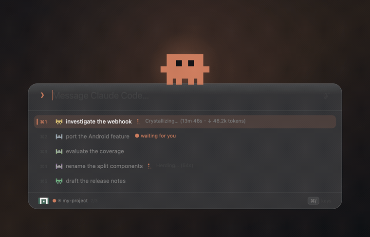
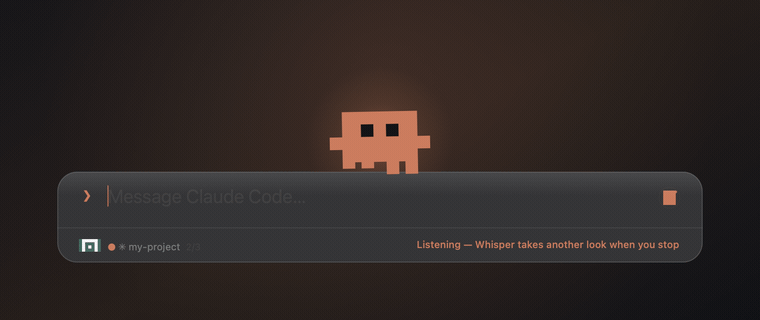
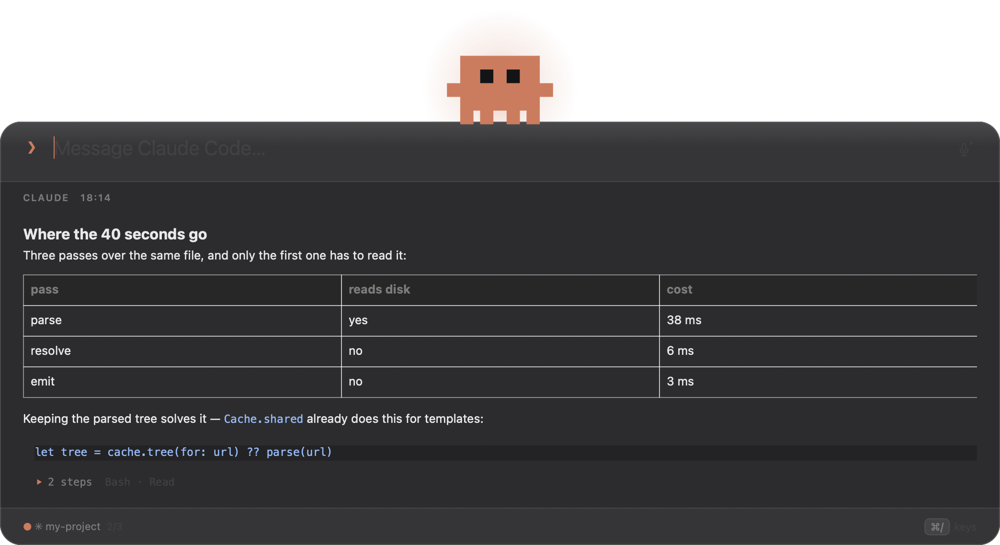
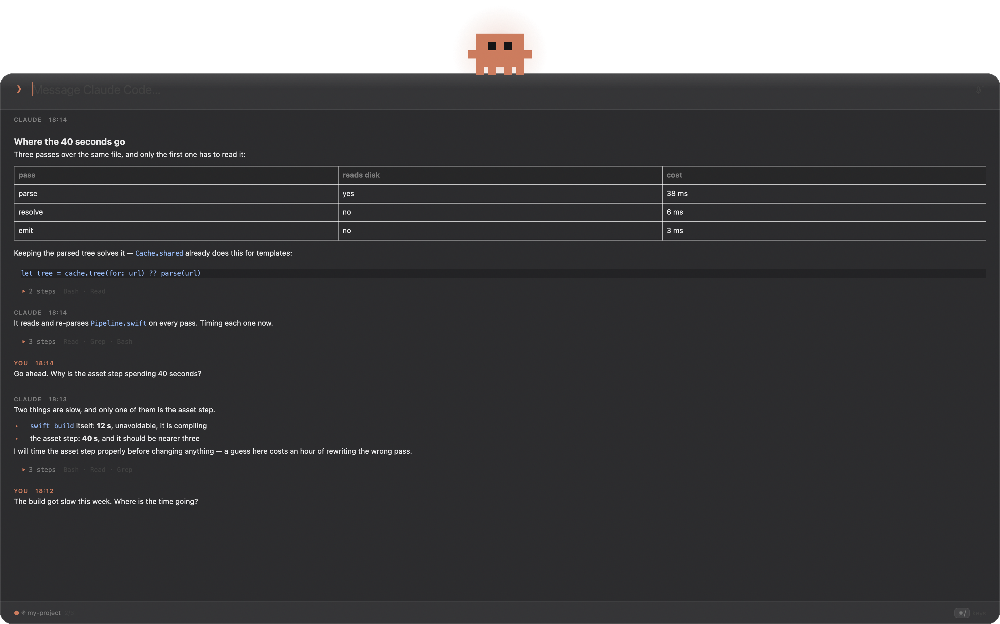
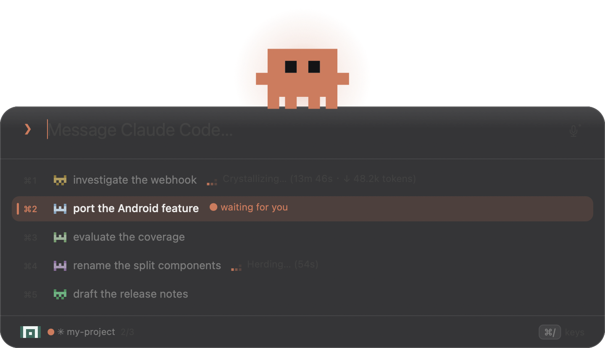
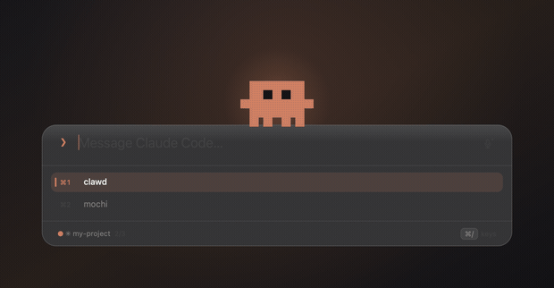
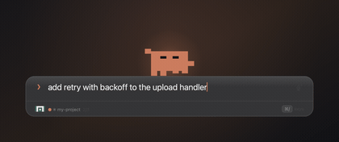
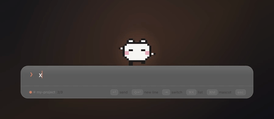

<div align="center">

# Clawdline

**一條輸入條，管你開著的每一個 Claude Code session。**

打完字按 Enter，內容進到你指定的那個 session。
按 <kbd>⌘</kbd><kbd>J</kbd>，那個 session 就在你眼睛已經在看的地方讀得回來——是**排版過的**，
不是刮畫面。按 <kbd>⌘</kbd><kbd>K</kbd>，每個 session 都是一行，而那一行會說它在做什麼：
**在跑、跑完了、還是在等你回答。**

不會在 Claude Code 裡裝任何東西。iTerm2 直接支援，其餘終端機透過 tmux。

[](LICENSE)
[](#安裝)
[](Sources)
[](#安裝)

[](https://ko-fi.com/sainteye)

[English](README.md) · 繁體中文


</div>

---

## 這個東西是為了什麼

Claude Code 把所有東西都放在一個終端機視窗底部的同一個方框裡：它說的話、它問你的問題、
還有你打字的地方。**開一個 session 的時候，這是好設計。**

**但你開了四個。**

於是一天就花在「跑去某個 session」上面。要跟它講一句話，先找到它的分頁。要知道它跑完了沒，
再找一次它的分頁。而你在找的那排東西是**分頁標題**——那是**任務**，
兩個不同專案很容易在做讀起來一模一樣的任務。

Clawdline 把它們收在同一個地方，放在眼睛的高度。它可以打字進任何一個、把任何一個讀回來，
而且——這一項只有在「不只一個」的時候才有意義——**告訴你哪一個停了、哪一個在等你回答**，
你不必跑過去看。

**它不會在 Claude Code 裡裝任何東西。** 沒有 hook、沒有 MCP server、不會動你的設定檔、
也不會包一層 `claude` 指令。它讀的是你的 session 本來就在畫的螢幕、本來就在寫的逐字稿。
所以它對**一小時前就開好的** session 一樣有效，所以它不可能弄壞它正在讀的那個東西，
也所以你不想要的時候，關掉就是關掉，沒有東西要復原。

## 它做得到、而一般輸入框做不到的事

- **告訴你哪一個 session 在等你。** 四個分頁在做讀起來差不多的任務，在別的工具裡就是四行一樣的字。
  這裡：正在跑的那個帶著 Claude Code 自己畫的那行字，而螢幕上有問題沒人回答的那個會**大聲說出來**
  ——因為那是唯一一種每過一秒都在賠錢的狀態。每一行還帶著它自己專案的像素圖示。
  這件事**不需要在 Claude Code 裡裝任何東西**：它讀的就是每個 session 自己的螢幕。
  → [哪一個 session 在等你](#哪一個-session-在等你)

- **瀏海裡也會講。** 你的吉祥物住在鏡頭那塊：有東西在跑就探出來，有人在等你就講出是哪一個，
  長工作跑完就跳舞。**看起來有多忙，就是你手上有多少東西在跑。** 設定裡一個字就能整個關掉。
  → [瀏海](#瀏海)

- **終端機的分頁跟著走。** 在清單裡移動，iTerm2 就跟著換分頁——而且**不會跳到前景**，
  因為把鍵盤搶走正是這個東西存在的理由要避免的事。輸入條瞄準的那個，和你眼前那個分頁，
  不再是兩個不同的 session。
  → [它會送到哪個分頁](#它會送到哪個分頁)

- **可以用中文對 Claude Code 講話，一句話裡中英夾雜也可以。** Claude Code 內建的 `/voice`
  支援二十種語言，日文韓文都在——**截至 2026-08-17（Claude Code 2.1.233），
  [中文一種都沒有](docs/compatibility.md)**。這裡有。
  講的時候字就出現；停下來，Whisper 讀同一段錄音把它換掉，
  「把那個 webhook 的 retry 改成 exponential backoff」這種句子任何即時辨識器都聽不出來。
  而你講話的停頓就是它定案的地方——前面的句子不會在你繼續講的時候還在動。
  **而且你的聲音不會離開這台 Mac**：Whisper 完全在本機跑，不需要任何帳號。
  → [語音輸入](#用說的代替打字) · [Whisper 安裝](docs/whisper.md)

- **把 session 讀回來，而且是排版過的。** 不是終端機的截圖：標題、有框線的表格、程式碼，
  跑完的工具呼叫各收成一行——三十行路徑不是你回頭要看的東西。上面還有一行說它現在正在做什麼。
  → [逐字稿面板](#看那個分頁在說什麼)

- **告訴你是哪個專案，不只是哪個任務。** 兩個分頁很容易在做讀起來一樣的任務。
  這條輸入條會講出 repo、分支、未提交數量、進行中的部署、backlog——還有那個專案自己的像素圖示與顏色。
  → [是哪個專案](#是哪個專案不只是哪個任務)

- **剪貼簿裡的截圖直接丟進來。** 視窗上任何地方都能丟檔案、也能貼圖，畫面上是縮圖。
  送出去的是**路徑**——那才是 Claude Code 讀得了的東西。
  → [檔案與圖片](#把檔案或圖片丟進來)

- **記得你送過什麼。** <kbd>↑</kbd> <kbd>↓</kbd> 翻自己的歷史，而**同一批字就是語音辨識被告知
  要預期的詞**——所以你真的在用的那些術語，它認得。
  → [用法](#用法)

- **戴上你自己畫的吉祥物。** 輸入條上那隻是一份 JSON：像素網格、色盤、五段動畫。
  換一隻不必 fork 任何東西。
  → [吉祥物](#換上你自己的吉祥物)

<div align="center">








</div>

## 目錄

- [安裝](#安裝) · [用法](#用法)
- **知道** — [哪一個 session 在等你](#哪一個-session-在等你) · [瀏海](#瀏海)
- **讀** — [逐字稿面板](#看那個分頁在說什麼) · [是哪個專案](#是哪個專案不只是哪個任務)
- **寫** — [語音輸入](#用說的代替打字) · [檔案與圖片](#把檔案或圖片丟進來) · [它會送到哪個分頁](#它會送到哪個分頁)
- **調成你的樣子** — [吉祥物](#換上你自己的吉祥物) · [設定](#設定) · [其他終端機](#其他終端機把-claude-code-跑在-tmux-裡)
- **底下是什麼** — [怎麼把字送進去的](#它是怎麼把字送進去的) · [權限與隱私](#權限與隱私) · [限制](#限制) · [出事的時候](#出事的時候)
- **再往下** — [Whisper 與中英夾雜](docs/whisper.md) · [專案狀態檔](docs/project-status.md) · [吉祥物格式](docs/mascots.md)

## 為什麼有這個東西

Claude Code 的輸入框畫在終端機的最下緣，而終端機通常是滿版的。於是那個你一天要看幾百次的
東西，長期釘在螢幕的**左下角**——離視線落點最遠的那個位置。

這件事沒有設定可以改。輸入框固定在畫面底部，plugin 也動不到：plugin 提供的是 command、
agent、hook、MCP server 與 skill，不是 TUI 版面。

所以 Clawdline 換一個方向：不動終端機，另外給你一個打字的地方。它出現在你指定的高度，
接住你的字，送進你剛才在用的那個 session，然後把焦點還給你原本的 app。視線不必移動。

## 安裝

四種擇一，結果都是同一個 app，挑你最信得過的那條。

**Homebrew**

```bash
brew install --cask sainteye/tap/clawdline
xattr -dr com.apple.quarantine /Applications/Clawdline.app
```

**用腳本抓最新版**

```bash
curl -fsSL https://raw.githubusercontent.com/sainteye/clawdline/main/install.sh -o install.sh
less install.sh          # 四十行，值得花十秒看一遍
bash install.sh          # 或 bash install.sh ~/Applications
```

**手動** —— 從 [Releases](https://github.com/sainteye/clawdline/releases/latest) 下載 `.zip`，
解開丟進 `/Applications`，然後：

```bash
xattr -dr com.apple.quarantine /Applications/Clawdline.app
```

**自己編** —— 沒有套件管理器、沒有相依套件，幾秒鐘：

```bash
git clone https://github.com/sainteye/clawdline.git
cd clawdline && ./build.sh
open ~/Applications/Clawdline.app
```

<details>
<summary>那行 <code>xattr</code> 是幹嘛的，以及為什麼自己編就不用</summary>

release 的 build 有 ad-hoc 簽章但**沒有公證**——公證需要付費的 Apple Developer 帳號。
macOS 會把從網路下載的東西加上隔離屬性，並拒絕開啟沒公證的副本，所以那個屬性得拿掉，
不然就要走系統設定 › 隱私權與安全性 › 強制打開。

自己編出來的 app 從來沒被下載過，所以不會被隔離。如果你不想憑信任執行陌生人給的二進位檔，
那就是該選的那條：整個 build 就是 `swiftc` 跑過幾個你讀得完的檔案。

</details>

第一次送出時，macOS 會問要不要讓 Clawdline 控制 iTerm2，按**好**；沒有這個權限它什麼都送不出去。
選單列的 ✳ → **開機時啟動** 可以讓它常駐。

## 用法

在 iTerm2 裡按 <kbd>⌥</kbd><kbd>Space</kbd>，打字，按 <kbd>Enter</kbd>。

| 按鍵 | 做什麼 |
|---|---|
| <kbd>⌥</kbd><kbd>Space</kbd> | 叫出／收起輸入條 |
| <kbd>Enter</kbd> | 送到目前的目標分頁 |
| <kbd>⇧</kbd><kbd>Enter</kbd> | 換行（輸入條會跟著長高） |
| <kbd>Tab</kbd> / <kbd>⇧</kbd><kbd>Tab</kbd> | 下一個／上一個 Claude Code 分頁 |
| <kbd>⌘</kbd><kbd>K</kbd> | 展開 session 清單 |
| <kbd>⌘</kbd><kbd>1</kbd>…<kbd>⌘</kbd><kbd>9</kbd> | 直接跳到第 N 個 |
| <kbd>↑</kbd> / <kbd>↓</kbd> | 輸入框空的時候翻歷史 |
| <kbd>⌘</kbd><kbd>J</kbd> | 看那個分頁現在說了什麼 |
| <kbd>⌘</kbd><kbd>F</kbd> | 把它撐滿整個螢幕 |
| <kbd>⌘</kbd><kbd>R</kbd> | 最新的訊息放最上面，而不是最下面 |
| <kbd>⌘</kbd><kbd>+</kbd> / <kbd>⌘</kbd><kbd>−</kbd> / <kbd>⌘</kbd><kbd>0</kbd> | 那塊的字級，會記住 |
| <kbd>⌘</kbd><kbd>S</kbd> | 每個專案的伺服器——啟動、重啟、停止、看是哪個掛了 |
| <kbd>⌘</kbd><kbd>M</kbd> | 瀏覽／切換吉祥物 |
| <kbd>⌘</kbd><kbd>D</kbd> | 叫吉祥物跳舞 |
| <kbd>⌘</kbd><kbd>/</kbd> | 展開其餘的快速鍵 |
| <kbd>⌘</kbd><kbd>L</kbd> 或點麥克風 | 用說的代替打字 |
| 拖曳 / <kbd>⌘</kbd><kbd>V</kbd> | 視窗上任何地方都可以丟檔案、貼圖片 |
| <kbd>Esc</kbd> | 關掉 |

<kbd>⌘A</kbd> · <kbd>⌘C</kbd> · <kbd>⌘V</kbd> · <kbd>⌘X</kbd> · <kbd>⌘Z</kbd> 都照你想的運作。

**熱鍵只在 iTerm2 在前景時生效。** 在其他 app 裡，<kbd>⌥</kbd><kbd>Space</kbd> 還是你裝這個
之前的那顆鍵。把 `"scope_app"` 設成 `""` 就變全域。

### 它會送到哪個分頁

Clawdline 列出所有 iTerm2 session，用 `ps` 比對每個的 TTY，留下真正在跑 `claude` 的那些，
預設選你最後停留的那一個。

輸入條下緣一直寫著目標是誰。**它不做盲送**——一個不肯告訴你字會跑去哪的輸入框，比沒有更糟。

**而且終端機會跟著走。** 在清單裡移動，iTerm2 就跟著換分頁：你眼前的那個分頁，
依構造就是輸入條瞄準的那個 session。「選取分頁」和「把終端機叫到前景」是兩件事，而只有第一件會發生
——否則你每按一次 <kbd>Tab</kbd>，iTerm2 就會把鍵盤搶走，那正是這個程式存在的理由要避免的事。
如果你習慣固定開一個終端機分頁在旁邊看東西，`"follow_target": false`。

### 把檔案或圖片丟進來

把檔案拖到視窗上的任何地方，或直接貼上一張圖，它會以**縮圖**出現在輸入框裡——你丟進來的是
一張圖，不是四十個字元的目錄。而**送出去的是路徑**：Claude Code 自己讀得了檔案（圖片也是），
所以送路徑跟你自己打路徑是同一件事，不需要另一端有任何它現在還沒有的東西。
畫面上那個是給你看的，線上那個是給 Claude Code 的——這兩個一旦變成同一個字串，
就一定有一邊為了遷就另一邊而變差。

從剪貼簿貼的圖還沒有路徑，所以會先寫成一個檔（`~/Library/Caches/dev.sainteye.clawdline/drops/`）
再把那個路徑放進去。那些檔案是這個功能唯一會留下來的東西，所以只保留最近幾個。

### 用說的代替打字

**Claude Code 自己有聽寫**——`/voice`，按住空白鍵，而且做得很好。
但**截至 2026-08-17（實測 Claude Code 2.1.233）它完全不支援中文**：
支援清單二十種語言，日文韓文都在，中文一種都沒有，而且沒有任何 `language` 值改得掉——
填 `zh`、`zh-TW`、`Chinese` 都會警告一次然後用英文聽。
另外三件它也做不到：在你自己的機器上轉譯（它的文件寫「audio is not processed locally」）、
不需要 Claude.ai 帳號、一句話裡聽得懂兩種語言。
這裡就是為那幾件事存在的，完整對照在 [docs/whisper.md](docs/whisper.md)。

<kbd>⌘</kbd><kbd>L</kbd>（或點輸入框右邊那顆麥克風）把你說的話變成框裡的字。
**講完它會自己停**——兩秒左右的停頓把一句話定下來，更長的安靜結束整段，
所以一口氣講完一整段只要按一次鍵而不是兩次。**停頓不會停**：辨識器在每個停頓
把一句話定案、下一句從零開始，那些句子是在這一側接回去的，而不是第二句蓋掉第一句。
它周圍的圈圈接的是**同一批正在被辨識的音訊**——圈圈不動就代表麥克風沒收到聲音，
而那個失敗本來要等到你看見空白的輸入框才會發現。

**中英夾雜不是 Apple 給得起的開關。** 它的兩套語音 API 都是一個辨識器一個 locale，
句中不換語言。可用的只有「一百個詞的偏置」，而 Clawdline 把這個額度花在**你自己的 prompt 歷史**
上——你打給 Claude Code 的字就是你會對它說的字，所以 `webhook`、`rebase`、你的 repo 名字
被夾在中文句子裡講出來時活得下來。它不需要維護詞表，而需要人手動維護的詞表，寫完那一週就開始過期。

**還沒定案的字會淡一點，定下來才變成正常的濃度。** 底線是 macOS 輸入法的做法，
這裡一開始也是那樣——但那條線只對已經知道這個慣例的人說話，而且一句話底下畫一條線
會跟那句話搶注意力。淡讀起來就是「還沒完全到位」，不需要任何人教；而且輕重是對的：
**定下來的字才是看起來正常的那些**。另外**聽寫是從游標開始寫的**，
所以你可以回到中間去補一句話。
**大約兩秒的停頓會把前面講的定下來**（`voice_settle_seconds` 可改，0 是關掉；
「安靜」是相對於前幾秒的底噪，不是一個固定數字——實測這個房間的環境音就落在刻度的三分之一，
寫死一個門檻等於寫死某一個房間），所以你繼續講的時候，前面的句子不會再動。
**四秒的安靜則是結束整段**（`voice_stop_seconds`，0 是關掉）。停在半句話上的那一段
會多等一點——**晚停的代價是空房間裡開著一支麥克風，早停的代價正好是這個功能要省掉的那一下按鍵**。
沒講過話的麥克風不會被這樣關掉：還沒有任何東西可以讓這段安靜當成結尾。
**講到一半直接按 Enter 就是「講完了」**：麥克風關掉、最後那段讀完，然後送出——
不必先自己停。也**可以講一段、動手改字、再繼續講**：輸入框裡任何一處被編輯過，這一輪就結束，
下一句從游標的位置開始寫，而不是插進你剛才正在修的那句話中間。

你下載過的聽寫語言在這台 Mac 上辨識，沒下載的送到 Apple。**現在是哪一種，聽的時候一直寫在畫面上。**
見[權限與隱私](#權限與隱私)。

真的會在一句話裡講兩種語言的話，**[Whisper](docs/whisper.md) 是一道處理得了的選配第二關**——
一行 `brew install` 加一個模型檔，裝好之後 Clawdline 自己就會用它。**它不取代即時的那個**：
講的時候還是 Apple 在寫，你一停下來，Whisper 讀同一段錄音、把整段換成它的版本。
一個給你即時回饋，另一個給你正確的句子。那一頁有一段可以直接貼給 Claude Code 的 prompt。

### 是哪個專案，不只是哪個任務

輸入條下緣一直寫著目標是誰，而分頁標題是**任務**——「查一下 webhook」跟另一個專案的
「查一下 webhook」讀起來一模一樣。所以那一行改成先講 repo，再接分支與未提交的數量：

    ▣ atrium  查一下 webhook  ⎇ main *3   9/10

如果你的終端機狀態列用的是 [claude-bestiary](https://github.com/sainteye/claude-bestiary)，
那個圖示與顏色直接來自它的 registry（`~/.claude/project-icons.json`）——所以輸入條上的圖示
與終端機裡的圖示會一樣，是因為**它們是同一筆資料**，不是因為有人把兩個程式手動對齊。
Clawdline 對那個檔案只讀不寫：它通常是指向 checkout 的 symlink，透過 symlink 寫入會把它
換成一份實體檔。

它能顯示的不只名字。**進行中的部署會畫進度、backlog 會標出「現在該做」那一欄、健康檢查是一顆
燈**——而且前兩者是連結，點下去就開到你本來要自己去找的那一頁。

這些都不是 Clawdline 算的，是 `~/.claude/statusline-cache/` 底下幾個小 JSON 檔。
**格式寫在 [docs/project-status.md](docs/project-status.md)**，旁邊附的範例檔會被測試實際解析，
所以那一頁不會安靜地變成不實。誰都可以寫它們——一個 cron、一個 git hook，或是 claude-bestiary
（它為了自己的終端機狀態列本來就在寫）。沒有那些檔案，底部那行就只是少講幾件事。

沒有 registry 時顏色由路徑推導，每次啟動都一樣。分支與數量走一次
`git status --porcelain=v2 --branch`。

### 看那個分頁在說什麼

<kbd>⌘</kbd><kbd>J</kbd> 會在輸入框下面展開一塊，顯示那個 session 現在的畫面，約一秒更新一次，
按 <kbd>Tab</kbd> 換分頁時也跟著換。展開時整個螢幕背景會模糊——讀一段輸出跟丟一行指令
是兩種模式。裡面的字可以選取，畢竟把錯誤訊息複製出來是能看到它的主要理由。

**只有你原本就停在「新的會出現的那一端」時才自動跟著捲**：往上翻在讀東西的時候被拉走，比不跟還糟。
而且終端機沒有變動時 capture 出來的字串一模一樣，那一輪會整個跳過，不會在你眼前重排。

能讀到的時候，那塊顯示的是**對話**而不是畫面。Claude Code 會邊跑邊把每個 session 寫進
`~/.claude/projects/<專案>/<session>.jsonl`，那份檔案有畫面只能暗示的結構：誰說的、
說了什麼、跑了哪些工具。讀它的好處是有真正的訊息邊界、看得到完整歷史而不只是一屏，
而且可以用**排版**而不是截圖來呈現——說話者有標籤、內文用比例字、工具呼叫退到頁邊的等寬字裡。

<kbd>⌘</kbd><kbd>F</kbd> 把它變成螢幕的大小——不是 macOS 的全螢幕（那個會把視窗丟到自己的
Space，對一個蓋在工作上的面板來說正好相反）。它就是一次縮放，有動畫，吉祥物也有一段對應的動作。

**切到別的 app 會把面板收起來，切回終端機它會自己回來**——不管當時是什麼尺寸。
把一個開著的面板留在那裡然後離開，意思是「我要看一下別的東西」；
「我用完了」要用 <kbd>Esc</kbd> 說，而你刻意關掉的東西就該維持關著。
希望每次出現都是自己叫的，把 `"reopen_on_return"` 設成 `false`。

<div align="center">

</div>

<kbd>⌘</kbd><kbd>R</kbd> 把整份倒過來，最新的訊息在最上面。自動跟隨也跟著換邊
（往上捲到頂而不是往下到底），而且會記住。**只有逐字稿會翻**：終端機畫面是一格一格的
截圖，把它的行倒過來會讓一句折行的話變成由下往上讀。

那個 session 正在跑的時候，面板上方會有一行寫著它在做什麼——
`Finagling… (5m 52s · ↓ 18.6k tokens)`。**這一行是從終端機刮下來的**，即使其他內容都來自檔案：
因為它從來不會被寫進檔案。逐字稿記的是「已經存在的訊息」，而這是畫在畫面上、又被擦掉的東西。

工具呼叫會折疊起來。一則回答底下常常壓著三十行路徑與 shell，而那不是你回頭要看的東西——
所以每一組跑完的工具收成一行，寫著花了幾個動作、用了哪些工具，點一下就展開。
**還在跑的那一組永遠不折**：那一組正好是會變的部分。

Claude 寫出來的是 Markdown，所以那塊會把它渲染出來：標題、清單、**有框線的表格**、引用、
強調、程式碼。表格留著直線交給等寬字型是行不通的——中日文字的字形來自 fallback，
它的字寬不保證剛好是等寬字的兩倍，所以在原始碼裡對齊的直線，畫到畫面上每一行都落在不同位置。
認不得的東西一律當純文字放行，因為那是唯一真正要緊的失敗方式：**畫面上多一個星號只是難看，
被剖析器吃掉一句話才是 bug。**

要找到對的那一份要三步，因為沒有任何一筆紀錄帶著 tty：用工作目錄找到專案資料夾、
用分頁標題比對 transcript 記下的 `aiTitle`、平手時取最近寫入的那個。
**那個格式沒有文件而且會變**，所以每個欄位進來時都是可有可無，認不得的一律跳過。

沒有 transcript 的時候（純 shell、非 Claude 的 pane）就退回刮終端機畫面。
iTerm2 只交得出**目前可見的畫面**，它的 scripting 沒有 scrollback；tmux 則是可見畫面加 200 行歷史。
把 `output_mode` 設成 `terminal` 或 `transcript` 可以固定用哪一種。

**卡片是霧面玻璃，而玻璃會吸背後的顏色。** 底下是一整片綠色的 diff 或一個亮色頁面時，
整張卡片會跟著偏色、連字一起被拖走，所以材質與所有內容之間墊了一層暗色。
`card_opacity` 決定那層有多厚：0 ＝ 純玻璃，1 ＝ 完全不透明。
常在亮色或重彩的視窗上工作就把它調高。

**在那條退路上，顏色只有走 tmux 才有。** `capture-pane -e` 會保留跳脫序列，那些會被解析成
真的顏色。iTerm2 的 scripting 回傳的是純字串——它告訴得了你「ANSI 紅是哪個紅」，
但告訴不了你「哪幾個字是紅的」，所以那條路拿到的是無色的文字。
這一段跟逐字稿無關：那邊的顏色來自**文字的意思**，不是終端機畫了什麼。

`output_font` 設成你終端機用的那個字型。預設是 Menlo；用方框字元拼出來的狀態列，
在字寬不同的字型下會整排跑掉——那就是它看起來壞掉的原因。

## 哪一個 session 在等你

不看終端機，在只有一個 session 的時候成立。開到四個，你就又回到「一個一個切過去看誰跑完了」
——這條輸入條最值錢的地方，正好在你開始需要它的那一刻失效。

<kbd>⌘</kbd><kbd>K</kbd> 改成直接回答這件事：

<div align="center">

</div>

- **在跑的**帶著 Claude Code 自己畫的那行字——*Crystallizing… (13m 46s)*——灰色。
  故意安靜：四行同時喊，等於沒有一行在喊。
- **在等你的**是唯一大聲的那一個。螢幕上有個問題而沒有人回答它，是唯一一種每過一秒都在賠錢的狀態。
- **安靜的**什麼都不說；**讀不到螢幕的**也什麼都不說——因為把「不知道」畫成「閒著」，
  是對別人工作狀態的一個很有自信的錯誤答案。

每一行都帶著那個專案自己的像素圖示，跟頁尾、跟你終端機狀態列用的是同一份登錄檔。
分頁標題是**任務**，兩個專案可以在做讀起來一樣的任務；圖示是你不用讀的那一半。

**選單列也會講。** 那個 ✳ 本來是一個固定的字元，永遠看得到、永遠什麼都沒說。
現在它會帶數字，有人在等你的時候會多一個記號。

**這些都不需要在 Claude Code 裡裝任何東西。** 沒有 hook、不會動你的設定檔、沒有任何要設定的：
它讀的就是每個 session 自己的螢幕，跟 <kbd>⌘</kbd><kbd>J</kbd> 那一格讀的是同一份——
輸入條開著的時候大約每秒一次，收起來的時候每二十秒一次。

## 瀏海

這一段是拿來玩的，程式碼裡也是這樣寫的。它講的東西選單列那個記號都講得出來，
它只是同一份讀取換了一身衣服。

<div align="center">

</div>

你的吉祥物住在鏡頭旁邊那條選單列裡。有東西在跑就探出來——**牠看起來有多忙，就是你手上有多少東西在跑**
——有人在等你就講出是哪一個，長工作跑完就跳舞。

- **點那隻角色**：輸入條打開，而且已經瞄準牠剛才在講的那個 session。
- **點那行字**：直接切到那個終端機分頁。
- **當那個數字代表不只一個 session**：它給你一個選單讓你選，而不是替你猜，
  而且選單裡有一條路通到完整清單。

除了選單列的空間之外，它不會蓋住任何東西：那個形狀活在選單列自己那條帶裡、往**左右**長，
因為瀏海是一個後面有相機的洞，畫在那裡的像素是畫在相機背面。
沒有挖孔的螢幕上它會變成掛在選單列下面的圓角膠囊，而且**跟著你滑鼠所在的那個螢幕走**。

```jsonc
{ "notch": false }   // 整個不建立——沒有視窗、沒有 observer、什麼都不畫
```

## 換上你自己的吉祥物

輸入條上那隻是**資料，不是程式**。一份 JSON 檔裝著像素網格、色盤、每一個姿勢與每一段動畫，
所以換一隻完全不必 fork。

```
~/.config/clawdline/mascots/clawd.json
```

改完按 <kbd>⌥</kbd><kbd>Space</kbd> 就看得到，不用重新編譯。

### 瀏覽與快速切換

<div align="center">

</div>

<kbd>⌘</kbd><kbd>M</kbd> 列出你有的每一份 pack，上下鍵**邊移動邊預覽**——清單還開著，
輸入條上那隻就已經換了，所以你是用看的挑，不是用讀名字挑。
<kbd>⌘</kbd><kbd>1</kbd>–<kbd>⌘</kbd><kbd>9</kbd> 直接跳，選單列的 ✳ 也有同一份清單。

內建兩隻，更多在 [**docs/gallery.md**](docs/gallery.md)：

<div align="center">


</div>

### 自己做一隻

做這件事的方式是交給 Claude Code。存一張參考圖，然後說：

> 這是參考圖：`~/Downloads/my-character.gif`
>
> 幫我做成 Clawdline 的 mascot pack。格式看 `docs/mascots.md`，
> `~/.config/clawdline/mascots/clawd.json` 是可以照抄的範例。網格不要超過 20×16，
> 腳要放在最下面那一列才站得住。六段動畫都要寫：`pop`、`idle`、`typing`、`dance`、`cheer`、`stretch`。
> 存成 `~/.config/clawdline/mascots/my-character.json`，並把設定檔指過去。
>
> 然後驗收你自己的成果：跑
> `open "clawdline://snapshot?path=/tmp/m.png&routine=dance&t=0.3"`，看那張 PNG，
> 哪裡不對就改，改到看起來像參考圖為止。

**最後那段才是關鍵。** `clawdline://snapshot` 會把任何一段動畫的某一格畫成 PNG，
而且**不需要螢幕錄製權限**，所以 agent 看得到自己畫了什麼、可以自己迭代。
沒看過就寫的像素圖，出來會是一團。

完整格式、六段動畫的觸發時機、以及這個尺寸下什麼畫得出來：**[docs/mascots.md](docs/mascots.md)**。
pack 是純資料——一堆字元、顏色與數字——執行不了任何東西，最壞就是載入失敗並說明原因。
`tools/validate-pack.py` 可以驗，CI 在每個 PR 上都會跑。

## 它是怎麼把字送進去的

不是模擬鍵盤，也不是寫進終端機的 pty——現代 macOS 上你寫不進別的行程的 TTY。
走的是 iTerm2 的 scripting 介面，並且包在括號貼上（bracketed paste）裡：

```
ESC[200~ 你的文字，含換行 ESC[201~     ← 當成一次貼上，不是連按好幾次 Enter
CR                                     ← 再單獨送一個 Return 才送出
```

少了那層包裝，兩行的 prompt 會在第一行就自己送出去。另一個好處是
**終端機完全不必被叫到前景**——那正是這整個工具的重點。

## 設定

選單列 ✳ → **設定⋯** 裡每個值得調的東西都有一個控制項，而且**動一下就生效**，沒有確定按鈕。

底下還是 `~/.config/clawdline/config.json`，它仍然是真相、仍然可以手改——設定視窗寫進去的
就是你自己會寫的東西。視窗裡有一顆按鈕直接打開那個檔案，給只住在檔案裡的那幾個設定用。

```jsonc
{
  "hotkey": "option+space",              // cmd / option / control / shift ＋ 一個鍵
  "scope_app": "com.googlecode.iterm2",  // 逗號分隔多個；"" ＝ 全域生效
  "y_fraction": 0.30,                    // 輸入條上緣落在螢幕高度的幾成，0 ＝ 最上面
  "width": 720,
  "language": "auto",                    // auto，或下面清單裡的任一個標籤
  "mascot": "clawd",
  "tmux_path": ""                        // 空的 ＝ 去常見位置找,
  "output_height": 340                    // ⌘J 那塊的高度，80–900
  "output_font": "Menlo",                // 配合你的終端機，不然方框字元會跑掉
  "output_mode": "auto",                 // auto | transcript | terminal
  "output_size": 11.5,                   // ⌘+ / ⌘− 會直接改這個值
  "output_newest_first": false,          // ⌘R：最新的在最上面
  "card_opacity": 0.55,                  // 0 ＝ 純玻璃，1 ＝ 完全不透明
  "reopen_on_return": true,              // 切回終端機時自己回來
  "notch": true,                        // 住在瀏海裡的那隻——false 就整個關掉
  "follow_target": true,                 // 終端機的分頁跟著輸入條的目標走
  "backdrop": 0.5,                       // ⌘J 的背景模糊，0 ＝ 不要
  "voice_settle_seconds": 1.8,           // 多長的停頓算一句話結束，0 ＝ 關掉
  "voice_stop_seconds": 4.0,             // 多長的安靜算整段講完，0 ＝ 麥克風一直開著
  "voice_language": "auto",              // "zh-TW"、"en"…auto 讓 Whisper 自己判斷
}
```

### 語言

介面支援英文、中文（繁體與簡體）、日文、韓文、西班牙文、葡萄牙文、法文、德文、俄文、
義大利文、印地文、印尼文、土耳其文。`auto` 跟著系統；填一個標籤（`ja`、`pt`、`zh-Hant`）就釘住。

加一個語言＝複製 [`Sources/Copy+English.swift`](Sources/Copy+English.swift)、
在 `L.catalog` 加一行。之後有兩道東西撐著它：**編譯器**拒絕少了字串的語言，
**測試**拒絕還停在英文的語言——前者是 protocol 買到的，後者是它買不到的，
因為複製過去的檔案編得過。任何一種語言的修正都歡迎，
其中沒有人以母語在用的那幾種最需要。

## 權限與隱私

| 要什麼 | 為什麼 | 什麼時候 |
|---|---|---|
| **自動化 → iTerm2** | 把文字放進 session 的唯一方式 | 第一次送出時問一次 |
| **麥克風 ＋ 語音辨識** | 語音輸入 | 只有你按下麥克風時 |
| *（沒有其他）* | 不要輔助使用、不要螢幕錄製 | — |

全域熱鍵刻意走 Carbon 的 `RegisterEventHotKey` 而不是 `NSEvent` monitor，
就是為了**避開輔助使用權限**——一個只是要開輸入框的工具，沒有理由拿到「看見你每一次按鍵」的能力。

**語音輸入是這裡唯一可能連網的東西，而且它在連的時候會講。** macOS 對「你下載過的聽寫語言」
在本機辨識，沒下載的則把聲音送到 Apple。現在是哪一種，會整段寫在輸入條下緣——
**麥克風不會在那行字沒出現的情況下開著**，收起面板也會停止。想要它永遠不出這台機器，
到系統設定 › 鍵盤 › 聽寫把那個語言下載下來。

其他部分都不連網。歷史紀錄存在 `~/.config/clawdline/config.json`，不會去任何地方。

## 其他終端機：把 Claude Code 跑在 tmux 裡

iTerm2 直接支援。其餘全部——Terminal.app、Warp、Tabby、Ghostty、Alacritty、Kitty——
只要 Claude Code 跑在 **tmux** 裡就能用：

```bash
tmux new -s work
claude
```

設定就這樣。Clawdline 會把 tmux 的 pane 跟 iTerm2 的 session 列在同一份清單，
用同樣的方式認出哪些在跑 `claude`，並透過 `load-buffer` ＋ `paste-buffer`
套同一層括號貼上送進去。而且 **tmux 完全不需要任何 macOS 權限**——
它是普通的子行程，不是跨 app 自動化。

如果你的終端機不是 iTerm2，記得把熱鍵範圍放寬：

```jsonc
{ "scope_app": "com.apple.Terminal,com.googlecode.iterm2" }
```

<details>
<summary>為什麼不直接支援那些終端機？</summary>

因為它們收不到文字。Terminal.app 有 `do script`，聽起來應該可以——實測不行：
一個在它的分頁裡卡在 `read` 的程式，從頭到尾一個位元組都沒收到，而那個呼叫回報成功。
Warp 與 Tabby 連等價的介面都沒有。

剩下的路只有模擬鍵盤，那需要輔助使用權限——一個工作只是開一個輸入框的工具，
去要「看見你每一次按鍵」的能力——而且必須把終端機叫到前景，那正是這個工具要避開的事。
tmux 兩個代價都不必付，結果一樣。

</details>

## 限制

- **單向。** Claude 的回覆還是在終端機裡。不過那半本來就是往上捲的；
  這個工具修的是被釘在左下角的那一半。
- **非 iTerm2 的終端機需要 tmux**，見上一節。
- **Apple silicon、macOS 13 以上。** build 只出 arm64，所以下載回來的 release
  在 Intel Mac 上起不來。在那種機器上自己 build 只要改 `build.sh` 的 target 一個字，
  但沒測過——這裡沒有 Intel Mac 可以拿來測錯。

## 出事的時候

App 做的每一件事都寫進 `~/Library/Logs/Clawdline.log`：熱鍵有沒有註冊成功、
面板有沒有顯示、每一次送出的結果。

- **按 ⌥Space 沒反應**——看 log 有沒有 `hotkey registered`。沒有就是被別的 app 佔走了，換一個。
- **顯示「No Claude Code session found」**——多半是自動化權限被拒。跑
  `tccutil reset AppleEvents dev.sainteye.clawdline` 之後重開，讓它重新問一次。
- **送出失敗**——面板會自己跳回來，你打的字還在，下緣寫著原因。它不會吃掉你的字。

## 參與開發

純 AppKit、沒有框架、除了 `swiftc` 沒有 build 系統。

```bash
./test.sh     # 880 個檢查，約兩秒
./build.sh    # 編譯，原本有在跑的話會自己接回來
```

測試涵蓋的是「改動會安靜弄壞」的那幾塊：pack 解碼與驗證、keyframe 取樣、顏色解析、
熱鍵字串，以及決定「字會送去哪」的兩個解析器（`ps` 輸出與 `tmux list-panes`）。
需要畫面上有視窗才能測的東西刻意沒寫——**跑不了 CI 的測試就是沒有人會跑的測試**。

註解寫的是**為什麼是這樣**，特別是那些「先試了顯而易見的做法然後失敗」的地方，
那些才是有價值的部分，請保持這個習慣。

## 出處說明

吉祥物是 Claude Code 裡那隻像素角色的同人畫，社群叫牠 **Clawd**。
本專案與 Anthropic 無任何關聯，未經其背書或授權。Claude 與 Claude Code 是 Anthropic 的商標。

吉祥物之所以做成可替換的 JSON，正是為了讓你換成自己的——見 [docs/mascots.md](docs/mascots.md)。

**瀏海那件事是別人的點子。** 把 AI agent 的即時動態放進 MacBook 的鏡頭那塊，是
[bistin](https://github.com/bistin) 的 [CLI Island](https://github.com/bistin/cc-island)
（原名 `cc-island`）先做的——讀了那個專案，「輸入條應該在某個 session 需要你的時候告訴你」
才從一句話變成一個有形狀的東西。這裡的實作是自己寫的、做法也不一樣（讀 session 自己的螢幕，
而不是在 Claude Code 裡裝 hook），但那個點子、以及「內容放在洞的左右兩耳」這個讓它好看的
文法，是借來的，在此致謝。

瀏海本身的形狀——與選單列相接處那兩個往外張的凹角——出自
[DynamicNotchKit](https://github.com/MrKai77/DynamicNotchKit)，經由
[boring.notch](https://github.com/TheBoredTeam/boring.notch)；把面板疊到選單列**之上**的
那個 window level 也是從後者學來的。

## 授權

[MIT](LICENSE)
