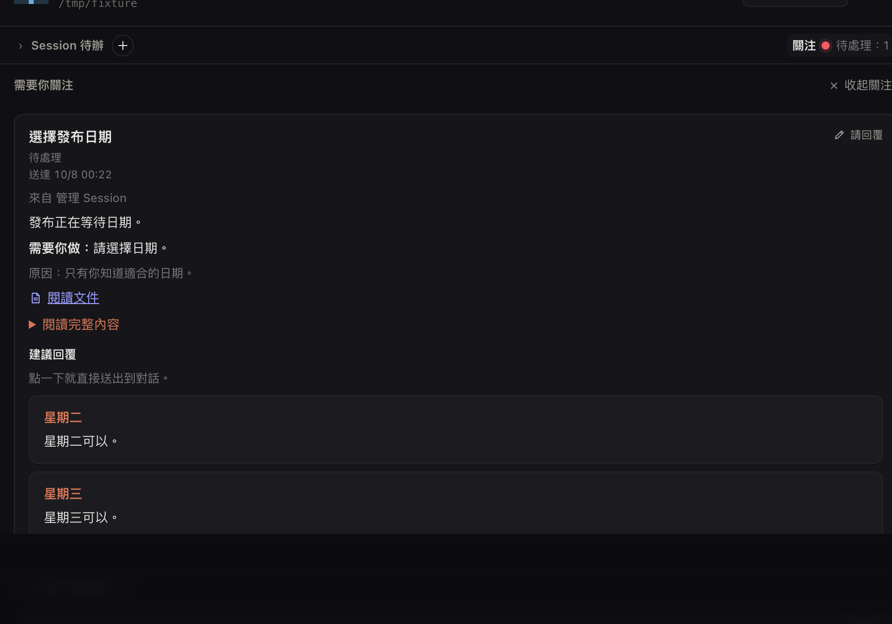
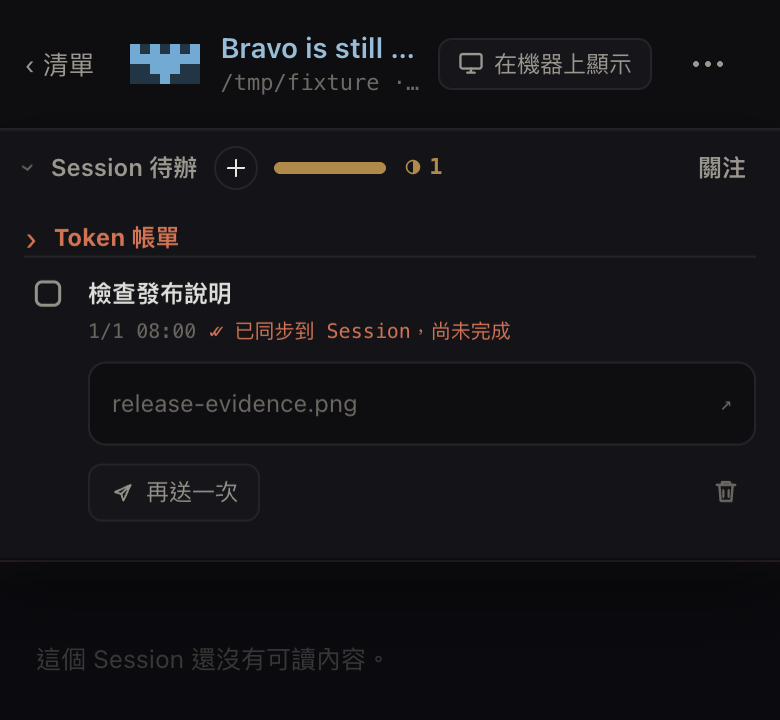
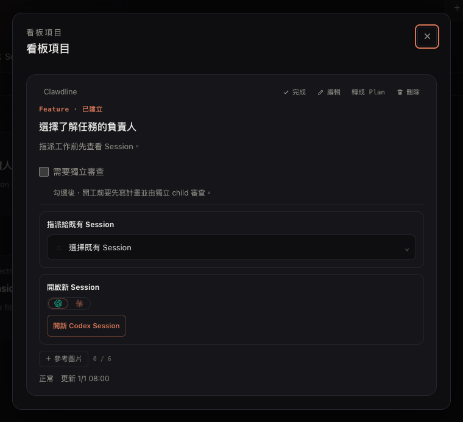
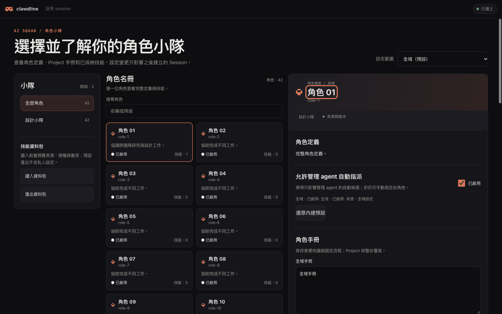
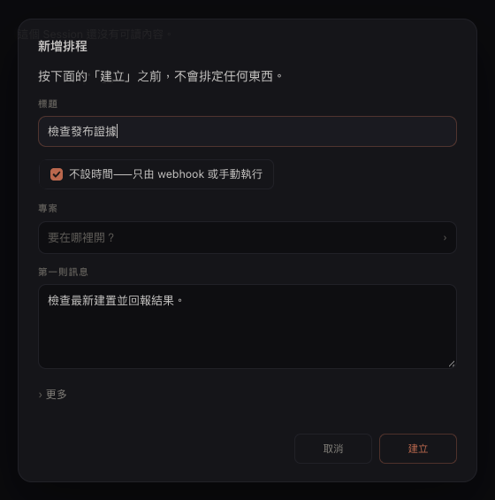

# Clawdline

[English](README.md)

[](LICENSE)
[](go.mod)

**你已經在跑的 Claude Code 與 Codex Session，都在這裡管理。**

Clawdline 是在 macOS 與 Linux 上執行的本機 daemon，附網頁主控台。它不需要 wrapper 或 hook，
就能找到你在 tmux（Mac 上也包括 iTerm2）裡的 Session，告訴你哪一個在等你，也讓一個 Session
把工作交給另一個，並證明結果真的合併進去了。Agent 與程式碼都留在你的機器上；選用的
Clawdline Cloud 透過端對端加密的中繼，讓手機或其他機器連回來。

工作不必一直占著同一輪對話。Session 可以把耗時命令交給常駐服務，等完成時再回來；Agent
可以在 Session 的「關注」面板留下需要你處理的事；你也能先替忙碌中的 Session 記下待辦，
不打斷它眼前的工作。

## 它能做什麼

**基本功能：每天都會用到**

- **看見每一個 Session。** 每一列都標出專案、助理與狀態：工作中、在等你、閒置，或讀不出來
  ——讀不出來就照實說，不會猜成閒置。可以讀真正的對話記錄、回答問題、傳文字或畫過重點的圖片、
  用說的輸入、開新 Session、停下目前這一輪、安全關閉，或先封存、之後再叫回來。
  [Session](docs/user/sessions.md)
- **即時終端機。** 在 Session 清單旁打開終端機直接輸入；在這台機器上可以，從 app.clawdline.com
  也可以（那個瀏覽器要先有 Cloud 終端權限），機器連得到時會自動改走直連。
  [終端機](https://clawdline.com/docs/shells/#terminals)
- **用手機操作，並收到通知。** 同一套主控台在任何瀏覽器都能用，「讀取」與「傳送」是兩個分開的
  權限；可以走 SSH 轉發、你自己免費的 cloudflared tunnel，或 Cloud。Session 等了十分鐘沒人回、
  Agent 呼叫你，或排程失敗時，會用 Web Push 通知你；點通知就打開那個 Session。
  [遠端連線](docs/user/remote-access.md)・[通知](docs/user/notifications.md)
- **用量一眼看懂。** 每個 Session 的 context、各 Session 與看板項目花了多少 token，以及每個
  助理的方案額度還剩多少。[用量](docs/user/usage.md)

**協調工作：Clawdline 和其他工具不同的地方**

以下截圖取自目前的主控台，內容使用示意資料。

- **派工，並留下合併證據。** Session 可以把範圍明確的工作派給子 Session、收回結果，或把整條
  工作線交接給新的 Session。寫入範圍（claims）會擋住彼此重疊的修改；Clawdline 記錄的是工作
  有沒有真的進到分支，而不只是子 Session 說它做完了。[派工與合併確認](docs/user/clawdfather-and-dispatch.md)
- **Callback 接手耗時工作。** Session 可以把編譯、測試、CI 檢查或部署命令排入 Heavy Work
  佇列，然後結束這一輪。常駐服務等到執行額度、跑完命令，再送出完成通知；Session 讀取結果後
  繼續工作。這能避免 Agent 閒置時反覆查詢，尤其在 context 已經很大的 Session 後期，有機會
  減少等待 token；實際節省量仍取決於模型供應商的 context 快取與價格。完成後仍需要一次接續，
  Callback 不會另開子 Session。[Callback](docs/user/clawdfather-and-dispatch.md#callbacks-for-long-commands)

  ```mermaid
  flowchart LR
    A["Agent 排入編譯、CI 或部署"] --> B["Heavy Work 佇列"]
    B --> C["常駐服務執行命令"]
    C --> D["完成通知"]
    D --> E["Session 讀取一次結果"]
  ```

- **Agent 用便條紙請你處理。** Agent 可以在 Session 的「關注」面板留下具體問題或動作；需要
  選擇時附上建議回覆。你可在那裡回覆，Agent 也能先做不依賴答案的事。
  [關注便條紙](docs/user/sessions.md#attention-notes-from-agents)

  

- **替稍後的工作記待辦。** 在 Session 忙碌時直接新增待辦，留給它稍後領取；新增待辦不會
  傳訊息，也不會喚醒 Session。[Session 待辦](docs/user/board.md#session-to-dos)

  

- **一路追到交付的看板。** 把 Feature、Issue 或 Epic 指派給 Session，跟著它經過實作、驗證、
  合併與部署，每個階段都要附證據。規劃預設開啟：Feature 與 Epic 開工前要先有計畫，並通過獨立
  審查。需要你決定的問題會直接出現在卡片上。看板本身預設關閉，要先在設定裡開啟。
  [看板](docs/user/board.md)

  

- **Agent 小隊與角色。** 用內建角色開 Session，例如架構師、審查者、技術寫手，各自帶著自己的手冊與 skill。
  [角色](docs/personas.md)

  

- **排程與 Webhook。** 把任務存起來，讓 Session 依本機時鐘或手動執行，有補跑、逾時與失敗通知。
  Cloud Pro 還能用 Webhook 啟動。[排程](docs/user/schedules.md)

  

**專案與多台機器**

- **手動加入本機專案。** 在存放既有資料夾的機器上執行
  `clawdline project add /absolute/path/to/project`，並確保該機器的 daemon 正在執行。
  指令只會在 daemon 登錄目錄後回報成功；`clawdline project list` 讀取同一份清單。
  已開啟的 Session 啟動視窗會自動更新；重新開啟**專案**頁也會看到。主控台目前沒有「新增專案」按鈕。
  [加入專案](docs/user/projects.md#add-a-project)
- **跨機器的專案。** 以 git origin 對應，讓第二台機器拿到相同的專案名稱、圖示和沒進
  git 的 skill，有沒有 Cloud 都可以。[專案](docs/user/projects.md)
- **Claude 和 Codex 共用同一套規則與 skill。** `clawdline project unify` 會列出怎麼讓同一個
  專案的 Claude Code 與 Codex Session 讀到同一份 `AGENTS.md` 和同一組 skill；你確認套用後才
  會改檔案，而且不會替你 commit。[Unify](docs/project-files.md#unify)
- **選用的加密 Cloud。** 透過 Clawdline Cloud 的端對端加密中繼，配對手機或多台機器。預設關閉，
  目前是預覽版。[遠端連線](docs/user/remote-access.md)

## 安裝

在 macOS 13 以上或 Linux，已經裝好 tmux 和 Claude Code 或 Codex：

```sh
curl -fsSL https://raw.githubusercontent.com/sainteye/clawdline/main/install.sh | sh
```

它會安裝簽章過的最新正式版，以使用者服務在登入時啟動（不需要 `sudo`、Go 或 Node.js），在 Mac
上一併裝選單列 App，最後在瀏覽器打開主控台。伺服器上請在 `sh` 後面加 `-s -- --headless`。接著
在 tmux 裡執行 `claude` 或 `codex`，Session 就會出現在清單裡。

每一步與確認方法、所有選項和移除方式，都在[安裝與第一次執行](docs/user/install.md)。正式版可以
在主控台的設定頁或用 `clawdline update --apply` 更新；新版起不來時會自己退回原版本
（[更新](docs/updates.md)）。

### 從原始碼建置

你需要 Go 1.25 以上、Node.js 與 npm、tmux，以及 Claude Code 或 Codex。

```sh
git clone https://github.com/sainteye/clawdline.git
cd clawdline
(cd web && npm install && npm run build)
go build -o bin/clawdline ./cmd/clawdline

CLAWDLINE_NEXT_WEB="$PWD/web/console/dist" ./bin/clawdline serve
```

在另一個終端機：

```sh
./bin/clawdline doctor      # 版本、port、狀態目錄
./bin/clawdline open        # 讓這個瀏覽器登入，讀取並傳送到 Session
```

在 tmux 裡執行 `claude` 或 `codex`，Session 就會出現在清單上。`./bin/clawdline update` 會告訴你
這台機器是否落後最新版本（[更新](docs/updates.md#development-machines)）。

## 限制

- **1.0 之前**：版本之間可能有變動。
- 主控台支援**英文、繁體中文、簡體中文、日文、韓文、西班牙文、巴西葡萄牙文、法文與德文**。
  次要語言尚未翻譯的新文案會回退為英文（[語系機制](docs/localization.md)）。
- **Windows** 能跑 daemon 與主控台，但還不能列出 Session，也不能開終端機。Linux 用
  `systemd --user` 在背景執行；macOS 另有選用的原生 App（[平台](docs/user/platforms.md)）。
- Claude 的 **5h／7d 方案百分比**需要一個會寫入 `~/.claude/statusline-cache/rate-limits.json`
  的 Claude Code status line（[用量](docs/user/usage.md)）。
- 在你自己機器上的功能全部免費，也不需要帳號。Cloud 有 Free 與 Pro 兩種方案。

## 和其他工具相比

[T3 Code](https://github.com/pingdotgg/t3code) 是完整的操作介面，有桌面與手機 App 和原生版本控制
流程。[Herdr](https://github.com/herdrdev/herdr) 是以終端機為主的 Agent multiplexer。
[Orca](https://github.com/stablyai/orca) 是附編輯器與 diff review 的 Agent 開發環境。Clawdline 不是
IDE，也不取代 Claude Code 或 Codex：它管理你本來就會開的 Session——派工、合併證據、看板與排程
——適合「難的不是開一個 Agent，而是長時間可靠地帶好幾個 Agent」的時候。

## 文件

- 開始：[安裝與第一次執行](docs/user/install.md)・[平台](docs/user/platforms.md)・
  [疑難排解](docs/user/troubleshooting.md)
- 基本功能：[Session](docs/user/sessions.md)・[快捷鍵](docs/user/keyboard-shortcuts.md)・
  [遠端連線](docs/user/remote-access.md)・[通知](docs/user/notifications.md)・[用量](docs/user/usage.md)
- 協調工作：[派工與合併確認](docs/user/clawdfather-and-dispatch.md)・
  [Callback](docs/user/clawdfather-and-dispatch.md#callbacks-for-long-commands)・
  [關注便條紙](docs/user/sessions.md#attention-notes-from-agents)・
  [Session 待辦](docs/user/board.md#session-to-dos)・[看板](docs/user/board.md)・
  [排程](docs/user/schedules.md)
- 專案與多台機器：[專案](docs/user/projects.md)・[更新](docs/updates.md)
- 網站指南：[clawdline.com/docs](https://clawdline.com/docs/)
- 開發者：[architecture.md](docs/architecture.md)、[AGENTS.md](AGENTS.md)、
  [docs/README.md](docs/README.md)

使用指南目前只有英文版。

## 授權

[MIT](LICENSE)
