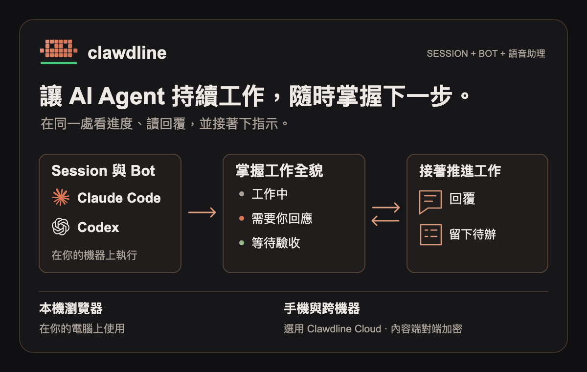
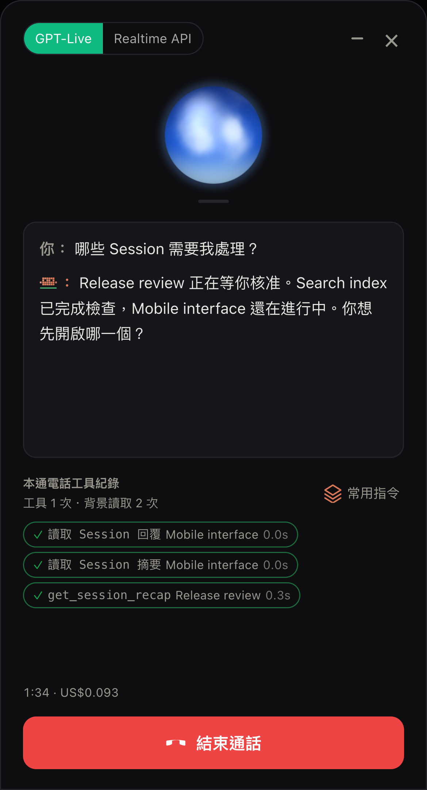
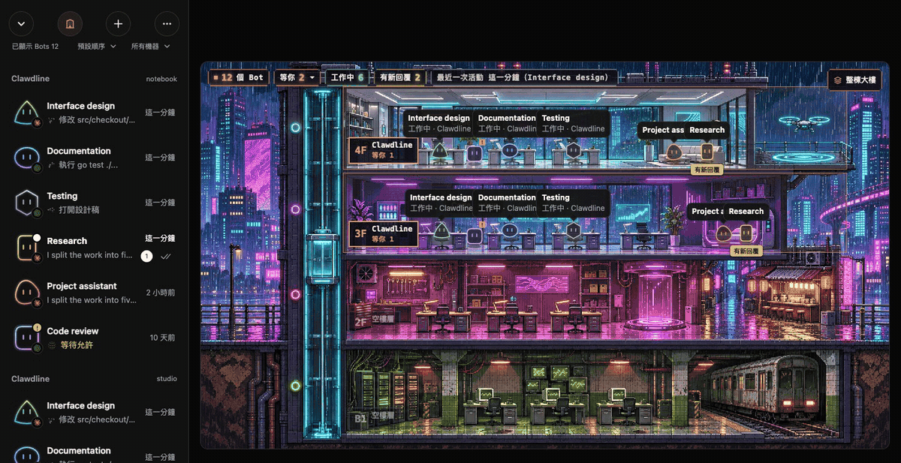
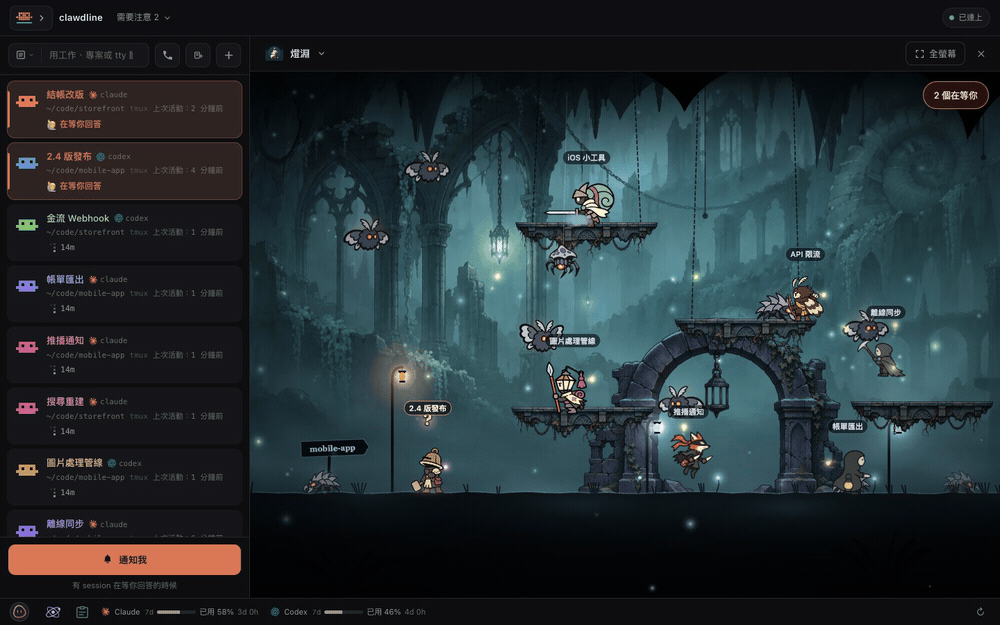
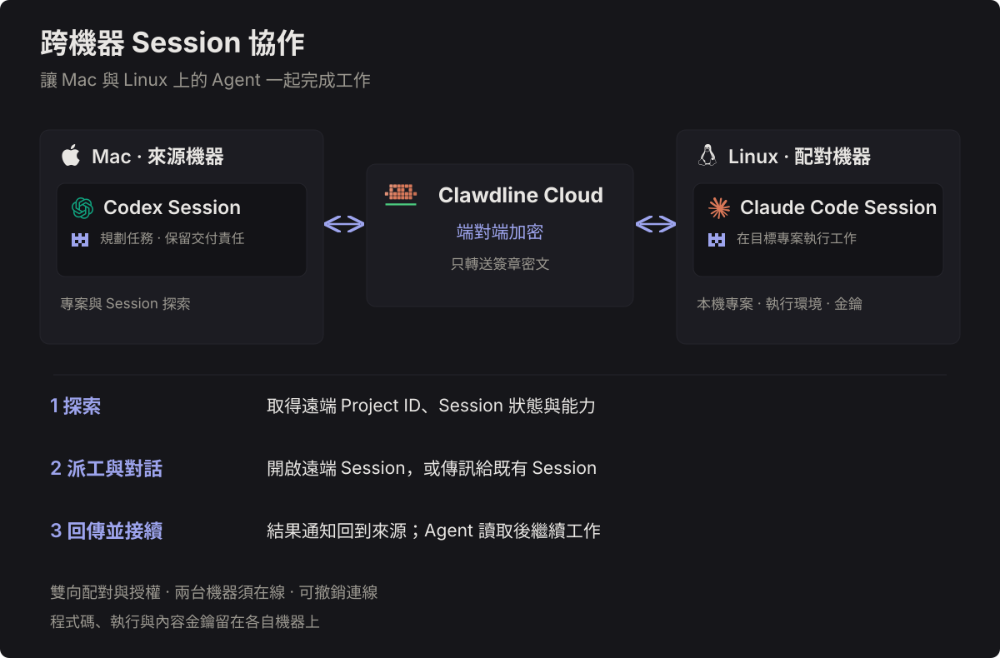
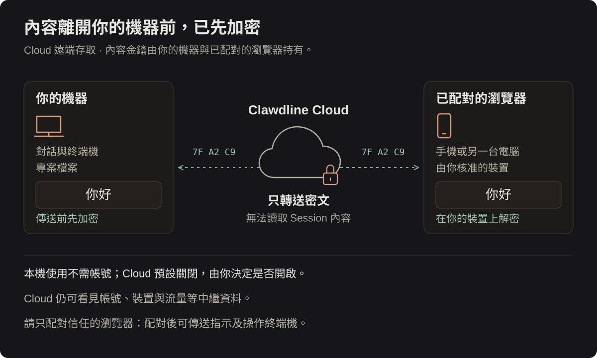

# Clawdline

🌐 **[Clawdline 官網首頁](https://clawdline.com/)** — 了解 Clawdline 如何集中管理 Claude Code 和 Codex Session、下載 App，並查看安裝指南與安全性說明。

[English](README.md)・[安全性](https://clawdline.com/security/)

[](LICENSE)
[](go.mod)

**Clawdline 把你的 Claude Code、Codex Session 與長期陪你工作的 Bot 整合在同一個平台，還有一位能直接打電話詢問的語音助理，告訴你哪裡需要你。**



### 🧩 Session 與 Bot 整合在同一個平台

**Session** 是你原本就在用的 Claude Code、Codex 對話；**Bot** 是綁定在某個 Project 的長期助理：記得你交代過的事，用它所屬 Agent 的工具在專案裡工作，較大的修改則透過 Clawdline 的 Broker 交給隔離的 worker（與 Session 派工走同一條路），結果再回到同一個聊天室。兩者都在同一個主控台，旁邊就是終端機、選用的看板與通知。Bot 目前在 macOS 上執行。[Session](docs/user/sessions.md)・[Bot](docs/bots.md)

### 🎙️ 用語音掌握你的 Session

打給語音助理，聽它回報哪裡需要你、查詢 Session 進度或留言板目前的 Lead，並開啟相關對話。送訊息前，它會先念出收件 Session 與完整內容，等你同意才送出。綠色膠囊保留當通工具紀錄，常用指令在同區右側，下方顯示時間與金額。

<a href="https://clawdline.com/docs/voice-copilot/"></a>

*目前 Cloud／dev 介面，使用合成示範資料。語音通話使用你自己的 OpenAI API key。*

[語音助理使用指南與示範](https://clawdline.com/docs/voice-copilot/?lang=zh-TW) · [桌機影片（2:43）](https://media.clawdline.com/voice-copilot/demo-zh-Hant-f3a541a44435.mp4) · [手機影片（2:35）](https://media.clawdline.com/voice-copilot/demo-zh-Hant-phone-c85af090b6cb.mp4)。實際 GPT-Live 通話使用虛構 Session 與預錄的 AI 使用者語音，畫面金額為示例。先保留 30 秒通話畫面，再縮小圓球、收成浮球後操作。

### 🏙️ Bot 住在一棟大樓裡



把 Bots 切換到大樓檢視，每個 Project 會分到像素風大樓裡的一層樓，左側仍是同一份 Bot 清單。「整棟大樓」一次看到所有樓層，搭電梯就能到其中一層。工作中的 Bot 坐在辦公桌前，等你的排隊，出錯的到維修角落，閒置的在休息區散步，一天沒動靜的就去睡覺。有未讀回覆的 Bot 會帶著「有新回覆」標記；點一下 Bot 就能打開它的聊天室，樓層畫面照常運作。[Bots 大樓](docs/bots.md#the-bots-tower)

*畫面為合成的示範 Bot，從主控台實際錄製。*

### 🏮 燈淵：把 Session 變成一場遊戲



安裝燈淵視圖並固定在 Session 清單旁，每個 Project 都是一座手繪的地底洞室，每個 Session 則是十二位逐格動畫小旅人之一。工作中的旅人在戰鬥，需要你的站在暖光燈下一臉疑惑，工作完成的在營火旁休息或睡覺；頭上的生命條代表剩下多少 context。點選旅人就能打開它的 Session。燈淵是實驗中的 View Plugin，可在「探索視圖」安裝。[燈淵](plugins/session-lantern-deep/README.md)・[View Plugin](docs/plugins/view-plugin-v1.md)

*畫面為合成的示範 Session，從主控台實際錄製。*

## 與 Herdr、T3 Code 的差異

- 🖥️ **Herdr：管理終端機與程式開發 Agent 的桌面 App。** 用 space 整理工作、先看到哪些 Agent 需要你，並透過 herdr-core 讓本機與 SSH 機器上的終端機持續運行；Agent 也能派出幫手並收到回報。提供 macOS、Windows、Linux 原生 App，iPhone、iPad、Android 手機 App，另有獨立的 TUI，以及社群製作的版面與 mod 圖庫。[Herdr 官網](https://herdr.dev/)・[桌面 App](https://github.com/herdrdev/herdr-app#readme)・[herdr-core](https://github.com/herdrdev/herdr-core#readme)
- 💬 **T3 Code：開源的程式開發 Agent 控制台。** 透過桌機、網頁與手機 App 操作 Claude Code、Codex、Cursor、OpenCode 及其他 ACP Agent；可經 T3 Connect、區域網路、Tailscale 或 SSH 連接其他機器，也能讓一個 Agent 把任務交給另一個。[T3 Code 介紹](https://github.com/pingdotgg/t3code#readme)・[遠端存取](https://github.com/pingdotgg/t3code/blob/main/docs/user/remote-access.md)
- 🔁 **Clawdline：Session 與 Bot 集中在一處，再加上語音助理。** 在瀏覽器主控台集中你已在用的 Claude Code、Codex Session 與綁定 Project 的長期 Bot；打給語音助理聽它回報哪裡需要你，也能用 Bots 大樓或燈淵這類遊戲視圖看工作進展。留下待辦、回答 Agent 便條並派工，選用看板追蹤驗證、合併與部署；清楚區分「Agent 回報完成」與「已驗證合併」。選用 Cloud 後，也能從手機同一份清單掌握多台機器。[Session](docs/user/sessions.md)・[Bot](docs/bots.md)・[語音助理](docs/user/voice-copilot.md)・[看板](docs/user/board.md)

## 你可以做什麼

### 掌握 Agent 的工作

- 🤖 **所有 Session 集中在一處** — 看哪些 Claude Code 和 Codex Session 正在工作、哪些在等你，點開對話就能跟上進度。[Session](docs/user/sessions.md)
- 💬 **用文字、語音或圖片回覆** — 口述訊息、附上截圖，或先圈出要改的地方再送出；Agent 傳來的圖片也能直接在對話中打開。[訊息與圖片](docs/user/sessions.md#answer-and-send)
- 🖥️ **Session 旁的即時終端機** — 直接在主控台執行命令，不必切換到另一個終端機程式。[終端機](https://clawdline.com/docs/shells/#terminals)
- 📌 **可以直接回應的 Agent 便條紙** — 問題、建議回覆與待你檢視的內容留在對話上方，回來時就能接著處理。[關注便條](docs/user/sessions.md#attention-notes-from-agents)
- 🔔 **工作需要你時收到通知** — 自行開啟 Session 等待、交付、看板決策與排程失敗等通知，點開即可回到相關工作。[通知](docs/user/notifications.md)
- 📊 **Token 用量與帳號額度** — 查看 Session 的 context 與 Token 用量、任務和看板的 Token 帳單；有可用讀值時，也能查看供應商額度與重設時間。[用量](docs/user/usage.md)

### 把需求推進到交付

- ☑️ **不打斷當前工作的待辦** — 把下一件事留在 Session 佇列，讓 Agent 在檢查工作時接手。[Session 待辦](docs/user/board.md#session-to-dos)
- 🗂️ **從想法追到部署的看板** — 追蹤提案、規劃、實作、驗證、合併與部署；將工作指派給 Session，也看得見哪些地方需要你決定。看板可自行選擇是否啟用。[看板](docs/user/board.md)
- 🤝 **派給另一個 Session 協作** — 派出範圍明確的任務、收回結果，並核對變更是否真的合併。[派工](docs/user/clawdfather-and-dispatch.md)
- 📖 **用 Playbook 重複啟動工作** — 儲存審查等常用任務的完整啟動訊息；Agent 也能透過 `clawdline playbook list|create|edit|delete` 管理。[Playbook API 與 CLI 指南](docs/playbooks.md#agent-api)・`clawdline guide project`
- 🧩 **共用規則與 skill** — 透過 unify，讓 Claude Code 和 Codex 都能使用專案指示與 skill。[Unify](docs/project-files.md#unify)
- 📁 **一起管理專案與 worktree** — 登錄專案、在正確的目錄啟動 Session，並查看 worktree、已交付的工作與已合併的變更。[專案](docs/user/projects.md)

### 離開桌前，工作繼續

- 📱 **手機同一份清單掌握多台機器（Cloud）** — 在配對的瀏覽器開啟不同機器的 Session、讀取對話、回覆與留待辦。Cloud 是選用功能。[遠端存取](docs/user/remote-access.md)
- 🌐 **Agent 跨機器接力（Cloud・dev）** — 雙向配對後，Agent 可探索遠端 Project 與 Session、派出任務並互傳訊息；新增的探索與 Session 喚醒功能目前提供於 dev 版本。[跨機器協作](docs/remote-agent-work.md)
- ⚡ **手機直連你的機器（Cloud）** — ICE 可直連時，即時終端機與 Session 讀取走 WebRTC；無法直連時，改走端對端加密 Relay。[Cloud 連線](docs/cloud.md)
- ⏳ **耗時命令完成後再接續** — 把命令交給 Callback，結果就緒時通知 Session 回來處理。[Callback](docs/user/clawdfather-and-dispatch.md#callbacks-for-long-commands)
- 🗓️ **排程任務與 Webhook 觸發** — 指定時間或定期啟動工作；透過 Cloud 也能讓外部服務用 Webhook 觸發排程。[排程](docs/user/schedules.md)
- 💡 **問答、Issues 與 Ideas 社群（Cloud）** — 閱讀討論、詢問使用方式、回報問題與提出功能建議。任何人都能閱讀，登入後可參與；回覆與實際交付進度分開追蹤。[社群指南](docs/user/help-center.zh-TW.md)・[公開邊界](docs/cloud-support.md)

Clawdline 的常駐服務與主控台在你的機器上執行，管理你已使用的 Claude Code 和 Codex Session。Cloud 是選用功能；中繼只傳送密文。[運作方式](docs/architecture.md)

## 跨機器 Session 協作（Cloud）

讓 Mac 上的 Codex 與 Linux 上的 Claude Code 接力工作。雙向配對後，Agent 可探索遠端 Project 與 Session、把任務派到指定專案、與既有 Session 互傳訊息，並在結果回來時接續工作；不必由你複製指示與回覆。



兩台機器都需在線並授權互通；工作在目標機器執行，程式碼與內容金鑰留在各自機器上。配對可撤銷，派工完成不代表變更已合併。**目前提供於 dev 版本**；正式版的一行安裝尚未包含這次新增的探索與 Session 喚醒功能。[使用方式與權限界線](docs/remote-agent-work.md)

## 手機直連你的機器（Cloud）

手機完成配對後，Clawdline 會嘗試與 Mac 或 Linux 機器建立 WebRTC 直連資料通道，讓即時終端機與 Session 讀取少經過一次 Relay 轉送，操作反應可以更快。Cloud 仍負責連線協商及其他指令；ICE 無法直連時，讀取會改走端對端加密的 Relay。


可以在機器的「設定 → 遠端」或執行 `clawdline cloud direct off` 關閉直連。AWS Linux 可把 ICE 固定在單一 UDP 埠；請看 [Cloud 設定說明](docs/cloud.md#aws-linux-direct-connection)與[完整 Linux 步驟](docs/linux.md#let-a-cloud-browser-connect-directly-to-ec2)。固定埠設定目前提供於開發版本。

## 安全性與你的資料

Clawdline 在你自己的機器上讀取 Claude Code 與 Codex 對話、終端與專案檔案。本機使用不需要帳號，Cloud 預設關閉，由你決定是否開啟。



開啟 Cloud 後，內容先在本機加密才送出。Cloud 只轉送密文，不持有解密金鑰；只有你的機器與你配對的瀏覽器能讀取。Cloud 仍看得到帳號、裝置與流量等中繼資料。

配對的瀏覽器可以傳送指示、操作你的終端，請只配對你信任的裝置。Claude Code 與 Codex 仍會依各自 AI 供應商的政策傳送請求。

[運作方式、資料流圖解與原始碼](https://clawdline.com/security/)・[AI 資安檢視比較](https://clawdline.com/zh-TW/ai-review/)

## 安裝

[](https://github.com/sainteye/clawdline/releases/download/v3.2.0/Clawdline-v3.2.0-macos-arm64.dmg)

Apple Silicon · macOS 13+ · [安裝教學](https://clawdline.com/docs/install/#mac-dmg)

使用 macOS 13 以上或 Linux 的命令列安裝器時，先安裝 Claude Code 或 Codex、受信任的 Python 3 與 OpenSSL 3 以上版本。macOS 內建的 LibreSSL 不足以驗證；請看[驗證工具需求](docs/user/install.md#before-you-start)。接著執行：

```sh
curl -fsSL https://clawdline.com/install.sh | sh
```

安裝腳本會先用本機 OpenSSL，對照已審查腳本內固定的公鑰驗證 manifest 簽章，再核對已簽署的壓縮檔大小與 SHA-256；通過後才解壓縮、執行下載的程式。缺少驗證工具或檢查失敗都會停止安裝。你仍須信任安裝腳本與本機工具；驗證通過的程式才會啟動使用者服務並開啟主控台。你可以從主控台開 Session，或在 tmux 執行 `claude` 或 `codex`；需要時可用發行版內附的 tmux。[安裝與首次使用](docs/user/install.md)・[第一個 Session](docs/user/first-session.md)

短網址指向經審查的驗簽腳本，並安裝最新穩定版。腳本版本與安裝程式的版本是兩個獨立來源；已簽署的發行 manifest 會標明程式的原始碼版本。入口會隨經審查的安裝器更新。[先審查再固定版本安裝](docs/user/install.md#review-and-pin-an-installation)保留固定腳本與發行版的替代方式，並說明首次安裝的信任邊界。

## 支援範圍

- Clawdline 全部免費。本機使用不需要 Clawdline 帳號；Cloud 需要登入，同樣免費。
- Windows 可執行常駐服務與主控台，但目前不能列出 Session 或開終端機。[平台](docs/user/platforms.md)
- 1.0 起，macOS 與 Linux 的正式安裝版可直接更新。主控台支援九種語言；新文案尚無翻譯時會顯示英文。[更新方式](docs/updates.md)・[語系機制](docs/localization.md)

## 指南

[使用指南](docs/user/README.md)・[Agent 指南](docs/agent-contract.md)・[從原始碼建置](docs/user/install.md)・[疑難排解](docs/user/troubleshooting.md)・[開發文件](docs/README.md)・[本機 CodeGraph](docs/codegraph-integration.md)・[UI 動畫編號表](docs/ui-motion-catalog.md)・[靜態 HTML 成果頁](docs/html-artifacts.md)・[API 效能評估與優先準則](docs/performance/local-api-review-2026-11-08.md)・[三項 API 最佳化量測](docs/performance/api-round-two-2026-11-08.md)

使用指南目前只有英文版。

[實驗性視圖 Plugin](docs/plugins/view-plugin-v1.md)可動態載入獨立 ZIP 視圖。套件依瀏覽器／介面儲存；內附星系與清單，讀取明確授權範圍內的 Session 摘要。公開 Release 是否提供此功能，取決於已安裝的宿主版本。

## Bots 架構與致謝

Clawdline 的 **Bots 架構參考自 [Codync](https://github.com/leepokai/Codync)**，包含持續存在的 Bot 身分、每個 Bot 的訊息佇列、記憶，以及原生 Agent Session 的邊界設計。Clawdline 將這些概念改寫並整合至 Go 常駐服務與 React 主控台。感謝 Codync 作者與貢獻者的工作。

詳見[重用範圍與架構參考](docs/project-assistants-reuse.md)、[改寫紀錄](third_party/codync/DERIVATION.md)，以及保留的[授權條款](third_party/codync/LICENSE)與[來源聲明](third_party/codync/NOTICE)。

## 授權

[MIT](LICENSE)
