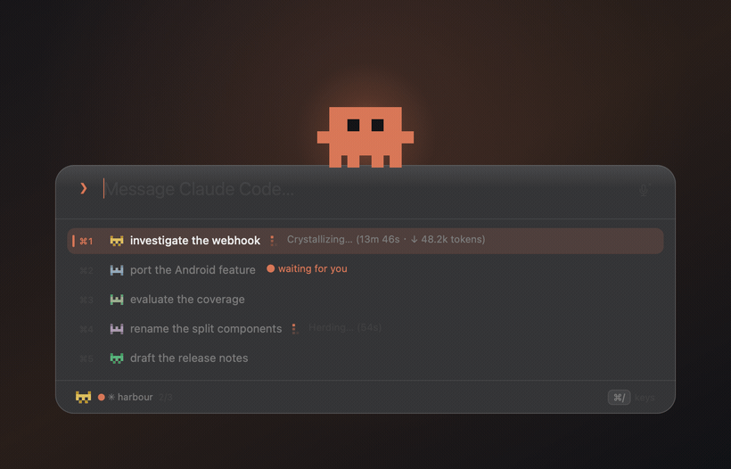

# The bar, up close

The [README](../README.md) says what each part is for. This page is the rest of it: how the bar
picks the session it types into, what the session list means by each state, how the <kbd>⌘</kbd><kbd>J</kbd>
pane decides what to draw, what the project mark on the page's session header opens, what
dictation is doing while you speak, and what the notch is up to when it looks asleep.

Nothing here needs reading to use the app. It is here because most of it is a decision that could
have gone the other way, and a decision with no reason written down is one the next person deletes.

- [Which session it sends to](#which-session-it-sends-to)
- [Running under `tmux -CC`](#running-under-tmux--cc)
- [When there is no tmux server yet](#when-there-is-no-tmux-server-yet)
- [Which session wants you](#which-session-wants-you)
- [Reading a session back](#reading-a-session-back)
- [The mark in a session's header](#the-mark-in-a-sessions-header)
- [Talk instead of type](#talk-instead-of-type)
- [Dropping in a file or an image](#dropping-in-a-file-or-an-image)
- [The notch](#the-notch)
- [Browsing mascots](#browsing-mascots)

## Which session it sends to

Clawdline lists every iTerm2 session and tmux pane, checks each one's TTY against `ps`, and keeps
the ones actually running `claude`. It defaults to the session you were last looking at.

The bar always names its target along the bottom edge. **It never sends blind** — a prompt box
that will not tell you where the text goes is worse than no prompt box.

**And the terminal follows.** Move through the list and iTerm2 moves with you: the tab in front of
you is the session the bar is pointed at, by construction. Selecting a tab is not the same as
bringing the terminal to the front and only the first one happens — otherwise every press of
<kbd>Tab</kbd> would hand iTerm2 your keyboard, which is the one thing this application exists to
avoid doing. `"follow_target": false` if you keep a terminal tab open to read from while you work
somewhere else.

The line along the bottom leads with the repository rather than the tab title, because a tab title
is the *task* — "investigate the webhook" reads much like another project's "investigate the
webhook":

    ▣ atrium  investigate the webhook  ⎇ main *3   9/10

The mark, the colour, the deploy in flight and the backlog come from small JSON files that anything
can write; [project-status.md](project-status.md) is the format. Without them the footer simply has
less to say — the branch and the uncommitted count still come from one
`git status --porcelain=v2 --branch`, and the colour is derived from the path, which is stable from
one launch to the next.

## Running under `tmux -CC`

iTerm2 can speak tmux's control-mode protocol, and then a tmux window is not something inside a
tab — it *is* a tab, drawn natively, with its own title bar and its own ⌘-number. It is a nice way
to work and it used to break this app completely.

What Clawdline sees is the reason. Ask iTerm2 for its sessions and one row comes back per tmux
window with an identity, a name, and **no tty at all**, because the pty belongs to tmux; `tmux
list-panes` holds the real `/dev/ttys009` that iTerm2 never mentions. A row with no tty cannot be
matched against `ps`, cannot be checked for identity before a keystroke, and cannot safely refresh
an older row — so it used to be counted as a session that could not be read, which cost the whole
inventory its confidence. **And an inventory without confidence closes nothing**: one tmux window
open, anywhere, and no session on the Mac could be closed at all, with nothing on screen saying
why.

Those rows belong to the tmux backend, which already lists them properly — with the pty tmux
really has, the pane's own title, and everything else the pane can answer for. So they are
attributed rather than dropped, and the iTerm2 half of the list stops claiming them.

**The attribution needs a second source, and tmux is it.** A row that says nothing about itself
cannot also be the evidence for what it is, so a pty-less row is only read as a tmux window when
tmux independently agrees — when `tmux list-clients` reports a client whose flags carry
`control-mode`. Nothing else is taken as agreement: a tmux that is not installed, cannot be found
on this Mac, has no server, or does not answer in time has not agreed, and a pty-less row with
nothing to explain it is still exactly the unreadable row this guard was written for. It still
lowers the inventory's confidence, and now it says which of those happened.

**Agreement is not a headcount, and the flag is not a name.** `control-mode` says a protocol is
being spoken over a pty; anything can speak it, and `tmux -C attach` from a script carries the
identical flag. So two more things have to hold before a row is attributed to tmux, and both come
out of the same `list-clients` reading:

- **The client has to be iTerm2's.** Its `#{client_tty}` — the gateway pty — has to be the tty of
  a row in the very same iTerm2 listing. A client with no tty at all matches nothing rather than
  everything.
- **It can only account for what it draws.** A control-mode client draws one tab per window of the
  session it is attached to, so `#{session_windows}` is the ceiling; two clients watching one
  session are watching the same windows and are counted once. Pty-less rows beyond that ceiling
  are unexplained, and say so.

The attribution above still says only the coarse, true thing — tmux is drawing windows here —
and not which row is which pane. It does not need to: for the one place that question matters,
there is a real answer.

### Jumping to a pane lands on its tab

**This used to land on the wrong tab, and the reason is worth writing down because the wrong
belief is an easy one to hold.** Under `tmux -CC` it looks as though iTerm2 must be following
tmux: the tabs appear and disappear as tmux windows come and go, so surely selecting a tmux
window selects the tab. It does not. Measured on this Mac against tmux 3.6a: `tmux select-window`
moved tmux's active window from 8 to 4 and iTerm2's current session id did not change — not after
two minutes, and not when iTerm2 was brought frontmost first in case that was the condition. tmux
is not withholding anything either; a control-mode client attached to a throwaway session was
sent `%session-window-changed` for exactly those calls. iTerm2 receives that notification and
does not move its selection for it. So "the window comes forward and stays on the tab you were
last looking at" was the whole of what a jump did.

**The mapping to fix it does exist, one level below where it was looked for.** iTerm2's `session`
class carries no tmux property — that part of the old note was right — but the same scripting
dictionary carries a `variable` command, and the tmux facts live there:

| variable | on a mirrored tmux window | on the gateway | on an ordinary session |
| --- | --- | --- | --- |
| `session.tmuxRole` | `client` | `gateway` | nothing |
| `session.tmuxWindowPane` | the tmux pane id without its `%` | nothing | nothing |

The name says window and the value is a pane. On most Macs those cannot be told apart — open one
pane per window and tmux's two id counters advance in step, so `@65` and `%65` carry the same
number — so it was settled by splitting one: tmux window `@85` holding panes `%85` and `%86` came
back as a single iTerm2 tab with two sessions, reporting `85` and `86`.

So a jump now selects the tab and brings iTerm2 forward with it, and falls back to bringing
iTerm2 forward alone when the mirroring row cannot be found — a window in front of the wrong tab
being closer to what somebody asked for than a press that does nothing.

**Both locks stay in front of it.** The tab is only selected once tmux's client list has said a
control-mode client is attached to that pane's session *and* that client's gateway pty is a row in
iTerm2's own listing; and then `iterm.js` refuses a second time on any row whose `tmuxRole` is not
`client`. Selecting the wrong tab takes somebody's keyboard away from what they were typing into
just as surely as raising the wrong application does, so the step that was added is behind the
guard rather than beside it.

One thing this does not extend to: the prompt bar walking its list with `activate: false`. On the
iTerm2 backend the tab underneath follows your selection while the keyboard stays in the box you
are typing into; under tmux it still does not, because doing it would put the whole identity check
on every arrow key.

The tmux gateway — the session you typed `tmux -CC` into, usually named something like
`Default (tmux)` — is an ordinary iTerm2 row with a real tty and behaves exactly as it always did.
It is also what makes the attribution work at all: the client tmux reports is speaking over that
row's pty, which is how Clawdline knows the emulator on the other end is iTerm2 and not something
else that speaks the same protocol.

**Clawdline only ever asks tmux's default socket.** Every `tmux` it runs is invoked with no `-L`
and no `-S`, so a control-mode session started as `tmux -L work -CC` or with `TMUX_TMPDIR` set to
somewhere else is invisible here: `list-clients` answers "no server running", which is a complete
and honest *no*, and the pty-less rows that session draws stay unexplained. The inventory is then
incomplete, and an incomplete inventory refuses every close — the same silence this section is
about, for a case that is not fixed. Nothing here guesses at other sockets: enumerating them means
reading whatever is in `$TMUX_TMPDIR` or `/tmp/tmux-$UID` and attaching meaning to it, and a wrong
guess about which server is drawing your tabs is worse than a refusal that says so. `tmuxPath` in
the config names the binary; there is deliberately no socket setting yet, and adding one is a
decision about what Clawdline is willing to assume rather than a missing line of code.

## Which terminal a session opens in

**Settings → New sessions open in**, and it is a different question from the row above it. Until
2026-09-02 it was the same value: `scope_app` said where <kbd>⌥</kbd><kbd>Space</kbd> is live *and*
which backend a session was started with, so somebody who wanted the chord bound to iTerm2 had no
way to ask for sessions in tmux, and somebody who changed it for the terminal lost the binding they
had. Two questions, one answer, and no spelling for half the combinations.

| | what a start does |
| --- | --- |
| **Auto** | iTerm2 while it is open; tmux while it is not; and with neither, an ask to open iTerm2. The order every terminal operation in this app has always taken, and what a config that never said otherwise means. |
| **iTerm2** | an iTerm2 tab, and a refusal naming iTerm2 when it is shut. Named, so a tmux server running beside it is deliberately *not* an answer — picking iTerm2 over auto asks for the tab you can see rather than a pane you cannot. |
| **tmux** | a tmux pane, running iTerm2 or no running iTerm2. With tmux installed and no server, Clawdline starts one detached — the section below. With no tmux on this Mac at all the start is refused, `terminal_unsupported`. That refusal has no application to name — tmux is not one — so unlike `terminal_closed` the phone does not write a sentence around a name; it draws a sentence of its own saying that Settings asks for tmux, that this Mac has none, and that the answers are to install it or to choose another terminal here. |

The key is `terminal` in `config.json`, and its values are `auto`, `iterm` and `tmux`. It is read
at the moment a session starts rather than when the app launches, so the next session goes where
this now says and nothing has to be restarted.

**A value this app cannot read is treated as one that was never written**, which is what the
migration below is for — and because the next save then writes that migrated answer over what was
typed, the discarded value is named once in `~/Library/Logs/Clawdline.log` rather than disappearing
without a word. Hand-editing `"terminal": "ghostty"` is not an error you will be stopped on; it is
one you can find out about afterwards.

**A `config.json` written before the key existed keeps the terminal it had.** It is filled in once,
from the hotkey's scope, because that is the only place the old file said anything about a
terminal: a scope naming iTerm2 — or an empty one, which is a global hotkey and says nothing at all
— reads as **auto**, and a scope naming any other terminal reads as **tmux**, which is where those
sessions have always gone. The next save writes the answer down, and after that the scope is never
consulted about a terminal again: move the hotkey wherever you like and the sessions stay put.

## When there is no tmux server yet

With **tmux** chosen above — which is how Ghostty, Terminal.app, Warp and everything else Clawdline
cannot drive directly is reached — that used to mean *a tmux server that was already running*.
Close your last tmux window and asking for a session from a phone came back with "run tmux there",
which is an instruction a phone cannot carry out.

So Clawdline starts one. With tmux installed and no server up, a start creates the server itself,
in a session called **`clawdline`**, with nothing attached to it:

```sh
tmux attach -t clawdline
```

**Nothing is attached, and that is the trade.** The pane is real from the moment it exists —
Clawdline lists it, reads it, types into it and closes it, exactly like any other tmux pane,
because `list-panes -a` counts detached sessions on purpose. What it is *not* is drawn anywhere:
at the Mac you see nothing until you run the line above. It is offered where the alternative is a
refusal you cannot act on, and withheld where there is something better: with iTerm2 named in
Settings and merely shut, Clawdline still asks you to open iTerm2, because that is one click and
puts the session where you are already looking. With no tmux at all, the refusal stands and now
says the true thing — install tmux.

**The line is typed at a login shell rather than handed to tmux as the pane's command.** A pane
started as `new-window 'claude …'` is run by `sh -c` with the tmux *server's* environment, and a
server Clawdline started inherits the app's — which, for anything launched from Finder, has no
login shell behind it and so no `PATH` worth reading. Measured on macOS with tmux 3.6a: that
spelling draws `zsh:1: command not found: claude`, and so does every later window on the same
server. A pane created with no command at all gets an interactive login shell, which reads the
file your `PATH` is actually set in — so Clawdline makes the pane, then types the line into it,
the same two steps the iTerm2 backend has always taken.

**Typing is not running, and Clawdline claims only the first.** tmux tells it the keystrokes were
delivered to the pane; nothing on that path tells it your shell ran them. A startup file that
flushes pending input — `tcsetattr(0, TCSAFLUSH, …)`, which is what some `stty` lines and a few
framework rc files do — throws the line away while tmux reports the same success it reports for a
line that ran. There is deliberately no check for that here: an rc that merely sleeps for three
seconds *keeps* the line and runs it late, so inside any wait a start can afford, a swallowed line
and a slow shell are the same silence. What you get instead is the truth a moment later — the pane
appears in the list as the shell it actually is, and a task briefed into it ends `spawn_failed`
rather than reporting a session that was never there. iTerm2 has always worked this way too: the
tab is made, the line is written, and the shell is not waited for.

## Which session wants you

Not looking at the terminal works for one session. With four, you are back to going round the tabs
to find out who finished — so the thing that made the bar worth having stops working at exactly the
point you start needing it.

<kbd>⌘</kbd><kbd>K</kbd> answers it instead:

<div align="center">

</div>

- **Working** carries the line Claude Code draws for itself — *Crystallizing… (13m 46s)* — in grey.
  Quiet on purpose: four rows calling for attention at once is the same as none of them calling.
- **Waiting for you** is the loud one, and the only one. A question on screen with nobody answering
  it is the single state that costs you something for every second it goes unnoticed.
- **Quiet** says nothing at all, and so does a session whose screen could not be read — because
  drawing "no idea" as "idle" would be a confident wrong answer about somebody's work.

Each row wears its project's own pixel mark, from the same registry the footer and your terminal
status line use. A tab title is the *task*, and two projects can be working on tasks that read
alike; the mark is the part you do not have to read.

The complete row vocabulary—including 🙋, 📥, ⏳, 🔜, 📭, the one/two check marks, 🔒, 🗝 and
🔓—is in [Session states](session-states.md). It also explains why project marks, assistant logos
and the Clawdfather crown are identity, not status, and why "work complete" and "safe to close"
are deliberately separate answers.

**The menu bar carries it too.** The ✳ was a fixed character that opened a menu — permanently
visible and permanently saying nothing. It has a count on it now, and a mark when something is
waiting.

**None of this is installed into Claude Code.** No hooks, no settings file of yours is edited,
nothing to set up: it is each session's own screen, read the same way the <kbd>⌘</kbd><kbd>J</kbd>
pane reads it, about once a second while the bar is up and once every twenty seconds while it is
not. That last number is the one thing looking cannot fix, and it is what the optional
[hooks](hooks.md) are for.

## Reading a session back

<kbd>⌘</kbd><kbd>J</kbd> opens a pane below the input showing what that session currently says,
refreshed about once a second and following <kbd>Tab</kbd> as you switch. The rest of the screen
blurs behind it, because reading a transcript is a different mode from firing off one line. The
text is selectable — copying an error out of it is most of the point.

It only auto-scrolls when you were already parked at the end where new lines land; being yanked
away while reading something further up is worse than not following at all. And an unchanged
terminal produces an identical capture, which is skipped entirely rather than relaid out under your
eyes.

Where it can, the pane shows the **conversation** rather than the screen. Claude Code writes each
session to `~/.claude/projects/<project>/<session>.jsonl` as it goes, and that file has the
structure the screen only implies: who spoke, what they said, which tools ran. Reading it means
real message boundaries, full history rather than one viewport, and typography instead of a
screenshot — speakers get a label, prose gets a proportional face, tool calls recede into monospace
at the edge of the page.

<kbd>⌘</kbd><kbd>F</kbd> makes it the size of the screen — not macOS's full screen, which moves the
window to a Space of its own and is the opposite of what a panel you summon over your work is for.
It is a resize, animated, and the mascot has a routine for it.

Switching to another app puts the panel away, and coming back to the terminal takes it out again —
at whatever size it was. Leaving a panel you had open is "I need to see something for a moment";
<kbd>Esc</kbd> is how you say "I am done", and something you closed on purpose stays closed. Set
`"reopen_on_return": false` if you would rather every appearance be one you asked for.

<div align="center">

</div>

<kbd>⌘</kbd><kbd>R</kbd> turns the whole thing round, newest message at the top. It follows
whichever end the newest message is at — auto-scrolling to the top rather than the bottom — and it
is remembered. Only the transcript flips: a terminal capture is a picture of a grid, and reversing
its lines would have a wrapped sentence reading upwards.

While the session is working, the pane carries a line saying what it is doing —
`Finagling… (5m 52s · ↓ 18.6k tokens)`. That one is scraped from the terminal even when everything
else comes from the file, because it is never written to the file: the transcript records messages
once they exist, and this is a spinner painted on the screen and erased again.

**Runs of tool calls fold.** A single answer can sit under thirty lines of paths and shell, and the
shell is not what you came back to read — so each finished run collapses to one line saying how
many steps it took and which tools ran, and clicking it opens the run back up. The run still going
never folds: that one is the part that is changing.

What Claude writes is Markdown, so the pane renders it: headings, lists, tables with real borders,
quotes, emphasis, and code. Leaving a table's pipes in and setting it in monospace does not work —
a CJK glyph comes from a fallback face whose advance is not reliably twice the monospace one, so
pipes that line up in the source land somewhere different on every row. Anything unrecognised falls
through as plain text, which is the one failure mode that matters: a stray asterisk on screen is a
blemish, a sentence swallowed by a parser is a bug.

Finding the right file takes three steps, because no record carries a tty: the session's working
directory gives the project folder, the tab title matches the `aiTitle` the transcript recorded, and
the most recent file breaks any tie. **The format is undocumented and can change**, so every field
is optional on the way in and anything unrecognised is skipped — see
[compatibility.md](compatibility.md).

When there is no transcript — a plain shell, a non-Claude pane — it falls back to scraping the
terminal. iTerm2 hands over the **visible screen** and no more, since its scripting has no
scrollback; tmux gives the visible pane plus 200 lines of history. Set `output_mode` to `terminal`
or `transcript` to pin it either way.

**The card is frosted glass, and glass takes the colour of what is behind it.** A screen of green
diff or a bright page tints the whole thing and drags the text with it, so a dark layer sits between
the material and everything drawn on it. `card_opacity` is how much of it: 0 is pure glass, 1 is
opaque. Raise it if you work over bright or strongly coloured windows.

**On that fallback path, colour only survives through tmux.** `capture-pane -e` keeps the escape
sequences, which get parsed into real colour. iTerm2's scripting returns a plain string: it will
tell you which red it uses for ANSI red, but not which characters are red, so that path arrives as
plain text. None of this touches the transcript, which is coloured by what the text means rather
than by what the terminal drew.

Set `output_font` to whatever your terminal uses. The default is Menlo; a status line built out of
box-drawing characters comes out at the wrong widths in anything with different metrics, which is
what makes it look broken.

## The mark in a session's header

This one is on the page rather than in the bar — the browser or phone from
[remote.md](remote.md), where a session's header carries the project's pixel mark, its name and
its path. **The mark is a button of its own now, and it opens that project's snippets**: the
pieces of text you wrote once and press instead of typing again. It used to be a picture inside
the identity block, so pressing anywhere on that block opened Session info; the block is two
buttons now, the mark and everything beside it, and neither press has to guess which of the two
you meant. `⋯` → **Snippets** opens the same sheet, and it is the discoverable entrance rather than
the fallback one: **a project the icon registry has never seen gets a mark of its own anyway**,
drawn from the project's path, so two unregistered projects look like two projects instead of like
two blanks. A registered icon always wins over it.

Pressing a row **puts its text in the composer and closes the sheet. It does not send.** Sending is
the second press, on the button that already sends — so a mis-tap on a phone in a pocket cannot
run `commit, push, deploy` in the wrong session, and *snippet plus one more sentence* needs no
separate feature. Clawdline never reads what a snippet says: the words go in the box the way
dictation's do, and what they mean is the assistant's business.

The sheet groups **this project** above **every project**, and the Mac decides which project that
is by the mark's own rule — the icon registry first, then the repository a worktree was cut from,
so a child session in an isolated checkout sees the snippets of the project it came from rather
than an empty list of its own. A device the Mac granted `read` and not `send` still sees the list,
with the insert disabled and the reason on screen, because the composer it would insert into is
disabled too. [snippets.md](snippets.md) is the whole feature; the routes are in
[api.md](api.md#the-snippets-a-session-can-press).

## Talk instead of type

<kbd>⌘</kbd><kbd>L</kbd>, or the microphone at the right of the box, turns your voice into text in
it.

**It stops on its own when you are done talking** — a pause of a couple of seconds fixes a
sentence, a longer silence ends the session, so a paragraph said in one go needs one keystroke
rather than two. Pausing does not stop it: the recogniser settles a sentence at every pause and
starts the next from nothing, so the sentences are stitched back together on this side rather than
the second one replacing the first. The rings around the microphone follow the same audio being
transcribed, so a ring that will not move means the microphone is hearing nothing — a failure you
would otherwise find out about by reading an empty box afterwards.

Words still being worked on are drawn **faded**, and come up to full when they settle. An underline
is what macOS input methods use, and it was the first thing tried here — but it only speaks to
people who already know that convention, and a line under a sentence competes with the sentence.
Fading reads as "not all the way here" to anybody, and it puts the emphasis the right way round: the
words that have settled are the ones that look normal.

**Dictation starts at the caret**, so you can go back and say a sentence into the middle of what you
have written. You can also stop, fix a word by hand, and carry on talking: an edit anywhere in the
box ends the current run, and the next thing you say starts after the caret rather than being
written into the middle of the sentence you were correcting.

Pressing <kbd>Enter</kbd> while still talking means "that was the end of it": the microphone closes,
the last stretch is read back, and then it sends — you do not have to stop it first.

**The two timings.** Every pause of about two seconds fixes what you have said so far, so earlier
sentences stop moving while you carry on — `voice_settle_seconds` sets the pause, 0 turns it off.
A pause means quiet *compared to the last few seconds*, not quiet compared to a number: an ordinary
room measures a third of the way up the scale, so a fixed threshold would be one room and nobody
else's. Four seconds of it ends the session altogether (`voice_stop_seconds`), and a sentence that
broke off mid-clause is given longer than one that arrived with a full stop on it — being late costs
an open microphone in a quiet room, being early costs the keystroke this is here to remove.

**Mixed-language speech is not a switch Apple can offer you.** Neither of its speech APIs changes
language mid-sentence: one recogniser, one locale. What is available is a hundred phrases of bias,
and Clawdline spends them on your own prompt history — the words you have typed at Claude Code are
the words you would say to it, so `webhook`, `rebase` and the name of your repo survive being said
inside a Chinese sentence. It needs no word list to maintain, and a list you have to curate is one
that goes stale the week you write it. `voice_vocabulary` is there for names even that cannot be
expected to know.

Recognition runs on this Mac for the dictation languages you have downloaded, and goes to Apple for
the ones you have not. The bar says which, for as long as it is listening — see
[Permissions and privacy](../README.md#permissions-and-privacy).

If you do speak two languages in one sentence, **[Whisper](whisper.md) is an optional second pass
that handles it** — a `brew install` and a model file, after which Clawdline uses it without being
told to. It does not replace the live text: Apple's recogniser keeps writing as you speak, and when
you stop, Whisper reads the same recording and replaces the run with its version. The feedback of
one, the sentence of the other. That page also has the comparison with Claude Code's own `/voice`,
with the date it was checked, and a prompt you can paste into Claude Code to have it installed for
you.

## Dropping in a file or an image

Drag a file anywhere onto the window, or paste an image, and it appears in the box as a thumbnail —
the picture you dropped, not forty characters of directory.

**An image arrives as `[Image #3]`**, the same as if you had pasted it into Claude Code yourself:
in the message, numbered, and something you can point at in the sentence you are writing. That is
not a string anything can type — Claude Code produces it when it reads an image off the system
pasteboard on a Ctrl-V — so the send is split around the images, each one is lent to the pasteboard
for the keystroke, and the pasteboard is handed back exactly as it was.

Only into a Claude Code session, because Ctrl-V in a shell means something else entirely; and only
when the image loads, otherwise it falls back to the path. Anything that is **not** an image — a
PDF, a folder — goes as a path on purpose: Claude Code reads files itself, so a path is the whole
handoff and is the same thing you would have typed. `send_images_as_paste: false` sends everything
the old way.

What is on screen is for you; what goes down the wire is for Claude Code, and the moment those are
the same string one of them is being made worse to suit the other.

An image off the clipboard has no path yet, so one is written under
`~/Library/Caches/com.tsunamiworks.clawdline/drops/` and that path is inserted. Those files are the only
thing this leaves behind, so the most recent few are kept and the rest are removed.

## The notch

This one is play, and it says so in the source. It tells you nothing the menu bar mark does not —
it is the same reading, wearing a costume.

<div align="center">

</div>

Your mascot lives in the menu bar band beside the camera housing. It leans out while something is
running — **how hard it looks like it is working is how much you have running** — names the session
that wants you when one does, and dances when a long job finishes.

**When nothing is running it is still there, asleep.** Just the character, breathing slowly with its
eyes shut: no ear, no name, no number. That is the state your machine is in for most of the day, so
it is built to be forgotten rather than read — and when work starts it stretches, and gets on with
it.

- **Click the character** and the bar opens, already pointed at the session it was talking about.
- **Click the words** and you land in that terminal tab.
- **When the number stands for more than one session** it offers a menu rather than guessing, with
  a way through to the whole list.

Nothing is ever covered except menu bar space: the shape sits in the menu bar's own band and grows
sideways, because the notch is a hole with a camera behind it and pixels drawn there are drawn on
the back of a camera. On a display without a notch it becomes a pill under the menu bar, on
whichever screen your pointer is on — and there it does not sleep. A pill is fine for the minute a
job takes and quite another thing parked over your menu bar all day, so a screen with no camera
housing behaves exactly as it did before: it shows up when there is something to say and goes away
again.

```jsonc
{ "notch": false }   // and none of it is created — no window, no observer, nothing drawn
```

## Browsing mascots

<div align="center">

</div>

<kbd>⌘</kbd><kbd>M</kbd> lists every pack you have. Arrow keys **preview as you move** — the
character on the bar changes while the list is still open, so you pick by looking rather than by
reading names. <kbd>⌘</kbd><kbd>1</kbd>–<kbd>⌘</kbd><kbd>9</kbd> jumps straight to one, and the menu
bar ✳ has the same list.

Two ship with the app. [**gallery.md**](gallery.md) is where more get posted, and
[**mascots.md**](mascots.md) is the format — including `clawdline://snapshot`, which renders a frame
of any routine to a PNG so an agent drawing one can see what it drew.

<div align="center">


</div>
