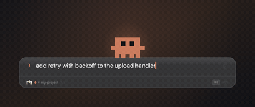

# Mascot packs

The character on top of the prompt bar is data, not code. One JSON file describes what it
looks like and how it moves, so replacing it never means touching Swift or forking this repo.

The intended way to make one is to hand Claude Code a reference image and let it write the
file. There is an example prompt at the bottom.

```
~/.config/clawdline/mascots/
├── clawd.json      ← installed on first launch, yours to edit
└── whatever.json   ← drop your own here
```

Then point the config at it and reopen the bar:

```jsonc
// ~/.config/clawdline/config.json
{ "mascot": "whatever" }
```

The pack is re-read **every time the bar opens**, so editing the JSON and pressing ⌥Space is
the whole edit loop. No rebuild, no relaunch. A broken pack shows the reason in the hint row
instead of the shortcut keys.

---

## The format

```jsonc
{
  "name": "Clawd",
  "author": "optional, free text",

  // The pixel grid. Every pose must be exactly this many rows, each exactly this many
  // characters. Smaller grids read better — 16×11 is plenty, 40×40 turns to mush at 100pt.
  "grid": { "cols": 16, "rows": 11 },

  // How big to draw it, in points — kept separate from the grid on purpose. Without this,
  // a finer grid would simply render smaller, and resolution would decide scale.
  // Everything here is optional; the defaults reproduce the stock Clawd geometry.
  "display": {
    "height": 77,      // intended sprite height; the cell size follows from height / rows
    "overlap": 3,      // how far the feet sink into the card, so it stands rather than floats
    "jumpRoom": 41,    // headroom for jumps and the pop overshoot (a view clips its own drawing)
    "sideRoom": 12,    // slack each side for sway and horizontal squash
    "footInset": 6     // gap between the feet and the bottom of the view
  },

  // One character per colour.
  //   "accent"      → follows the app tint (the Claude terracotta)
  //   "#RRGGBB"     → literal colour, also #RGB and #RRGGBBAA
  //   "transparent" → paints nothing
  "palette": { "#": "accent", "o": "#141416", ".": "transparent" },

  // Which characters are eyes. Used by the blink and happy expressions (see below).
  "eyeChars": ["o"],

  // What a closed eye fills in with. Defaults to whatever is mapped to "accent", which is
  // wrong for any character that is not accent-coloured — a white one would blink orange.
  "skin": "#",

  // Named pictures. Name them however you like; routines refer to them by name.
  "poses": {
    "stand": [
      "................",
      "..############..",
      "..###oo##oo###..",
      "  … 11 rows total …"
    ],
    "armsUp": [ "…" ]
  },

  // Named animations.
  "routines": {
    "idle": {
      "duration": 2.2,          // seconds for one pass
      "loop": true,             // false = play once, then fall back to idle
      "blink": { "everyMin": 2.4, "everyMax": 5.5, "duration": 0.11 },
      "keys": [
        { "t": 0.00, "pose": "stand", "sx": 1.00, "sy": 1.00, "dy": 0 },
        { "t": 0.25, "sy": 1.035, "dy": 1.5, "ease": "inout" },
        { "t": 1.00, "sy": 1.00,  "dy": 0,   "ease": "inout" }
      ]
    }
  }
}
```

### Keys

`t` is a fraction of `duration`, from `0` to `1`. Every other field is optional; leave one out
and it holds whatever the previous key set.

| field  | meaning | unit |
|--------|---------|------|
| `pose` | which picture to draw | pose name |
| `dx`   | move sideways | points |
| `dy`   | move up | points |
| `rot`  | tilt | radians (`0.12` ≈ 7°) |
| `sx`   | horizontal scale | `1.0` = unchanged |
| `sy`   | vertical scale | `1.0` = unchanged |
| `eyes` | expression | `open`, `blink`, `happy` |
| `ease` | how to reach this key | `linear` (default), `inout`, `out` |

`dx`/`dy`/`rot`/`sx`/`sy` interpolate between keys. `pose` and `eyes` **step** — a half-drawn
pose is not a thing. Rotation and scale pivot low on the body, so a tilt looks like the
character turning on its feet rather than spinning around its middle.

**Squash and stretch is what sells a jump.** Raising `dy` alone reads as floating. Pair the
landing with `sy` below 1 and `sx` above it, and it lands with weight.

**Keep `rot` small.** Past about 7° the square cells smear and it stops reading as pixel art.
Sway with `dx` and by swapping poses instead.

### Expressions

There is no separate "closed eye" picture. Wherever an `eyeChars` character appears:

- `blink` hides the **top** row of the eyes, leaving the bottom — a half-lidded look.
- `happy` hides the **bottom** row, leaving the top — a squint.

Both fill in with the `skin` character, so the eye disappears into the face. One drawing
covers all three expressions.

### Routine names

Seven names are wired to real moments. Anything missing falls back to `idle`, which is the only
one that is required.

| routine  | fires when |
|----------|------------|
| `pop`    | the bar opens |
| `idle`   | nothing is happening |
| `typing` | you are typing |
| `dance`  | idle for ~7 seconds, or you press ⌘D |
| `cheer`  | you press Enter and the message goes out |
| `stretch`| the window changes size (⌘F), and when the notch mascot wakes up |
| `sleep`  | nothing at all is running, and the character is asleep in the notch |

<div align="center">

</div>

A pack written before a routine existed is not broken: `stretch` is asked for by name and
falls back to `cheer` when the pack has none, so an older pack keeps working and simply does
something else at that moment.

### `sleep`, and what happens without it

`sleep` is optional, and it is the only routine that is **on screen all day** rather than for the
second and a half something takes. Nothing is running, so the notch holds the character and
nothing else — no ear, no name, no count — and the bar for how quiet it has to be is a different
bar: anything that catches your eye every few seconds is wrong.

```jsonc
"sleep": {
  "duration": 4.8,          // long. this is a breath, not an animation
  "loop": true,
  // no "blink" block: a sleeping character does not blink
  "keys": [
    { "t": 0.00, "pose": "stand", "eyes": "blink", "sx": 1.000, "sy": 1.000, "dy":  0.0 },
    { "t": 0.40, "sx": 0.991, "sy": 1.026, "dy":  1.2, "ease": "inout" },
    { "t": 0.85, "sx": 1.005, "sy": 0.992, "dy": -0.4, "ease": "inout" },
    { "t": 1.00, "sx": 1.000, "sy": 1.000, "dy":  0.0, "ease": "inout" }   // back where it began
  ]
}
```

Three things this is doing, none of them optional if you write your own:

- **`eyes` is `blink` on the first key and never set again.** Expressions step and hold, so that
  one word keeps them shut for the whole loop. There is no separate sleeping face to draw.
- **No `blink` block.** A blink block on this routine would open and shut the eyes on a timer,
  which is precisely the every-few-seconds movement the state exists to avoid.
- **The last key agrees with the first.** A loop that ends somewhere else jumps once a cycle. On a
  half-second dance nobody catches it; on a five-second breath in the menu bar it is a twitch.

**A pack without `sleep` still works.** It falls back to that pack's own `idle` at a little under
half speed, with the eyes held shut on top — which lands on roughly the same slow breath, so an
older pack sleeps rather than standing there awake or drawing nothing at all. Writing `sleep`
yourself is worth it only if your character should rest differently from how it idles.

You can define extra routines and trigger them yourself with
`open "clawdline://snapshot?routine=yourname&t=0.3&path=/tmp/x.png"`, which is mostly useful
while building one.

---

## Seeing what you drew

This is the part that makes an agent able to do the work: it can look at its own output.

```bash
# One frame of a routine, as a PNG
open "clawdline://snapshot?path=/tmp/frame.png&routine=dance&t=0.30"

# One state of the notch island, drawn into a menu bar: working, working2, waiting, finished, resting
open "clawdline://snapshot?path=/tmp/i.png&island=resting&t=1.9"

# A whole routine, frame by frame, ready for ffmpeg
open "clawdline://filmstrip?dir=/tmp/dance&script=dance&fps=24&seconds=2"
ffmpeg -framerate 24 -i /tmp/dance/f%04d.png -vf "fps=24,scale=480:-2:flags=lanczos" /tmp/dance.gif
```

Both draw the app's own layers, so neither needs Screen Recording permission. Claude Code can
run these and then read the PNG back to check its work.

### The pictures in the README

Those are shot the same way, from a **made-up transcript** kept in the repo. Shooting a real
session would publish whatever the machine happened to be working on that afternoon, so the
target label is a stand-in too. The file goes through the same parse and render as a live
session — a picture made any other way would be a picture of a mock-up, and would stop
matching the app the day it drifted.

```bash
T="$PWD/docs/assets/demo-transcript.jsonl"
open "clawdline://snapshot?path=/tmp/pane.png&output=1&full=0&transcript=$T"   # the pane
open "clawdline://snapshot?path=/tmp/full.png&output=1&full=1&transcript=$T"   # ⌘F
```

Set `"language": "en"` in the config first, or the chrome comes out in whatever language you
run in. You can edit that file while the app is running — it keeps what it did not change — but
choose **Reload config** from the menu bar afterwards, or it will go on drawing with what it read
at launch.

---

## Example prompt

Save a reference image somewhere, then say something like this to Claude Code:

> Here is a reference image: `~/Downloads/my-character.gif`
>
> Make it into a Clawdline mascot pack. Read the format in
> `~/code/clawdline/docs/mascots.md`, and use `~/.config/clawdline/mascots/clawd.json` as a
> working example.
>
> - Grid no larger than 20×16. Chunky reads better than detailed at this size.
> - Put the feet on the bottom row so it stands on the bar instead of floating.
> - Draw poses for: standing, both arms up, two dance poses (one arm up + the opposite
>   foot lifted, then mirrored), and left/right stepping.
> - Write the routines: `pop`, `idle`, `typing`, `dance`, `cheer`, `stretch`, and `sleep` — a
>   long, looping, eyes-shut breath with no blink block, for when nothing is running.
> - Save it as `~/.config/clawdline/mascots/my-character.json` and set `"mascot": "my-character"` in
>   `~/.config/clawdline/config.json`.
>
> Then check your work: run
> `open "clawdline://snapshot?path=/tmp/m.png&routine=dance&t=0.3"`, look at the PNG, and fix
> whatever looks wrong. Repeat until it reads as the character in the reference.

That last paragraph matters more than the rest. Without it the agent writes a pack it has
never looked at, and pixel art written blind comes out as a blob.

---

## Sharing a pack

A pack is one self-contained JSON file with no assets. Post it as a gist, or open a PR adding
it to `Resources/mascots/` — anything shipped there is installed for everyone on first launch.

If your character is someone else's intellectual property, keep it in your own config
directory rather than sending a PR.
